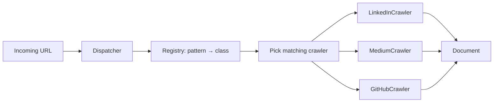

# Crawler Dispatcher

**Also known as:** URL Domain Dispatcher, Crawler Factory

**Category:** Tool Use & Environment  
**Status in practice:** mature

## Intent

Route each incoming URL to a domain-specific crawler through a central dispatcher mapping URL patterns to registered crawler classes.

## Context

An LLM application ingests text from many web sources — LinkedIn posts, Medium articles, GitHub repos, Substack posts, custom company sites. Each source has its own structure, login flow, rate limits, and quirks. The ingestion code accumulates per-source branches.

## Problem

If-else branching by URL host scales badly. Adding a new source requires editing the ingestion module, the dispatching is mixed with the per-source logic, and conflict between contributors over the module file slows down adding sources. Tests for one source pull in dependencies of all sources. Without a registry-based dispatcher, ingestion becomes a fragile monolith where each new source rewrites the world.

## Forces

- New sources are added frequently; cost of adding must be low.
- Per-source logic differs enough that one crawler cannot serve all.
- Tests for a source should not pull in unrelated crawlers.
- URL-to-crawler mapping is the only routing decision; it should be one place.

## Applicability

**Use when**

- Many heterogeneous sources need ingestion.
- Sources are added frequently and per-source logic differs materially.
- Tests should not couple across crawlers.

**Do not use when**

- Only one or two sources, with no growth expected.
- Sources are similar enough that one crawler suffices.
- Cross-source coordination (shared rate-limit budgets) dominates per-source variation.

## Therefore

Therefore: route each URL through a central dispatcher that maps URL patterns to registered crawler classes, so adding a new source is a registration change rather than an edit to the dispatch logic.

## Solution

Define a Crawler interface (e.g. `fetch(url) -> document`). Implement one crawler class per source (LinkedInCrawler, MediumCrawler, GitHubCrawler, ...). A Dispatcher object holds a registry of (URL pattern → crawler class). `dispatcher.get_crawler(url)` returns the right instance; adding a source is `dispatcher.register(pattern, CrawlerClass)`. The dispatcher is small and stable; the crawler classes evolve independently. Tests for one crawler don't import the others.

## Example scenario

A personal-knowledge LLM ingests content from LinkedIn, Substack, GitHub, and the author's personal site. The Dispatcher has four registrations. Adding a fifth source (Bluesky) is a new BlueskyCrawler class and one register call. The ingestion module is unchanged.

## Diagram

## Consequences

**Benefits**

- Adding a source is a registration call, not a module edit.
- Per-source crawlers evolve and are tested independently.
- Dispatch logic is one small reviewable surface.

**Liabilities**

- URL pattern matching can be ambiguous when sources share hosts.
- Cross-source coordination (rate-limit budgets across crawlers) needs a layer above the dispatcher.
- Registry can drift if registrations live in many files without a startup audit.

## What this pattern constrains

URL-to-crawler dispatch must not be inlined as if-else branching in the ingestion code; the mapping lives in a central registry the dispatcher consults.

## Known uses

- **LLM Engineer's Handbook (Iusztin, Labonne) — LLM Twin crawler dispatcher pattern** — *Available* — <https://medium.com/decodingai/your-content-is-gold-i-turned-3-years-of-blog-posts-into-an-llm-training-d19c265bdd6e>
- **Scrapy spider registry, Apache Tika parser registry (canonical equivalents)** — *Available*

## Related patterns

- *complements* → [agent-adapter](agent-adapter.md)
- *complements* → [augmented-llm](augmented-llm.md)
- *complements* → [tool-use](tool-use.md)
- *composes-with* → [fti-llm-pipeline-split](fti-llm-pipeline-split.md)
- *complements* → [browser-agent](browser-agent.md)
- *complements* → [rate-limiting](rate-limiting.md)

## References

- (book) *LLM Engineer's Handbook*, Paul Iusztin, Maxime Labonne, 2024, <https://www.packtpub.com/en-us/product/llm-engineers-handbook-9781836200079>
- (blog) *Your Content is Gold — Decoding AI*, <https://medium.com/decodingai/your-content-is-gold-i-turned-3-years-of-blog-posts-into-an-llm-training-d19c265bdd6e>

**Tags:** ingestion, data-pipeline, registry
