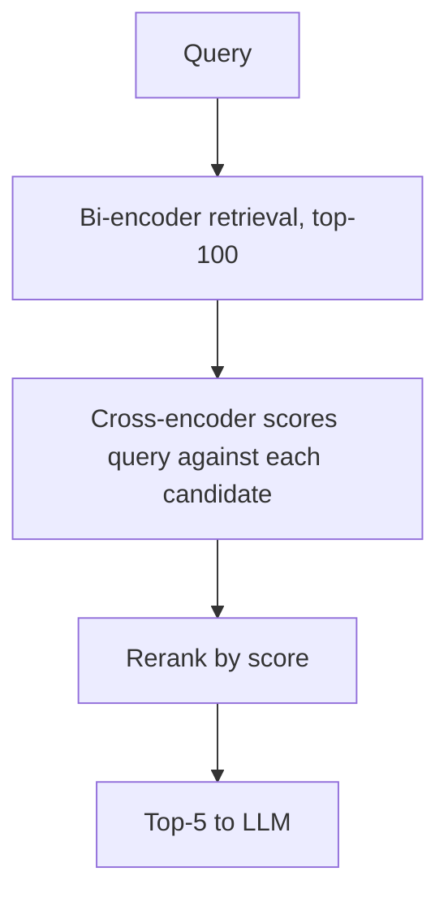

# Cross-Encoder Reranking

**Also known as:** Reranker, Two-Stage Retrieval, Retrieve-Then-Rerank

**Category:** Retrieval & RAG  
**Status in practice:** mature

## Intent

After cheap bi-encoder or BM25 retrieval, rescore top-N candidates with a cross-encoder that jointly attends over (query, candidate).

## Context

A team is using a two-stage retrieval pipeline. The first stage is a fast bi-encoder that embeds the query and each document independently and compares their vectors; an approximate nearest-neighbour index returns a top-k candidate set from a large corpus. Because the encoder sees query and document separately, it cannot model fine-grained interactions between them, and because the index is tuned for recall, the top-k list mixes truly relevant candidates with topically similar but unhelpful ones.

## Problem

Feeding the entire top-k list into the downstream generator wastes its context window on irrelevant candidates and lets the loudest distractor mislead the answer. The team needs a way to re-order or filter the candidate set so that the most relevant items rise to the top, but they cannot afford to run a heavy joint scoring model over the whole corpus on every query. They need a small but expensive scorer that runs only over the cheap retriever's shortlist and resorts it by genuine query-document relevance.

## Forces

- Cross-encoder cost is one model call per candidate.
- Latency budget caps N (typically 20-100).
- Fine-tuning a custom reranker is a separate effort.

## Therefore

Therefore: rescore the cheap retriever's top-N with a cross-encoder that jointly attends over (query, candidate), so that final ranking reflects joint relevance rather than vector proximity alone.

## Solution

Two-stage retrieval. Stage 1: cheap retrieve (BM25, dense, hybrid) returns top-N. Stage 2: cross-encoder scores each (query, candidate) jointly. Return top-K << N to the generator.

## Applicability

**Use when**

- Initial retrieval returns a noisy top-100 and accuracy of top-5 matters.
- Inference budget can afford a cross-encoder pass on each candidate.
- Downstream LLM context can only fit a small number of chunks.

**Do not use when**

- Latency target is sub-100ms end-to-end; cross-encoders blow it.
- Initial retrieval is already precise (e.g., exact ID lookup).
- Inference cost is the bottleneck and recall@k from the bi-encoder is good enough.

## Example scenario

A legal-research agent retrieves 100 candidate paragraphs from a corpus of contracts that mention 'force majeure'. Many are off-topic. Before showing them to the LLM, a small cross-encoder model scores each candidate against the user's exact question, picks the top 5, and discards the rest. The LLM only ever reads the sharpest results.

## Diagram

## Consequences

**Benefits**

- Largest single quality win on top of contextual embeddings (Anthropic ablation).
- Reranker can be swapped without re-indexing.

**Liabilities**

- Latency adds one call per candidate.
- Reranker calibration on out-of-domain content.

## What this pattern constrains

The generator sees only the reranker's top-K; pre-rerank candidates are not used.

## Known uses

- **Cohere Rerank** — *Available*
- **BGE-reranker (open-source)** — *Available*
- **Anthropic Contextual Retrieval** — *Available*

## Related patterns

- *composes-with* → [naive-rag](naive-rag.md)
- *composes-with* → [hybrid-search](hybrid-search.md)
- *composes-with* → [agentic-rag](agentic-rag.md)
- *composes-with* → [contextual-retrieval](contextual-retrieval.md)
- *composes-with* → [hyde](hyde.md)

## References

- (paper) Nogueira, Cho, *Passage Re-ranking with BERT*, 2019, <https://arxiv.org/abs/1901.04085>

**Tags:** rag, rerank, two-stage
