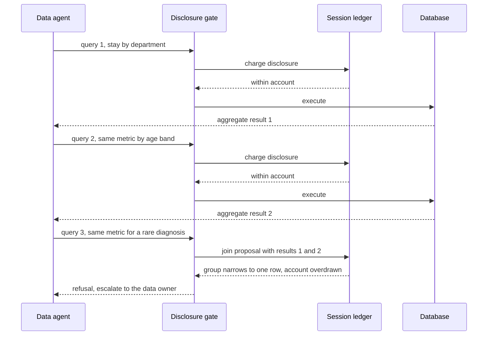

# Cumulative Disclosure Accounting

**Also known as:** Session Privacy Budget, Compositional Leakage Control, Composition-Aware Query Gate

**Category:** Safety & Control  
**Status in practice:** emerging

## Intent

Keep a session-scoped ledger of what a data agent has already disclosed and evaluate each new query against that accumulated record, so a sequence of individually-permitted results cannot jointly re-identify protected rows.

## Context

An agent has read access to a sensitive dataset and answers questions by issuing many queries against it over the course of a task. A policy layer sits between the agent and the database and decides whether each query may run. Every result the agent gets back is an aggregate, a redacted extract, or a filtered slice that on its own satisfies the policy — no identifier is returned, and no group is smaller than the declared minimum. Over a single session the agent may issue dozens of such queries, and their results all reach the same reader.

## Problem

The gate decides one call at a time and keeps no record of what it has already released, so it cannot see the join. Four aggregates that are each computed over a large enough group can intersect on a group of one, and the person the policy was written to protect is disclosed by arithmetic the gate never performed. Classical database-privacy work names this a composition attack and shows experimentally that it breaches privacy in practice against a large class of published anonymisation techniques, k-anonymity and several of its variants among them. A layered study of data agents finds the same hole in the policy layer of current systems, which approve each query in isolation and never track cumulative disclosure across the session.

## Forces

- Independently anonymised releases are each within policy and jointly are not; experiments on composition attacks breach privacy for a large class of published techniques, including k-anonymity and several of its variants.
- A per-call gate is cheap and stateless, while cumulative accounting needs durable per-principal state and a model of how results join, which the read path must carry on every query.
- A systematic study of data agents identifies eight agent-specific risks across the interpretation, execution and policy layers and, across six evaluated systems — four open-source data agents and two production cloud analytics services — finds policy checked one tool invocation at a time.
- Randomised mechanisms such as differential privacy provably resist composition and arbitrary side information, but they add noise to every answer, so accuracy falls as the account is spent.
- Among the governance mechanisms surveyed for agents working over data, only information-flow control covers both compositional and cross-session inference leakage, and those two are the least-protected risks in the field.

## Therefore

Therefore: bind a disclosure account to the principal and the session, charge every released result against it, and decide each query against the accumulated account rather than on the query's own merits.

## Solution

Make the policy decision stateful. Open an account when a principal starts a session, and record in a ledger every result the gate lets out: which table and attributes it touched, which population it was computed over, and what privacy cost it carried. When the next query arrives, the gate does not ask whether this query alone is permitted; it asks what the proposed result would reveal once joined with everything the ledger already holds. Two mechanisms answer that question. A composition check tests whether the new result intersected with prior ones narrows any protected group below the declared minimum, and refuses or coarsens the query when it does. A privacy budget prices each query in a randomised mechanism whose composition bound is provable, subtracts the price from the session's remaining allowance, and stops when the allowance runs out. Every disclosure channel is metered, not only direct table reads — tool results, memory writes, and messages passed to another agent all spend from the same account. Exhaustion is surfaced as an exhausted account escalated to the data owner, never as a quietly truncated answer, and the ledger is keyed to the principal so that opening a fresh session does not refill it.

## Structure

```
Principal + session -> disclosure account. Query -> gate -> ledger lookup (prior releases) -> composition check and budget charge -> allow / coarsen / refuse-and-escalate. Every released result is written back to the ledger before it reaches the caller.
```

## Diagram



*Each query is charged against a session ledger before it runs; the third is refused not for what it asks but for what it would reveal once joined with the first two.*

## Example scenario

A hospital analyst asks a data agent for the average length of stay by department, then by age band, then by postcode, and finally for the same figure restricted to one rare diagnosis. Each answer covers more than the minimum group size, so the per-call policy allows all four. Read side by side, the four results leave exactly one patient who can be in the last cell, and the agent has just published that person's stay. A session ledger would have refused the fourth query because it narrowed a group the first three had already bounded.

## Consequences

**Benefits**

- A run of individually safe releases can no longer compose into a re-identification, because the decision is made on the join rather than on the single call.
- The data owner gets one number for how much has been disclosed to a principal, in place of an unbounded stream of separately approved reads.
- A refusal names an exhausted account rather than a rule the caller can route around by rephrasing the same question.
- Cross-session leakage becomes visible, because the account is keyed to the principal and survives the end of a session.

**Liabilities**

- The gate stops being stateless, so the ledger becomes a durability and correctness dependency, and a lost or unavailable ledger silently degrades the system back to per-call decisions.
- An account that binds the whole session eventually stops legitimate work, and the tighter the allowance the sooner an honest analyst hits it.
- Thresholds on cell counts do not compose, so a ledger built only on minimum group size still admits breaches that only a randomised mechanism provably resists.
- Every channel out of the agent has to be metered, and one unmetered channel — an intermediate tool result, a memory write, a message to a peer agent — voids the account without any signal that it did.
- Pricing a query needs a model of what it reveals, and that model is dataset-specific work that has to be maintained as schemas change.

## Failure modes

- The gate stays stateless, an analyst asks for the same aggregate sliced five ways, and a single row is reconstructed while every call returns an allow verdict.
- The ledger is scoped to a session but not to a principal, so the caller opens a fresh session and the account resets to full.
- Only direct database reads are charged, and disclosure escapes unmetered through tool outputs, written memory, or a hand-off to another agent.
- The allowance runs out mid-task and the agent returns a partial answer as if it were complete, giving the reader no signal that the account stopped it.
- The account is priced on a threshold mechanism that does not compose, so the budget reads as healthy while the composed releases have already breached the policy.

## What this pattern constrains

A query must not be approved on its own merits alone: the gate must first charge the proposed disclosure against the principal's session ledger and refuse or coarsen any query whose result, joined with what the session has already returned, would narrow a protected group below the declared minimum or overdraw the remaining budget. A new session must not reset an account bound to the same principal.

## Applicability

**Use when**

- An agent issues many reads against the same sensitive dataset within one task or session.
- Results are aggregates or redacted extracts that are individually within policy but can be joined by whoever receives them.
- A data owner needs to state how much has been disclosed to a principal, not only that each release was permitted.
- The dataset covers a population containing groups small enough to be re-identified from a handful of slices.

**Do not use when**

- Requests are genuinely independent and their results cannot be joined, such as single-record lookups the caller was already entitled to read in full.
- Latency or throughput requirements rule out durable per-session state on the read path.
- The data is public or synthetic, so a composed inference discloses nothing the policy protects.
- No stable principal identity exists, in which case the account can be reset at will and offers false assurance.

## Components

- Disclosure ledger — session-scoped record of every result released, keyed to the tables, attributes and population each one touched
- Composition checker — tests whether the proposed result, intersected with prior releases, narrows a protected group below the declared minimum
- Privacy budget accountant — prices each query in a mechanism with a provable composition bound and tracks the remaining allowance
- Query gate — allows, coarsens or refuses the proposed query on the account's verdict rather than on the query considered alone
- Principal binding — ties the account to an identity so that starting a new session does not refill the allowance
- Channel meter — charges tool results, memory writes and inter-agent messages against the same account as direct reads
- Escalation path — routes an exhausted account to the data owner instead of silently truncating the answer

## Tools

- OpenDP SmartNoise — differential-privacy library whose accountant spends a privacy allowance across a query session
- Google BigQuery differential privacy — SQL privacy clause with per-query epsilon and contribution bounds
- Tumult Analytics — session-scoped differentially private query API that tracks the remaining budget
- Open Policy Agent — external decision point that can take ledger state as rule input so the verdict depends on history
- Query audit log — durable record of issued queries and returned results from which the ledger is rebuilt after a restart

## Evaluation metrics

- Re-identification rate under composition — share of protected individuals recoverable by joining the results one session returned
- Remaining allowance at session end — how much of the allocated privacy budget a typical session consumes
- Composed-query refusal rate — how often the gate blocks a query that a per-call policy would have allowed
- Minimum group size in released results — the smallest population any returned aggregate was computed over
- Ledger coverage — share of disclosure channels whose output was actually charged against the account

## Known uses

- **[Google BigQuery differential privacy](https://cloud.google.com/bigquery/docs/differential-privacy)** _available_ — SQL-level privacy clause with per-query epsilon and contribution bounds, so repeated queries against the same table spend from a declared allowance rather than being judged one at a time.
- **[OpenDP SmartNoise](https://docs.smartnoise.org/)** _available_ — Provides a budget accountant that tracks privacy loss spent across a query session and refuses further queries once the allocation is exhausted.
- **[Tumult Analytics](https://docs.tmlt.dev/analytics/latest/)** _available_ — Session-based differentially private query API in which a session holds a fixed privacy budget and each query deducts from the remainder.
- **[US Census Bureau 2020 Disclosure Avoidance System](https://www.census.gov/programs-surveys/decennial-census/decade/2020/planning-management/process/disclosure-avoidance.html)** _available_ — Allocates a privacy-loss budget across the statistics released from one confidential dataset, treating the whole set of releases as a single account rather than approving each table separately.
- **[Data-agent policy layer (V8, Lack of Compositional Leakage Control)](https://arxiv.org/abs/2606.08661)** _pure-future_ — Named as an open vulnerability class rather than a shipped control: the study evaluated six data agents and found none of them tracking cumulative disclosure across a session.

## Related patterns

- _complements_ **PII Redaction** — Redaction cleans identifiers out of one payload; here every payload is already clean and the disclosure exists only in the join across payloads.
- _alternative-to_ **Rate Limiting** — Both are session-scoped counters, but a rate limiter counts requests in a time window and says nothing about what those requests revealed.
- _complements_ **Session-Scoped Payment Authorization** — The same session-budget mechanism applied to money: a pre-authorised cap spent down by many small actions, escalating when exhausted.
- _complements_ **Policy-as-Code Gate** — Supplies the external decision point; this pattern makes its verdict depend on session history rather than on the proposed action alone.
- _complements_ **Semantic-Layer Query Guardrail** — Constrains which query may be issued at all; the account constrains how many permitted queries may be answered before their results compose.
- _uses_ **Provenance Ledger** — The disclosure ledger is a provenance record read at decision time, not only after the fact.
- _complements_ **Session Isolation** — Isolation keeps principals apart; the account has to be bound to the principal so a fresh session cannot refill it.
- _complements_ **Lethal Trifecta Threat Model** — That model blocks an exfiltration path assembled from three capabilities in one run; this one meters authorised reads that accumulate into an unauthorised inference.
- _complements_ **Memory Extraction Attack** — Read-side leakage from stored memory is one of the channels the account has to meter, alongside direct query results.

## References

- [Composition Attacks and Auxiliary Information in Data Privacy](https://arxiv.org/abs/0803.0032) — Srivatsava Ranjit Ganta, Shiva Prasad Kasiviswanathan, Adam Smith, 2008
- [Data Agents Under Attack: Vulnerabilities in LLM-Driven Analytical Systems](https://arxiv.org/abs/2606.08661) — Kuncan Wang et al., 2026
- [Agents That Know Too Much: A Data-Centric Survey of Privacy in LLM Agents](https://arxiv.org/abs/2606.26627) — Nada Lahjouji et al., 2026
- [The Algorithmic Foundations of Differential Privacy](https://www.cis.upenn.edu/~aaroth/Papers/privacybook.pdf) — Cynthia Dwork, Aaron Roth, 2014
- [Use differential privacy in BigQuery](https://cloud.google.com/bigquery/docs/differential-privacy)
