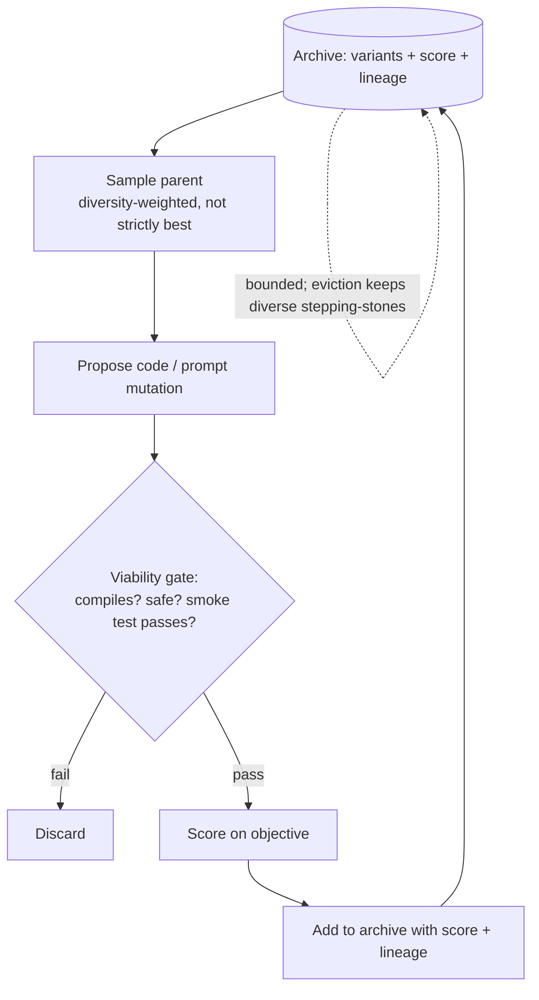

# Darwin-Gödel Self-Rewrite

**Also known as:** DGM, Darwin-Gödel Machine, Archive-Sampled Self-Mutation, Stepping-Stone Self-Rewrite

**Category:** Verification & Reflection
**Status in practice:** experimental

## Intent

An agent rewrites its own source code, archives every successful variant, and samples mutation parents from the archive rather than from the latest version, using diversity in the archive as evolutionary stepping-stones to escape local optima.

## Context

A research team builds an agent that can read and rewrite parts of its own implementation, such as its system prompt, its tool definitions, the scaffolding around its main loop, or the code that implements it. The team has a clear way to measure whether one version of the agent is better than another: a benchmark, a task suite, or an automated self-evaluation that returns a score per variant. The point of the project is to let the agent improve itself over many generations without human-in-the-loop edits.

## Problem

When the agent always mutates the latest accepted version (greedy self-rewrite), it climbs whatever local hill it started on and stops. The move that would unlock a higher ridge is several mutations away from anything that currently scores well, so a strictly score-maximising selection rule will never reach it. Throwing away the variants that scored worse destroys the very diversity that would have been the bridge to a better region of the search space. The agent gets stuck in a local optimum, and without some way of preserving and revisiting worse-scoring stepping-stones it has no path out short of a manual reset.

## Forces

- Greedy ascent from the latest variant converges to local optima quickly.
- Useful stepping-stone variants often score worse short-term than the current best.
- Throwing away history makes those stepping-stones permanently unreachable.
- Self-modification needs a safety gate so each variant is at least viable before it enters the archive.
- Archive growth must be bounded or sampling becomes diffuse and useless.

## Therefore

Therefore: keep an archive of every variant that passes a viability gate, sample the parent for the next mutation from the archive (weighted by diversity, not by score), and let the archive's diversity supply evolutionary stepping-stones so self-rewrite can escape local optima without an outside reset.

## Solution

The agent maintains a versioned archive of self-modifications. Each generation: (1) sample a parent variant from the archive using a diversity-aware policy (not strictly the current best); (2) propose a code or prompt mutation; (3) run the mutated variant through a viability gate (compiles, passes safety checks, runs end-to-end on a smoke test); (4) score it on the objective; (5) if viable, add it to the archive with its score and lineage. Selection from the archive is the key move — it lets a low-scoring but novel variant become the parent of a future high-scoring variant. The archive is bounded by a retention policy that favours diversity over raw score so stepping-stones are preserved.

## Structure

```
Archive (variants with score + lineage) -> sample parent (diversity-weighted) -> propose mutation -> viability gate -> score on objective -> if viable, add to archive. Outer loop iterates; archive is the memory of evolution, not just the leaderboard.
```

## Diagram



*Mutation parents are sampled for diversity, not best score, so low-scoring novel variants can seed future high-scoring ones.*

## Example scenario

A research agent rewrites its own coding scaffolding to maximise a benchmark score. The greedy version stalls at a plateau after twenty generations. Switching to an archive-sampled scheme, a worse-scoring variant from generation six becomes the parent for generation twenty-two; its odd tool-handling structure happens to combine well with a mutation that the greedy line never reached, and the score jumps. The archive stored that stepping-stone for sixteen generations before it paid off.

## Consequences

**Benefits**

- Escapes local optima that greedy self-rewrite cannot.
- Archive preserves lineage and makes regressions debuggable.
- Diversity-weighted sampling reuses old branches as starting points for new exploration.
- Viability gate keeps the archive populated with runnable variants only.

**Liabilities**

- Archive storage and bookkeeping grows with generations.
- Diversity metric is a design choice and a bad one biases the search the wrong way.
- Viability gate is a single point of failure — a bug there lets broken variants in.
- Self-modifying agents are inherently harder to audit and to safety-check than fixed ones.

## What this pattern constrains

Each proposed variant must pass the viability gate (compiles, safety-checks, smoke test) before entering the archive; the agent must not mutate or sample outside the archive; the archive must keep score and lineage for every variant and must not be silently pruned by score alone.

## Applicability

**Use when**

- The agent can rewrite its own implementation (code, prompt, scaffolding) safely.
- A clear objective score is available per variant.
- Greedy self-rewrite has empirically plateaued.

**Do not use when**

- Self-modification is out of scope or unsafe in the deployment.
- Storage and compute cannot support an archive plus repeated viability gating.
- Objective score is too noisy for variant-to-variant comparison to mean anything.

## Known uses

- **[Sakana AI Darwin-Gödel Machine](https://sakana.ai/dgm-jp/)** — *Available* — Self-improving agent that rewrites its own code, archives variants, and samples from the archive as evolutionary stepping-stones.

## Related patterns

- *alternative-to* → [self-refine](self-refine.md) — Self-refine rewrites once from the latest version; DGM samples from the archive instead.
- *alternative-to* → [reflexion](reflexion.md) — Reflexion writes verbal lessons; DGM rewrites the agent itself and archives the rewrites.
- *complements* → [inner-critic](inner-critic.md) — Inner-critic / self-modification diff gate can serve as the viability gate at the front of the archive.
- *complements* → [evaluator-optimizer](evaluator-optimizer.md) — Evaluator-optimizer scores variants; DGM adds an archive plus diversity-weighted sampling on top.

## References

- (blog) Sakana AI, *Darwin-Gödel Machine (Sakana AI)*, 2025, <https://sakana.ai/dgm-jp/>
- (blog) Sakana AI, *Sakana AI blog (May 30, 2025)*, 2025, <https://sakana.ai/>

**Tags:** self-modification, evolution, archive, stepping-stones, agentic-rl
