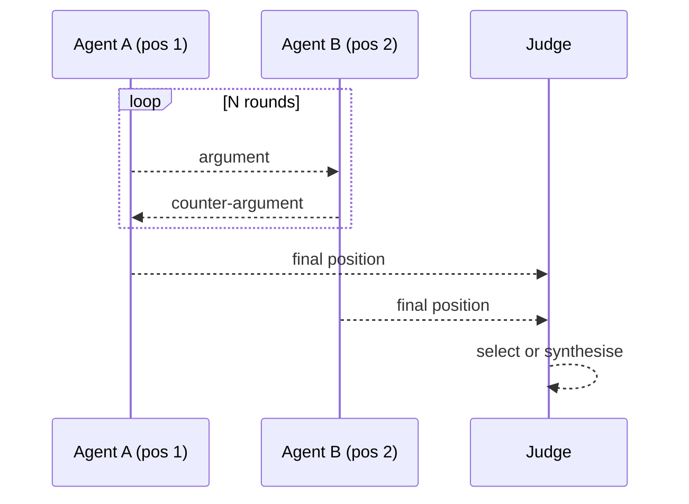

# Debate

**Also known as:** Multi-Agent Debate, Adversarial Debate

**Category:** Multi-Agent  
**Status in practice:** experimental

## Intent

Have multiple agents argue different positions on a question and converge through structured exchange.

## Context

A team is using agents on questions whose answers are genuinely contested or where the user explicitly wants to see the strongest case both for and against — should this firm adopt a particular open-source library, is this regulatory interpretation defensible, does this design choice hold up under scrutiny. The cost of a confidently wrong single answer is high enough to justify spending extra model calls.

## Problem

A single agent answering directly tends to hide its own reasoning blind spots: whatever case it considered first becomes the answer, and the counter-arguments never get articulated. Asking the same model to critique its own answer reinforces the original framing rather than challenging it, because both passes share the same priors. Without an explicit opposing voice, the team gets a confident answer with no view of what it might be missing.

## Forces

- Genuinely independent positions are hard to engineer with one model.
- Debate length must be bounded.
- A judge is needed to decide; the judge has its own biases.

## Therefore

Therefore: assign different agents to argue opposing positions over bounded rounds and let a judge resolve, so that counter-arguments are surfaced rather than reinforced by a single-model self-critique.

## Solution

Two or more agents are given different positions. They exchange arguments over N rounds. A judge agent (or a tie-break rule) selects the answer or synthesises a position from both.

## Example scenario

A policy-analysis agent answers 'should the firm adopt this open-source library?' with a confident yes that turns out to ignore a license incompatibility. Single-shot answers hide the reasoning the model didn't do. The team uses Debate: two agents argue opposing positions — one for adoption, one against — exchanging structured arguments for a fixed number of rounds, and a third agent reads the transcript and rules. The license question surfaces in the second round and changes the verdict.

## Diagram

## Consequences

**Benefits**

- Surfaces counterarguments the user can read.
- Higher answer quality on contested questions in benchmarks.

**Liabilities**

- N-x cost over single-agent.
- Position assignment is itself a prompt-engineering problem.

## What this pattern constrains

Each debater may only argue its assigned position until the judge step.

## Applicability

**Use when**

- Reasoning blind spots are reduced when multiple agents argue different positions.
- A judge agent or tie-break rule can converge the debate to a final answer.
- Multiple model calls per question are affordable for the lift in answer quality.

**Do not use when**

- Single-agent answers are already accurate enough and debate adds only cost.
- Agents collapse to agreement and the debate produces no new signal.
- No judge or tie-break mechanism exists and debates do not terminate cleanly.

## Known uses

- **Anthropic AI Safety via Debate research** — *Available*
- **MIT CSAIL multi-agent debate work** — *Available*

## Related patterns

- *alternative-to* → [inner-committee](inner-committee.md)
- *complements* → [self-consistency](self-consistency.md)
- *generalises* → [swarm](swarm.md)
- *alternative-to* → [infinite-debate](infinite-debate.md)
- *alternative-to* → [communicative-dehallucination](communicative-dehallucination.md)

## References

- (paper) Du, Li, Torralba, Tenenbaum, Mordatch, *Improving Factuality and Reasoning in Language Models through Multiagent Debate*, 2023, <https://arxiv.org/abs/2305.14325>
- (paper) Yue Liu, Sin Kit Lo, Qinghua Lu, Liming Zhu, Dehai Zhao, Xiwei Xu, Stefan Harrer, Jon Whittle, *Agent design pattern catalogue: A collection of architectural patterns for foundation model based agents* (2025) — https://doi.org/10.1016/j.jss.2024.112278

**Tags:** debate, multi-agent
