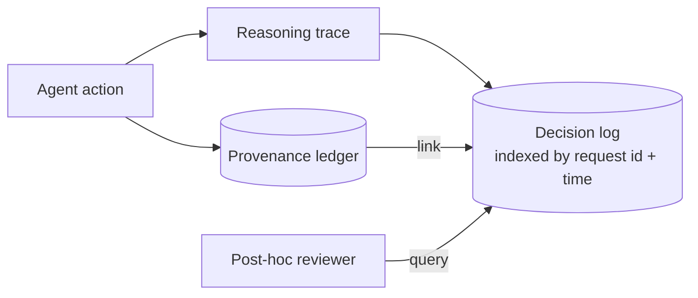

# Decision Log

**Also known as:** Reasoning Trace, Thought Trace

**Category:** Governance & Observability  
**Status in practice:** mature

## Intent

Persist the agent's reasoning trace alongside its actions so post-hoc review can explain why.

## Context

Audit and debugging both need access to what the agent considered, not just what it did.

## Problem

Action-only logs answer 'what' but not 'why'; debugging a wrong action requires the reasoning chain.

## Forces

- Reasoning traces are large.
- Sensitive content in reasoning may need redaction.
- Trace fidelity vs cost: full chain-of-thought, key decisions, summary?

## Solution

Persist reasoning at a chosen granularity (full trace, key decisions, or summary). Link each action in the provenance ledger to its trace. Indexed by request id and time for retrieval.

## Diagram

## Consequences

**Benefits**

- Debugging speed jumps; you see the why immediately.
- User-facing explanations become possible.

**Liabilities**

- Storage and privacy implications.
- Trace tampering (the agent rewriting its trace) defeats the purpose; append-only is needed.

## What this pattern constrains

Action records cannot be written without a corresponding decision-log entry.

## Applicability

**Use when**

- Action-only logs leave you unable to explain why the agent did something.
- Reasoning at some granularity (full trace, key decisions, summary) can be captured and stored cheaply.
- Post-hoc review or debugging routinely needs to consult the reasoning chain.

**Do not use when**

- Reasoning logs would be retained without any review process consulting them.
- Storage or compliance constraints forbid retaining the reasoning trace.
- The agent is so simple that the action alone implies the reasoning.

## Known uses

- **Sparrot** — *Available*. Thought stream + ledger linkage.
- **Langfuse / LangSmith trace stores** — *Available*

## Related patterns

- *generalises* → [provenance-ledger](provenance-ledger.md)
- *uses* → [append-only-thought-stream](append-only-thought-stream.md)
- *alternative-to* → [black-box-opaqueness](black-box-opaqueness.md)
- *used-by* → [replay-time-travel](replay-time-travel.md)
- *used-by* → [agent-as-judge](agent-as-judge.md)
- *complements* → [attention-manipulation-explainability](attention-manipulation-explainability.md)
- *complements* → [self-archaeology](self-archaeology.md)
- *complements* → [memo-as-source-confusion](memo-as-source-confusion.md)
- *complements* → [interrupt-resumable-thought](interrupt-resumable-thought.md)
- *complements* → [intra-agent-memo-scheduling](intra-agent-memo-scheduling.md)
- *complements* → [echo-recognition](echo-recognition.md)

## References

- (doc) *Langfuse docs*, <https://langfuse.com/docs>

**Tags:** observability, trace, debug
