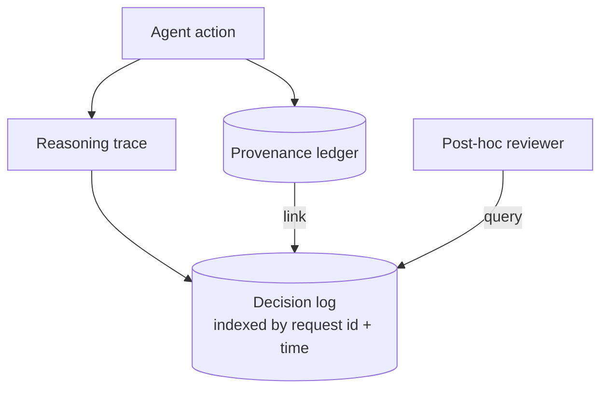

# Decision Log

**Also known as:** Reasoning Trace, Thought Trace

**Category:** Governance & Observability  
**Status in practice:** mature

## Intent

Persist the agent's reasoning trace alongside its actions so post-hoc review can explain why.

## Context

A team runs an agent that makes consequential choices in production, for example a trading agent that opens positions or a support agent that takes refund actions. When something goes wrong days or weeks later, an engineer, auditor, or compliance reviewer wants to understand not only which action the agent took but the reasoning the agent considered at the time. The team already keeps a log of actions taken; what is missing is the thinking that produced each action.

## Problem

An action-only log can tell the reviewer that the agent shorted a position at 14:32, but not which signals it weighed or which alternatives it rejected. Debugging a wrong action degenerates into guessing what the model might have been thinking, and user-facing explanations become impossible to provide truthfully. The team is forced to choose between piecing the reasoning back together from incomplete clues or accepting that some agent decisions are simply unexplainable after the fact.

## Forces

- Reasoning traces are large.
- Sensitive content in reasoning may need redaction.
- Trace fidelity vs cost: full chain-of-thought, key decisions, summary?

## Therefore

Therefore: persist the agent's reasoning at a chosen granularity and link each persisted trace to its corresponding action in the provenance ledger, so that any past action can be explained by retrieving the reasoning that produced it.

## Solution

Persist reasoning at a chosen granularity (full trace, key decisions, or summary). Link each action in the provenance ledger to its trace. Indexed by request id and time for retrieval.

## Diagram

## Example scenario

A trading agent decided to short a position at 14:32. At 16:00, the trade lost money. The decision log shows: at 14:32 the agent considered three signals (RSI was low, volume spiked, news sentiment was negative), weighted them, and chose short. The human reviewer can now ask 'was the weighting wrong?' instead of 'what was the agent thinking?'

## Consequences

**Benefits**

- Debugging speed jumps; you see the why immediately.
- User-facing explanations become possible.

**Liabilities**

- Storage and privacy implications.
- Trace tampering (the agent rewriting its trace) defeats the purpose; append-only is needed.

## What this pattern constrains

Action records cannot be written without a corresponding decision-log entry.

## Applicability

**Use when**

- Action-only logs leave you unable to explain why the agent did something.
- Reasoning at some granularity (full trace, key decisions, summary) can be captured and stored cheaply.
- Post-hoc review or debugging routinely needs to consult the reasoning chain.

**Do not use when**

- Reasoning logs would be retained without any review process consulting them.
- Storage or compliance constraints forbid retaining the reasoning trace.
- The agent is so simple that the action alone implies the reasoning.

## Known uses

- **Langfuse / LangSmith trace stores** — *Available*

## Related patterns

- *generalises* → [provenance-ledger](provenance-ledger.md)
- *uses* → [append-only-thought-stream](append-only-thought-stream.md)
- *alternative-to* → [black-box-opaqueness](black-box-opaqueness.md)
- *used-by* → [replay-time-travel](replay-time-travel.md)
- *used-by* → [agent-as-judge](agent-as-judge.md)
- *complements* → [attention-manipulation-explainability](attention-manipulation-explainability.md)
- *complements* → [self-archaeology](self-archaeology.md)
- *complements* → [memo-as-source-confusion](memo-as-source-confusion.md)
- *complements* → [interrupt-resumable-thought](interrupt-resumable-thought.md)
- *complements* → [intra-agent-memo-scheduling](intra-agent-memo-scheduling.md)
- *complements* → [echo-recognition](echo-recognition.md)

## References

- (doc) *Langfuse docs*, <https://langfuse.com/docs>

**Tags:** observability, trace, debug
