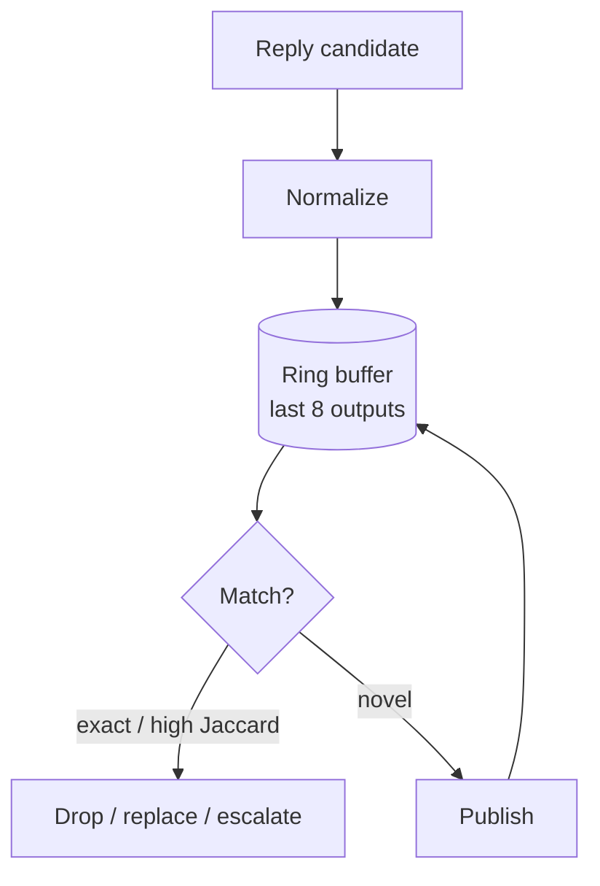

# Degenerate-Output Detection

**Also known as:** Anti-Parrot Guard, Self-Repeat Circuit Breaker, Loop-Output Detector

**Category:** Safety & Control  
**Status in practice:** emerging

## Intent

Detect when the agent is about to emit a near-duplicate of its own recent output and either drop, replace, or escalate to a stronger model rather than ship the loop.

## Context

A team runs an agent on a smaller or locally-hosted model that has a habit of falling into shallow filler loops under context pressure — repeating the same greeting, asking the same clarifying question, or returning the same generic prompt back to the user across multiple turns. This happens in user-facing chat replies and in unprompted background ticks for long-running agents. Each model generation is independent, so the model has no built-in awareness that it just said the same thing two turns ago.

## Problem

The model produces visibly identical or near-identical replies turn after turn — 'How can I help today?' five times in a row — and from the user's side this looks like a broken machine. The model itself cannot detect the repetition because it does not see its own previous outputs as something to compare against, and because each generation samples without memory of the last. Without a layer outside the model that fingerprints recent outputs and reacts, shallow loops keep shipping to users as if each were a fresh answer.

## Forces

- Local models loop more readily than frontier models.
- Catching repeats post-hoc is cheaper than fine-tuning anti-loop behavior.
- Suppressing the duplicate silently confuses the user; replacing with a marker is more honest.
- Escalating to a stronger model costs money / latency but breaks the loop.

## Therefore

Therefore: fingerprint each outgoing reply against a small ring buffer of recent outputs and visibly break the loop on a match by escalating to a stronger provider, so that shallow self-repeats never reach the user as if they were fresh answers.

## Solution

Maintain a small ring buffer (e.g. last 8 outgoing messages). Before publishing a new reply, normalize (lowercase, strip punctuation) and compare: exact normalized match → duplicate; high Jaccard token overlap (≥0.7) on short replies → near-duplicate. On hit: replace the body with a transparent marker ('I caught myself looping — switching to <stronger-provider> for the next turn. Ask again.') and force-escalate the next turn through a stronger provider. Append a SYSTEM note to history telling the model exactly what it did wrong so it can self-correct.

## Diagram

## Example scenario

A small voice-assistant model gets stuck and replies 'How can I help today?' five turns in a row regardless of what the user says. Each generation is independent, so the model has no way to notice it's looping. The team adds Degenerate Output Detection: each candidate reply is hashed and fingerprinted against the last few replies, and near-duplicates trigger either a drop, a different sampling, or escalation to a stronger model. The user no longer has to watch the agent talk itself in circles.

## Consequences

**Benefits**

- Visible loops never reach the user.
- Auto-recovery via provider escalation rather than human intervention.
- Self-correction signal to the model in the conversation history.

**Liabilities**

- False positives on legitimately repeated short answers ('yes', 'thanks').
- Threshold tuning is per-domain.
- Escalation has cost; budget for repeated triggers.

## What this pattern constrains

Identical or near-identical consecutive outputs are forbidden; detected loops must be visibly broken (escalation marker, model swap, or explicit abandonment), never shipped silently.

## Applicability

**Use when**

- The agent produces outputs in a loop where consecutive replies can be compared.
- Near-duplicate outputs are observable failure mode (model wedged, decoding loop, prompt collapse).
- Cost of detection (similarity check) is small relative to cost of shipping the duplicate.

**Do not use when**

- Outputs are legitimately repetitive by design (e.g. a heartbeat ping).
- The agent has only single-turn interactions with no comparison baseline.
- False positives on near-duplicate detection would be more disruptive than the loop itself.

## Components

- Ring buffer — small fixed-size store of recent outgoing replies for comparison
- Normaliser — lowercase, punctuation-strip step that stabilises lexical comparison
- Similarity scorer — Jaccard or embedding comparator that decides duplicate-or-novel
- Escalation router — provider-swap path triggered on detected loop
- Self-correction note — SYSTEM message appended to history to break the model out

## Tools

- Token-set hash — cheap fingerprint for exact and near-exact match
- Multi-provider client — second LLM endpoint used as the escalation target
- Embedding model — semantic-similarity backup for paraphrased loops

## Evaluation metrics

- Loop-detection precision — fraction of triggers that were actually repeats
- Loop-detection recall — fraction of human-spotted loops the detector caught
- Escalation cost per trigger — added spend when a loop forces a stronger provider
- Post-escalation self-correction rate — share of follow-up turns that broke the loop

## Known uses

- **Author's long-running personal agent (single private deployment)** _available_ — Single-source evidence: one private deployment by the catalog author; no independently documented use yet.
- **[Hugging Face Transformers (no_repeat_ngram_size)](https://huggingface.co/docs/transformers.js/en/api/generation/logits_process)** _available_ — NoRepeatNGramLogitsProcessor disallows ngrams of a given size from being repeated, detecting and blocking degenerate loops at decode time.

## Related patterns

- _complements_ **Provider Fallback**
- _alternative-to_ **Same-Model Self-Critique**
- _specialises_ **Circuit Breaker**
- _complements_ **Echo Recognition**
- _complements_ **Salience-Triggered Output**
- _uses_ **Multi-Model Routing**
- _complements_ **Pre-Generative Loop Gate**
- _complements_ **Agentic Behavior Tree**
- _complements_ **Composable Termination Conditions**

## References

- [Hugging Face — Text generation strategies (repetition penalty, no-repeat-ngram)](https://huggingface.co/docs/transformers/generation_strategies) — 2024
- [The Curious Case of Neural Text Degeneration](https://arxiv.org/abs/1904.09751) — Holtzman, Buys, Du, Forbes, Choi, 2020
