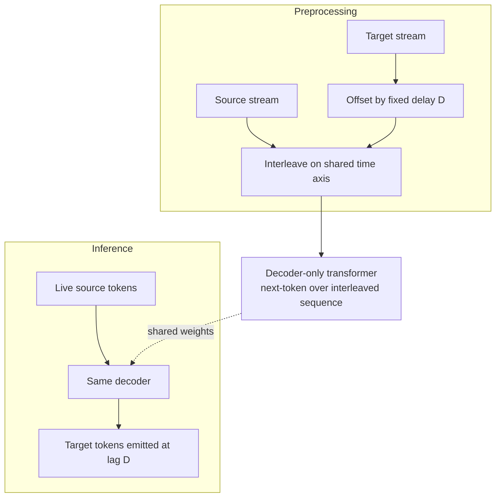

# Delayed Streams Modeling

**Also known as:** DSM, Modélisation à flux décalés, Time-Aligned Stream Decoder, Single-Decoder Speech Agent

**Category:** Streaming & UX
**Status in practice:** emerging

## Intent

Convert streaming X-to-Y tasks (speech-to-text, text-to-speech, simultaneous translation, full-duplex dialogue) into a single decoder-only autoregressive problem by time-aligning the parallel streams with a fixed offset in preprocessing, eliminating the learned read/write policy required by cascade systems.

## Context

Low-latency speech agents and simultaneous-translation systems. Traditional pipelines cascade STT, an LLM, and TTS, which introduces per-stage latency and brittle handoffs. Simultaneous-translation systems add a learned read/write policy to decide when to emit output given incoming input — itself an extra training problem with reward-shaping issues.

## Problem

Cascade speech pipelines accumulate latency and break under interruption; the LLM has to wait for STT to finalize before it can think, and TTS has to wait for the LLM to finish. Simultaneous-translation systems try to solve this with a learned read/write policy, but the policy is hard to train, sensitive to delay tuning, and adds yet another model. None of these architectures naturally support full-duplex dialogue where both sides speak and listen concurrently.

## Forces

- Streaming low-latency speech requires emitting output before input is finished.
- Cascade architectures accumulate latency across stages.
- Learned read/write policies are extra training problems with their own failure modes.
- A single decoder-only model is simpler to train and deploy than a cascade.
- Time-alignment between streams (e.g. translated speech lagging source speech by a fixed offset) can be enforced in preprocessing instead of learned at inference.

## Therefore

Therefore: time-align the input and output streams with a fixed offset during data preprocessing and train one decoder-only model that autoregressively predicts the offset-aligned target stream from the source stream, collapsing read/write policy into pure positional structure.

## Solution

In preprocessing, represent each training example as parallel token streams (source and target) interleaved on a shared time axis, with the target stream offset by a fixed delay (the chosen latency budget, e.g. 1-3 seconds for translation, ~80ms for full-duplex dialogue). Train a standard decoder-only transformer to autoregressively predict the next interleaved token. At inference, feed source tokens as they arrive and read off target tokens at the offset position — no learned policy decides when to emit, the offset structure does. The same architecture handles speech-to-text (text stream offset behind audio), text-to-speech (audio stream offset behind text), simultaneous translation (target language offset behind source), and full-duplex dialogue (each speaker's stream offset behind the joint conversation).

## Structure

```
Preprocessing: source stream || target stream offset by D tokens, interleaved on shared time axis. Training: single decoder-only model, next-token prediction over interleaved sequence. Inference: source tokens stream in, target tokens stream out at fixed lag D. No separate STT, LLM, TTS, or read/write policy.
```

## Diagram



*Fixed-offset interleaving turns streaming speech into a single next-token problem with no learned read/write policy.*

## Example scenario

A simultaneous translator app needs French speech out within two seconds of English speech in, on-device. The team trains a single delayed-streams decoder with target French audio offset 2s behind source English audio. At inference the user speaks; French tokens stream out two seconds later from the same model — no separate STT, no separate LLM, no learned read/write policy. The same architecture, retrained with a tiny offset and both speakers' audio as parallel streams, powers their full-duplex dialogue assistant.

## Consequences

**Benefits**

- Single model replaces a cascade; one training pipeline, one deployment target.
- Latency is a preprocessing knob, not a learned behaviour — easy to tune.
- Naturally supports full-duplex (both sides as parallel offset streams).
- Eliminates learned read/write policy and its failure modes.
- Stream alignment is interpretable: the offset is the latency.

**Liabilities**

- Requires time-aligned paired data, which is hard to obtain for some language pairs and modalities.
- Fixed offset means latency cannot adapt to easy vs hard segments — a learned policy could.
- Single model couples STT, LLM, and TTS quality; weakness in one role is hard to isolate.
- Long-context behavioural shaping (instruction-following, refusals) is less clean than in a separate LLM stage.
- Architecture commits to streaming use; batch tasks gain little from the offset structure.

## What this pattern constrains

The model must not predict output tokens ahead of the configured offset — emission position is structural, not learned. The architecture forbids inserting a separate read/write policy or cascade stage; the offset is the policy.

## Applicability

**Use when**

- Latency budget is tight (sub-second to few-second).
- Task is naturally a stream-to-stream transduction (speech, translation, dialogue).
- Time-aligned paired data is available or can be synthesized.
- Cascade complexity (STT+LLM+TTS) is dominating engineering cost or latency.

**Do not use when**

- Task is batch-shaped (transcribe a finished audio file).
- Paired time-aligned data is unobtainable.
- Per-stage modularity (swap the LLM independently) is a hard requirement.
- Variable per-segment latency (longer pause on hard sentences) is needed; fixed offset cannot do this.

## Known uses

- **[Kyutai Moshi](https://kyutai.org/)** — *Available* — Full-duplex spoken dialogue model trained as a delayed-streams decoder.
- **[Kyutai Hibiki](https://kyutai.org/)** — *Available* — Simultaneous speech-to-speech translation via DSM.
- **[Kyutai Unmute](https://kyutai.org/)** — *Available* — Real-time speech interaction stack on DSM.

## Related patterns

- *alternative-to* → [streaming-typed-events](streaming-typed-events.md) — Streaming-typed-events is a transport-layer SSE pattern; DSM is a model-architecture pattern that produces streamable output.
- *alternative-to* → [multilingual-voice-agent](multilingual-voice-agent.md) — Cascade STT->LLM->TTS vs single-decoder offset streams; DSM trades modularity for latency and simplicity.

## References

- (paper) Kyutai Labs, *Delayed Streams Modeling*, 2025, <https://arxiv.org/abs/2509.08753>
- (blog) Kyutai, *Simultaneous, on-device, high fidelity speech-to-speech translation with Hibiki*, 2025, <https://kyutai.org/>
- (repo) Kyutai Labs, *delayed-streams-modeling*, 2025, <https://github.com/kyutai-labs/delayed-streams-modeling>

**Tags:** streaming, speech, low-latency, translation, full-duplex, architecture
