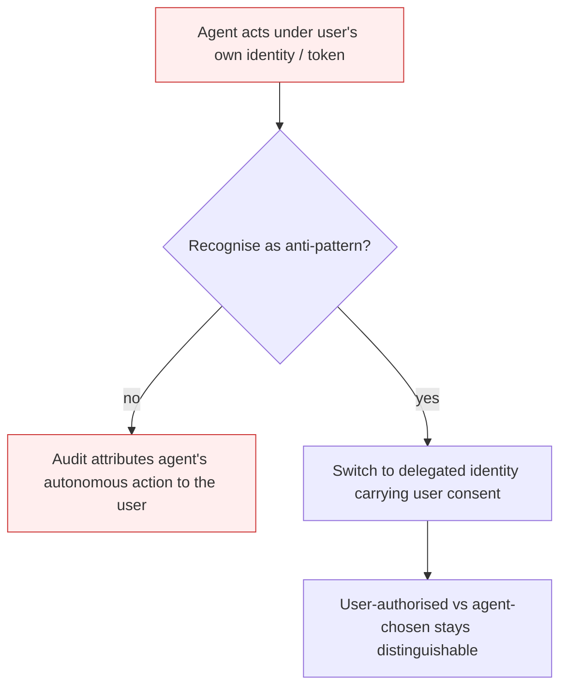

# Identity Impersonation

**Also known as:** Delegation Not Impersonation, Agent Impersonation

**Category:** Anti-Patterns  
**Status in practice:** deprecated

## Intent

Anti-pattern: let the agent act under the principal's own full identity and token, so every action it takes is recorded as the principal's and audit cannot separate user-initiated from agent-autonomous decisions.

## Context

An agent acts for a user against systems that enforce access control. The fastest way to give it authority is to hand it the user's own session token or credentials, because the downstream services already trust that identity and no new identity has to be issued. The agent then presents on the network exactly as the user, with all of the user's permissions, and the team treats this as a working delegation mechanism.

## Problem

When the agent assumes the user's full identity, it inherits every permission the user holds, far beyond the slice the task needs, and the downstream service has no way to tell that an agent and not the user is acting. Each action lands in the audit log attributed to the user, so a reviewer reading the log sees that the user placed the order or moved the funds, when in fact the agent chose that step autonomously from a goal the user only stated loosely. The distinction between what the user explicitly authorised and what the agent decided on its own collapses into one identity, and when the agent calls further agents downstream the whole chain disappears into that single borrowed identity, leaving no trace of the agent's own reasoning.

## Forces

- Passing the user's existing token is the path of least resistance because downstream services already trust that identity.
- Issuing the agent its own identity that still proves the user consented requires delegation infrastructure that is harder to stand up.
- Audit captures the identity presented at the call, not the actor that originated the decision behind it.
- A single borrowed identity carries the user's full permissions, far more than any one task requires.

## Therefore

Therefore: give the agent a distinct identity of its own that carries a verifiable claim of the user's consent to the goal, so each action is attributable to the agent acting for the user rather than indistinguishable from the user themselves.

## Solution

Don't. Replace impersonation with delegation: have the agent act under its own identity that carries a delegation claim naming the consenting principal, via an on-behalf-of token exchange (delegated-agent-authorization), so a downstream service and a later audit can always see both the user who authorised the goal and the agent that chose the implementation. Pair it with a task-bounded agent identity class (ephemeral-agent-identity) so the agent's self is never the user's self, and scope the delegated authority to the task rather than copying the user's full permissions.

## Diagram

*Borrowing the user's identity collapses attribution; a distinct agent identity carrying delegated consent keeps user intent and agent decision separable.*

## Example scenario

A procurement agent is told 'keep the team stocked with laptops' and is handed the user's own SSO token to act with. It decides on its own to order fifty MacBook Pros from a supplier. The purchasing system records the order as placed by the user, and the approval workflow waves it through because the user has buying authority. Weeks later the user disputes the order, but the audit log shows only 'user placed order' with no evidence that an agent chose the quantity or the supplier, so the action cannot be traced to the agent's reasoning.

## Consequences

**Liabilities**

- Every agent action is logged as the user's, so audit cannot distinguish user-initiated actions from the agent's autonomous decisions.
- The agent inherits the user's full permissions, violating least privilege by construction.
- A multi-hop agent chain collapses into one borrowed identity, erasing any trace of which agent did what.
- Disputes and incident response stall because no record attributes a contested action to the agent rather than the user.

## Failure modes

- Attribution collapse — the audit log reads 'the user did it' for actions the agent chose autonomously, and the difference cannot be recovered.
- Permission inheritance — the agent silently gains every permission the user holds, so a prompt-injected or buggy agent can do anything the user could.
- Chain erasure — downstream agents called under the same borrowed token leave no record of their own identity or reasoning.
- Non-repudiation loss — the user cannot disown an action the agent took, because the system has no evidence it was the agent and not the user.

## What this pattern constrains

No useful constraint; the missing constraint is that the agent must never present the principal's own identity and must instead act under a distinct identity carrying the principal's delegated consent.

## Applicability

**Use when**

- Never. Cite when reviewing how an agent authenticates on a user's behalf.
- Replace with delegated, scoped tokens carried under the agent's own identity.
- Stamp every action with both the consenting principal and the acting agent so audit can separate them.

**Do not use when**

- Any agent that takes privileged actions for a user and must be auditable per actor.
- Any agent that authorises the high-level goal but chooses implementation steps autonomously.
- Any multi-agent chain where each hop's actions must remain attributable.

## Components

- Borrowed principal identity — the user's own token or credential the agent presents as its own
- Downstream service — trusts the presented identity and cannot tell user from agent
- Audit log — records the borrowed identity, so every action reads as the user's
- Missing delegation claim — the on-behalf-of assertion that would name the agent acting for the consenting user
- Missing distinct agent identity — the agent's own non-human identity that should carry the user's consent instead of replacing it

## Tools

- Session token / credential pass-through — the surface that hands the user's identity to the agent
- Token exchange endpoint (RFC 8693) — the missing layer that would mint a delegated token under the agent's identity
- Per-actor audit aggregator — the missing log layer that would attribute actions to the agent and the consenting user separately

## Evaluation metrics

- Impersonated-action rate — share of agent actions taken under the user's own identity rather than a delegated one
- Attribution separability — fraction of logged actions where user-authorised and agent-chosen can be told apart
- Permission-inheritance gap — discrepancy between the task's needs and the full user permissions the agent borrows
- Delegation-claim coverage — share of agent actions carrying a verifiable on-behalf-of consent claim

## Known uses

- **[Red Hat Emerging Technologies — zero-trust agent identity](https://next.redhat.com/2026/05/21/zero-trust-for-ai-agents-why-delegation-beats-impersonation/)** _available_ — Names impersonation as the dangerous default in which 'the agent assumes your full identity, inherits all your permissions, and operates as if it were you', and warns that downstream agent calls make 'the audit trail disappear into a single identity'.
- **[Christian Posta — agent identity impersonation vs delegation](https://blog.christianposta.com/agent-identity-impersonation-or-delegation/)** _available_ — Walks through an order-placement example where impersonation produces the audit row 'Christian placed order for 50 MacBook Pros' for a step the agent decided autonomously; the delegation fix preserves that 'the user authorized the goal; the agent chose the implementation'.

## Related patterns

- _alternative-to_ **Delegated Agent Authorization** — Scoped on-behalf-of delegation under the agent's own identity is the positive model this impersonation anti-pattern fails to use.
- _alternative-to_ **Ephemeral Agent Identity** — Giving the agent its own task-bounded identity class is the cure for treating the agent's self as the user's self.
- _complements_ **Agent Privilege Escalation** — Both are attribution failures: escalation widens the agent past its own identity via tool/service identities, while impersonation collapses the agent onto the user's identity; either way the audit row points at the wrong actor.
- _complements_ **Authorized Tool Misuse** — An impersonating agent misuses authority that was never scoped to it because it borrowed the user's full permissions.

## References

- [Zero trust for AI agents: why delegation beats impersonation](https://next.redhat.com/2026/05/21/zero-trust-for-ai-agents-why-delegation-beats-impersonation/) — Pavel Anni, 2026
- [Agent Identity - Impersonation or Delegation?](https://blog.christianposta.com/agent-identity-impersonation-or-delegation/) — Christian Posta, 2025
- [OAuth 2.0 Token Exchange (RFC 8693)](https://datatracker.ietf.org/doc/html/rfc8693) — 2020
