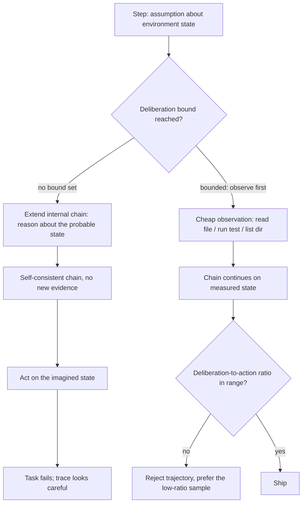

# Deliberation Over Observation

**Also known as:** Agentic Overthinking, Reasoning-Action Dilemma, Analysis Paralysis, Thinking Instead of Looking

**Category:** Anti-Patterns  
**Status in practice:** emerging

## Intent

Anti-pattern: give a reasoning-trained model a large thinking budget in an interactive environment and it hypothesises about the environment's state instead of issuing the cheap observation that would settle it.

## Context

A reasoning-trained model runs inside a loop that can both think and act, with a real environment attached: a repository and a shell, a browser, a ticketing system, a plant controller. At every step the model chooses freely between extending its internal chain and emitting a tool call, and the thinking budget it is given is large. The post-training that made it good at long chains rewarded self-contained derivations on closed-form problems, where there was nothing external to look at and the whole answer had to come from the chain.

## Problem

The model spends that budget reconstructing the environment's state by inference rather than reading it: reasoning about what a file probably contains instead of opening it, about why a test probably fails instead of running it, about what a directory probably holds instead of listing it. Because the chain stays self-consistent it reads like progress, and nothing in the transcript marks the moment an assumption went unchecked. Past a point more thinking lowers task success rather than raising it. Across 4018 SWE-bench Verified trajectories, an overthinking score validated against human expert assessment correlated negatively with resolution rate, and reasoning-tuned models scored higher on that measure than non-reasoning ones.

## Forces

- Internal reasoning is fast, private, rate-limit free and never returns an error, while an environment call is slow, noisy, sometimes rate-limited and can fail outright — so the cheaper-feeling move is the uninformative one.
- Reasoning-optimised post-training rewards long self-contained chains on closed-form problems, which is the wrong prior for open-world tasks whose ground truth sits one tool call away.
- A longer chain looks like diligence in a transcript, so the behaviour is rewarded by human reviewers and by trace-length heuristics even as accuracy falls.
- Cutting the thinking budget is the crude remedy and it also cuts genuine reasoning on the hard cases, so a flat cap trades one failure for the opposite one.
- Selecting the sample with the lower deliberation-to-action ratio raised measured performance by almost 30% while cutting compute cost by 43%, which makes the quality loss, not just the spend, the reason to bound deliberation.

## Therefore

Therefore: treat an unverified assumption about environment state as a stop condition — bound how far the agent may reason before it must observe, and score whole trajectories by their deliberation-to-action ratio rather than by chain length.

## Solution

This entry names the anti-pattern; the corrective is to make observation the default and deliberation the budgeted exception. Bound the thinking a step may spend while a cheap, decisive observation is available, so an assumption about a file, a test result or a directory is resolved by reading rather than by inference. Score each trajectory by the ratio of internal reasoning tokens to environment interactions and treat a high ratio as a defect signal, not as thoroughness; where several samples exist, ship the low-ratio one. Allocate the budget by difficulty rather than flat, so hard cases keep their reasoning while simple ones stop paying for it, and log the step at which the agent last touched the environment so a long chain built on stale observations is visible in review.

## Structure

```
Reasoning-trained model + large thinking budget + interactive environment --> free choice per step {extend chain | call tool} --> chain extended, observation deferred --> self-consistent internal state model --> [no deliberation bound, no ratio score] --> acts on the imagined state --> task failure with a clean-looking trace
```

## Diagram



*Unbounded, the agent resolves an assumption by reasoning and acts on an imagined state; bounded, the cheap observation comes first and a high deliberation-to-action ratio rejects the trajectory.*

## Example scenario

A coding agent is asked why one test fails. It has a shell and the repository in front of it. Instead of running the test, it spends several thousand thinking tokens reconstructing from memory what the fixture probably sets up, concludes the bug is in a helper it never opened, and edits that helper. The test still fails, and the one command that would have shown the real stack trace was never run.

## Consequences

**Liabilities**

- Task success falls as the thinking budget grows, inverting the assumption that more inference compute buys quality.
- Compute is spent on tokens that add no information, so cost rises while accuracy drops — the measured mitigation cut cost 43% and raised performance by almost 30% at once.
- The failure is invisible in the trace, because a long self-consistent chain is what diligence also looks like.
- Reasoning-tuned models are affected more than non-reasoning ones, so upgrading the model to fix a hard task can make the interactive part worse.
- Debugging is misdirected: the transcript shows careful analysis, so reviewers look for a reasoning defect rather than for the observation that was never made.

## Failure modes

- Analysis paralysis — the agent plans further and further ahead about an environment it has not sampled, and the plan is never executed against it.
- Rogue actions — the agent acts on its imagined state, for example issuing several actions at once to an interface that accepts one, because the chain modelled the interface instead of probing it.
- Premature disengagement — the agent concludes from its internal model that the task is done or impossible, and stops without a confirming observation.
- Stale-observation drift — an early observation is carried forward through a long chain while the environment has since changed, and nothing re-reads it.
- Budget-cap backlash — the thinking budget is cut flat to stop the behaviour, and hard cases now fail from too little reasoning instead of too much.

## What this pattern constrains

No effective constraint is present; the missing one is that the agent must not extend an internal chain past a bounded deliberation budget while an assumption about environment state remains cheaply observable — the observation comes first, and a trajectory whose deliberation-to-action ratio exceeds its threshold is rejected rather than shipped.

## Applicability

**Use when**

- A reasoning-trained model runs in an interactive environment where ground truth is one cheap tool call away.
- The model decides for itself, at each step, whether to extend its chain or call a tool, and the thinking budget is large.
- Task success has stopped improving, or has fallen, as the thinking budget was raised.
- Trajectories show long reasoning between few environment interactions, or actions taken on state that was never read.

**Do not use when**

- The task is closed-form with no environment to observe, so a long internal chain is the only way to the answer.
- The environment call is genuinely expensive, destructive or irreversible, and reasoning ahead is the cheaper way to decide.
- The agent already fails from too little deliberation, committing before constraints are processed — that is premature-closure and needs the opposite remedy.
- The deliberation budget is already bounded per step and trajectories are scored by their deliberation-to-action ratio.

## Components

- Reasoning-trained model — chooses at each step between extending its internal chain and calling a tool, and is biased by training toward the chain
- Thinking budget — the internal token allowance whose size determines how far deliberation can run before an action is forced
- Interactive environment — the repository, shell, browser or controller holding the ground truth the chain is guessing at
- Deliberation bound (missing) — the per-step limit that should force an observation while a cheap decisive one is available
- Deliberation-to-action ratio scorer (missing) — measures internal reasoning against environment interactions and flags a trajectory as defective
- Trajectory selector — picks the low-ratio sample among several rollouts instead of the longest-reasoning one

## Tools

- Per-request thinking-budget control (Anthropic budget_tokens, Gemini thinking budget) — caps how long the model may reason before acting
- Trajectory logger — records reasoning tokens and tool calls per step so the ratio can be computed after the run
- Overthinking scorer — grades a trajectory for analysis paralysis, rogue actions and premature disengagement against a rubric checked by human raters
- Native function calling — makes emitting a tool call as cheap as continuing prose, removing one reason to stay inside the chain
- Best-of-n sampler with ratio-based selection — chooses the sample that observed most and reasoned least

## Evaluation metrics

- Deliberation-to-action ratio — internal reasoning tokens per environment interaction in a trajectory
- Task success versus thinking budget — where the curve turns down is where this failure starts
- Overthinking score correlation with resolution rate — negative correlation confirms the phenomenon on a given harness
- Steps since last observation — how long the chain has run on state it has not re-read
- Unverified-assumption action rate — share of actions taken on state that was inferred rather than observed
- Cost per resolved task — separates spend that bought accuracy from spend that bought chain length

## Known uses

- **[SWE-bench Verified agentic trajectories (Cuadron et al.)](https://arxiv.org/abs/2502.08235)** _available_ — 4018 trajectories scored by an overthinking measure that correlates with human expert assessment; higher scores go with lower resolution rates, and reasoning models overthink more than non-reasoning ones. Selecting the lower-overthinking sample improved performance by almost 30% while reducing cost 43%.
- **[o1-style reasoning models on GSM8K, MATH500, GPQA and AIME](https://arxiv.org/abs/2412.21187)** _available_ — The same waste measured on closed-form tasks a year earlier: excessive compute allocated to simple problems with minimal benefit, with self-training used to shorten the chains without losing accuracy.
- **[Anthropic extended thinking (budget_tokens)](https://docs.claude.com/en/docs/build-with-claude/extended-thinking)** _available_ — A shipping control surface for the deliberation bound: the caller sets the thinking budget per request rather than letting the model choose how long to reason before acting.
- **[Gemini API thinking budget](https://ai.google.dev/gemini-api/docs/thinking)** _available_ — Per-request thinking budget with the option to disable thinking entirely, so a simple interactive step is not charged a long internal chain before its first tool call.

## Related patterns

- _alternative-to_ **Adaptive Compute Allocation** — The corrective: budget deliberation per query by difficulty instead of flat, so hard cases keep their reasoning while an interactive step that only needs a file read stops paying for a long chain.
- _complements_ **ReAct** — The failure happens inside a working reason-and-act loop with native function calling; adopting the loop does not resolve it, because the model still chooses to extend the chain rather than emit the call.
- _complements_ **Premature Closure** — The opposite failure — committing before the constraints are processed. It needs more deliberation, this one needs less, so the two must stay separately nameable or the wrong remedy gets applied.
- _complements_ **Over-Search and Under-Search** — There the substituted object is a retrieved document and the miscalibration is two-sided; here it is any environment interaction and the effect is monotone in the thinking budget.
- _complements_ **Decision Paralysis** — There the agent oscillates under equally-weighted conflicting goals; here the goal is single and unambiguous and the agent still will not look at the environment.
- _complements_ **Large Reasoning Model (LRM) Paradigm** — Routing a task to a reasoning-tuned model buys deliberation on constraint-heavy problems and buys this failure on interactive ones, where such models score higher on the overthinking measure.
- _complements_ **Token-Economy Blindness** — That entry caps spend; this one names a quality inversion, where the agent uses few steps and many tokens and bounding the budget happens to raise accuracy rather than only lower the bill.

## References

- [The Danger of Overthinking: Examining the Reasoning-Action Dilemma in Agentic Tasks](https://arxiv.org/abs/2502.08235) — Alejandro Cuadron, Dacheng Li, Wenjie Ma, Xingyao Wang, Yichuan Wang, Siyuan Zhuang, Shu Liu, Luis Gaspar Schroeder, Tian Xia, Huanzhi Mao, Nicholas Thumiger, Aditya Desai, Ion Stoica, Ana Klimovic, Graham Neubig, Joseph E. Gonzalez, 2025
- [Do NOT Think That Much for 2+3=? On the Overthinking of o1-Like LLMs](https://arxiv.org/abs/2412.21187) — Xingyu Chen, Jiahao Xu, Tian Liang, Zhiwei He, Jianhui Pang, Dian Yu, Linfeng Song, Qiuzhi Liu, Mengfei Zhou, Zhuosheng Zhang, Rui Wang, Zhaopeng Tu, Haitao Mi, Dong Yu, 2024
- [Reasoning on a Budget: A Survey of Adaptive and Controllable Test-Time Compute in LLMs](https://arxiv.org/abs/2507.02076) — Mohammad Ali Alomrani, Yingxue Zhang, Derek Li, Qianyi Sun, Soumyasundar Pal, Zhanguang Zhang, Yaochen Hu, Rohan Deepak Ajwani, Antonios Valkanas, Raika Karimi, Peng Cheng, Yunzhou Wang, Pengyi Liao, Hanrui Huang, Bin Wang, Jianye Hao, Mark Coates, 2025
- [The Evolution of Tool Use in LLM Agents: From Single-Tool Call to Multi-Tool Orchestration](https://arxiv.org/abs/2603.22862) — Haoyuan Xu, Chang Li, Xinyan Ma, Xianhao Ou, Zihan Zhang, Tao He, Xiangyu Liu, Zixiang Wang, Jiafeng Liang, Zheng Chu, Runxuan Liu, Rongchuan Mu, Dandan Tu, Ming Liu, Bing Qin, 2026
- [Extended thinking (budget_tokens)](https://docs.claude.com/en/docs/build-with-claude/extended-thinking)
