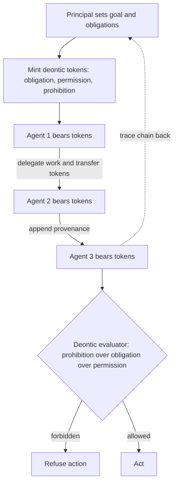

# Deontic Token Delegation

**Also known as:** Obligation Token Passing, Deontic Delegation

**Category:** Governance & Observability  
**Status in practice:** experimental

## Intent

Reify obligations, permissions, and prohibitions as transferable deontic tokens that agents pass along the delegation chain with provenance, so duty and accountability transfer with the work, not only the credentials to perform it.

## Context

A multi-agent system spreads a task across a chain of agents: a coordinator accepts a goal, delegates sub-tasks to specialist agents, and those agents delegate further to tools or to other agents. The work carries obligations — a duty to obtain consent before acting, to retain a record, to refuse a prohibited operation — that originate with the principal who set the goal. Standard delegation passes credentials and permissions down the chain so each agent can act, but the duties that came with the task have no representation that travels with it.

## Problem

When only permissions are delegated, the obligations attached to a task evaporate at the first hand-off: the sub-agent is authorised to act but holds no record of what it is obliged to do or forbidden from doing, and when something goes wrong there is no way to trace which agent inherited which duty or where accountability actually sits. Credential delegation answers whether an agent is allowed to do something, but not who is responsible for the obligation that the action was meant to satisfy, nor through what chain that responsibility passed. Without obligations as first-class, transferable objects, accountability has to be reconstructed after the fact from scattered logs, if it can be reconstructed at all, and a duty silently dropped in the middle of the chain stays invisible until it is breached.

## Forces

- Permissions and obligations are different things: a permission enables an action, an obligation requires it, yet most delegation mechanisms carry only the former.
- Accountability must survive every hand-off, but each additional agent in the chain is another place responsibility can be lost.
- Formalising duties as tokens adds protocol weight that simple credential-passing avoids.
- Provenance of a delegation chain is most needed precisely when the chain is longest and hardest to reconstruct.

## Applicability

**Use when**

- Tasks carry obligations or prohibitions — consent, retention, refusal duties — that must survive being delegated across a chain of agents.
- Accountability has to be traceable: you must be able to say which agent held which duty and where it came from.
- Permissions alone are insufficient because the system needs to enforce what agents must and must not do, not only what they may do.
- The delegation chain is long enough that reconstructing responsibility from logs after the fact is unreliable.

**Do not use when**

- Delegation only needs to pass permissions or credentials, with no duties that must travel with the task.
- The system is a single agent or a flat set with no hand-offs, so there is no chain to trace.
- The protocol overhead of reifying and transferring tokens is not justified by the accountability requirement.
- Obligations are static and globally known, so every agent already shares them without needing transfer.

## Therefore

Therefore: encapsulate each obligation, permission, and prohibition as a deontic token carrying its origin and its delegation history, and require that handing work to another agent transfers the relevant tokens with it, so duty and accountability move with the task and any obligation traces back through every hand-off to its source.

## Solution

Represent each deontic relation — an obligation, a permission, a prohibition — as a token: a structured object naming the duty, the agent currently bearing it, the principal it originates from, and the chain of agents it has passed through. When an agent delegates work, it transfers the tokens for the duties that delegation carries and appends itself to each token's provenance; it cannot pass authority for a task without also passing the obligations bound to it. Receiving agents evaluate their held tokens before acting — prohibitions override obligations override permissions, following deontic-logic precedence — and refuse actions their tokens forbid. Because every token carries its full chain, any obligation can be traced from its current bearer back through each hand-off to the originating principal, and a breach can be attributed to the agent that held the token when the duty was dropped. Compose with a provenance ledger that records token transfers, and with delegated-agent-authorization, which carries the permissions this pattern binds duties to.

## Variants

- **Provenance-chained token** — Each token carries the ordered list of agents it has passed through, appended at every hand-off, so the full delegation history is readable from the token itself. Use when after-the-fact attribution back to the originating principal is the primary requirement.
- **Prohibition-priority evaluation** — Agents evaluate held tokens with deontic precedence — prohibitions over obligations over permissions — before acting, refusing forbidden operations regardless of permissions held. Use when forbidden actions must be blocked even when an agent is otherwise authorised.
- **Smart-contract-anchored token** — Tokens and their transfers are anchored on a tamper-evident substrate such as a ledger or contract, so the chain cannot be rewritten. Use when the delegation record must be non-repudiable across organisational boundaries.

## Diagram

## Example scenario

A procurement workflow runs across agents: an orchestrator takes a buyer's goal, delegates supplier negotiation to a specialist agent, which delegates payment to a settlement agent. The buyer's task carries duties — obtain approval above a threshold, never pay an unverified supplier, retain the negotiation record. With permission-only delegation the settlement agent is authorised to pay but holds no record of the no-unverified-supplier duty, and when a bad payment goes out no one can say which agent was responsible. The team reifies these duties as deontic tokens that transfer with each hand-off and carry their provenance: the settlement agent now refuses to pay because it holds a prohibition token, and when an obligation is breached its chain points straight back to the agent that dropped it.

## Consequences

**Benefits**

- Duties travel with the work, so a sub-agent inherits what it must and must not do, not only what it may do.
- Every obligation carries its chain, so responsibility can be traced back to the originating principal after the fact.
- Prohibition tokens let a receiving agent refuse a forbidden action even when it holds the permission to perform it.
- A dropped or breached obligation can be attributed to the specific agent that held its token.

**Liabilities**

- Reifying and transferring tokens at every hand-off adds protocol weight that permission-only delegation avoids.
- Without a tamper-evident anchor, an agent can rewrite a token to shed an obligation it should keep.
- The model is largely research-grade for LLM agents; the mature lineage is in formal-methods and enterprise-distributed-systems standards, not yet in production agent stacks.
- Authoring the deontic rules and precedence correctly is its own design burden, separate from the delegation mechanism.

## What this pattern constrains

An agent may not accept delegated authority for a task without also accepting the deontic tokens bound to it, and it may not perform an action a held prohibition token forbids; authority cannot be passed stripped of its obligations.

## Known uses

- **[ODP Enterprise Language (ISO/IEC 15414)](https://en.wikipedia.org/wiki/RM-ODP)** — *Available* — The Open Distributed Processing enterprise-language standard encapsulates obligation, permission, and prohibition within objects that can be handed across actors — the deontic tokens this pattern reifies for agent systems. Predates LLM agents; the formal-methods ancestor of the mechanism.
- **[XMPro MAGS](https://github.com/XMPro/Multi-Agent/blob/main/docs/concepts/deontic-principles.md)** — *Available* — Implements deontic principles — obligations, permissions, prohibitions — as formal JSON rule specs with compliance checking and audit logging for multi-agent governance, though at single-agent rule-compliance level rather than token-based inter-agent obligation transfer.

## Related patterns

- *complements* → [delegated-agent-authorization](delegated-agent-authorization.md)
- *alternative-to* → [commitment-tracking](commitment-tracking.md)
- *alternative-to* → [joint-commitment-team](joint-commitment-team.md)
- *composes-with* → [provenance-ledger](provenance-ledger.md)

## References

- (paper) Milosevic, Rabhi, *Architecting Agentic Communities using Design Patterns*, 2026, <https://arxiv.org/abs/2601.03624>
- (doc) *Reference Model of Open Distributed Processing — Enterprise Language*, <https://en.wikipedia.org/wiki/RM-ODP>
- (doc) *XMPro MAGS — Deontic Principles*, <https://github.com/XMPro/Multi-Agent/blob/main/docs/concepts/deontic-principles.md>

**Tags:** governance, delegation, deontic, obligations, accountability, provenance, multi-agent
