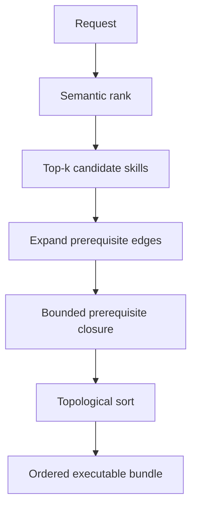

# Dependency-Aware Skill Retrieval

**Also known as:** Skill-Graph Retrieval, Prerequisite-Closure Retrieval

**Category:** Retrieval & RAG  
**Status in practice:** experimental

## Intent

Retrieve from a large skill library by returning each relevant skill together with its prerequisite dependency closure as an ordered subgraph, so the bundle the agent receives is executable rather than topically relevant but incomplete.

## Context

An agent draws on a library of hundreds or thousands of skills or tools, far more than fit in one context window, so a retrieval step selects which to load for the task at hand. Skills are not independent: one skill calls another, a higher-level routine assumes a lower-level primitive is present, and some skills only work once a setup skill has run. Standard retrieval ranks skills by semantic similarity to the request and returns the top matches.

## Problem

Semantic similarity surfaces the skills that look relevant to the request, but it is blind to the dependency structure between them. A retrieved skill whose prerequisites were not also retrieved fails at execution time, and the agent either errors out or wastes turns rediscovering the missing upstream skill. The more compositional the task, the wider this prerequisite gap grows, because each retrieved skill silently assumes others that ranking never surfaced.

## Forces

- Top-k semantic ranking optimises for topical relevance to the query, which is not the same as returning an executable, self-contained bundle.
- A skill's prerequisites are often not textually similar to the request, so similarity search ranks them low even though execution needs them.
- Returning the full transitive closure of every match can flood the context window, so the closure must be bounded and ordered rather than dumped.
- The dependency graph has to be maintained as skills are added or changed, upkeep that flat semantic indexing avoids.

## Therefore

Therefore: model the library as a typed dependency graph and, for each semantically retrieved skill, also retrieve its prerequisite closure, returning the result as a topologically ordered subgraph the agent can execute top to bottom.

## Solution

Represent the skill library as a graph whose nodes are skills and whose typed edges record prerequisite, enhancement, and co-occurrence relations. Retrieval runs in two stages: a semantic stage ranks skills against the request as usual, then a graph stage expands each candidate along prerequisite edges to gather the skills it depends on, bounding the expansion so the bundle stays within budget. The combined set is returned in topological order, so every skill appears after the skills it needs, and the agent receives a runnable plan rather than a flat list of lookalikes. Enhancement and co-occurrence edges can widen the bundle when budget allows, but prerequisite edges are followed first because they are what make the bundle execute.

## Structure

```
Request --semantic rank--> candidate skills --expand prerequisite edges--> bounded closure --topological sort--> ordered executable bundle
```

## Diagram



*Semantic ranking selects candidates; graph expansion adds their prerequisite closure; the bundle is returned in execution order.*

## Example scenario

A data-analysis agent is asked to publish the quarterly dashboard. Semantic search returns the publish-dashboard skill, but publishing depends on build-charts, which depends on load-warehouse-credentials. Flat retrieval would load only publish-dashboard and fail at the first call; dependency-aware retrieval walks the prerequisite edges and returns all three in order — credentials, charts, publish — so the agent runs the chain straight through.

## Consequences

**Benefits**

- The retrieved bundle executes without mid-task failures caused by a missing upstream skill.
- Compositional tasks that span several dependent skills succeed more often than under flat semantic retrieval at the same budget.
- Topological ordering hands the agent an execution order for free, reducing planning it would otherwise redo.

**Liabilities**

- The dependency graph is extra structure to build and keep current as skills change; stale edges retrieve the wrong closure.
- Unbounded prerequisite expansion can pull in a large closure and overflow the budget, so the bound itself becomes a tuning problem.
- Mis-typing an edge (recording an optional enhancement as a hard prerequisite) either bloats the bundle or drops a genuinely required skill.

## Failure modes

- Prerequisite gap — a required upstream skill is missing because no edge recorded the dependency, so the bundle still fails at execution.
- Closure explosion — following prerequisite edges transitively pulls in too many skills and blows the context budget.
- Stale graph — a skill changed its dependencies but the edges did not, so retrieval returns an outdated closure.
- Edge mis-typing — an optional enhancement is recorded as a hard prerequisite, padding every bundle that touches it.

## What this pattern constrains

A skill is never returned in isolation when its execution depends on skills not also retrieved; retrieval must expand the prerequisite closure and order it topologically before the bundle is handed to the agent.

## Applicability

**Use when**

- The skill or tool library is far larger than the context window, forcing a retrieval step.
- Skills are compositional: higher-level skills depend on lower-level ones that ranking would not surface on its own.
- A dependency graph over the skills can be built and kept current.

**Do not use when**

- The toolset is small enough to expose in full, so no retrieval is needed.
- Skills are mutually independent, so there is no prerequisite closure to expand.
- Dependencies change so fast that the graph cannot be kept accurate, making a flat semantic fallback safer.

## Components

- Skill graph — nodes are skills, typed edges record prerequisite, enhancement, and co-occurrence relations
- Semantic ranker — scores skills by similarity to the request and selects the initial candidates
- Closure expander — walks prerequisite edges from each candidate to gather the skills it depends on, within a budget bound
- Topological sorter — orders the gathered skills so each appears after the skills it requires
- Graph maintainer — updates nodes and edges as skills are added, changed, or removed so the closure stays correct

## Tools

- Vector index — serves the semantic ranking stage over skill descriptions
- Graph store — holds the typed skill-dependency edges and answers closure queries
- Tool-calling LLM — consumes the ordered bundle and executes the skills in sequence

## Evaluation metrics

- Execution-completeness rate — fraction of retrieved bundles that run without a missing-prerequisite failure
- Compositional task success vs flat retrieval at equal budget — what the closure buys
- Closure size vs budget — how much context the expansion consumes per request
- Prerequisite-gap incidents — count of task failures traced to an unretrieved upstream skill

## Known uses

- **[Graph-of-Skills](https://arxiv.org/abs/2604.05333)** _pure-future_ — Models a massive agent-skill library as a dependency graph and retrieves the prerequisite closure as a structured subgraph rather than top-k semantic matches.
- **[SkillGraph](https://arxiv.org/abs/2605.12039)** _pure-future_ — Skill-augmented RL agent that, for a new task, retrieves an ordered skill subgraph to guide multi-step decision making instead of isolated skills.
- **Group-of-Skills** _pure-future_ — Retrieves dependency-linked groups of skills together so a compositional task receives an execution-complete bundle.
- **[Graph of Skills (GoS)](https://github.com/davidliuk/graph-of-skills)** _available_ — Builds a skill graph from SKILL.md docs and retrieves a ranked set together with prerequisites and related capabilities.

## Related patterns

- _complements_ **Skill Library** — Skill-library is how an agent grows a toolkit; dependency-aware retrieval is how that toolkit is selected so prerequisites come with each match.
- _alternative-to_ **Tool Search Lazy Loading** — Lazy loading defers a tool's schema until a search hit; this retrieves the prerequisite closure up front so the loaded bundle is executable.
- _alternative-to_ **Hierarchical Tool Selection** — Hierarchical selection narrows a flat catalog by category tree; here the structure followed is the dependency graph, not a topical hierarchy.
- _complements_ **Tool Loadout** — Loadout picks a small task-relevant subset; dependency-aware retrieval guarantees that subset also includes the prerequisites the picked skills need.
- _complements_ **Knowledge Graph Memory** — Both make a graph the access path; knowledge-graph-memory queries remembered entities, this queries the skill-dependency graph.

## References

- [Graph-of-Skills: Dependency-Aware Structural Retrieval for Massive Agent Skills](https://arxiv.org/abs/2604.05333) — 2026
- [SkillGraph: Skill-Augmented Reinforcement Learning for Agents via Evolving Skill Graphs](https://arxiv.org/abs/2605.12039) — 2026
