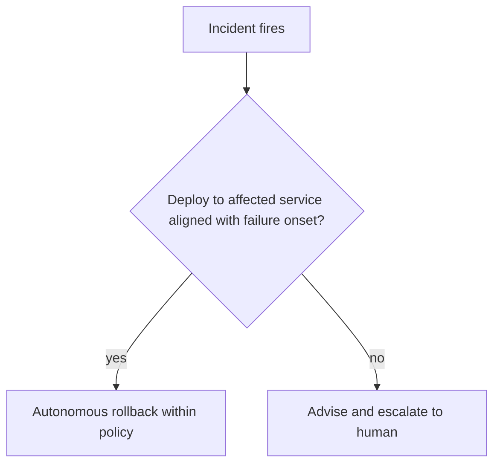

# Deployment-Correlated Rollback Gate

**Also known as:** Deploy-Correlation Rollback Gate, Change-Attributed Auto-Rollback

**Category:** Safety & Control  
**Status in practice:** emerging

## Intent

Gate an incident-response agent's authority to execute a rollback on whether the failure is temporally correlated with a recent deployment, unlocking autonomous rollback only on a clear deploy-to-failure link and escalating otherwise.

## Context

An incident-response agent watches production and can act to mitigate, including rolling back to a previous release. Some incidents start right after a deployment; others have no deployment near them at all. Rolling back is itself a change — it can fix a bad release or, applied to an unrelated incident, make things worse or destroy good state.

## Problem

Letting the agent roll back on any incident is unsafe, because a rollback aimed at a failure a deployment did not cause is a blind change that can compound the outage. Gating purely on the agent's confidence is weak, because a model can be confidently wrong about cause. What distinguishes a safe autonomous rollback from one that needs human judgement is whether a deployment actually precedes and plausibly caused the failure — a structural fact the agent can check rather than guess.

## Forces

- A clear deploy-to-failure temporal link makes rollback a bounded, high-confidence remedy; without it, rollback is a guess at the cause.
- Autonomy speeds mitigation when the cause is a recent deploy, but the same autonomy is dangerous when the cause is unknown.
- Confidence scores conflate 'the model is sure' with 'the cause is established', so the unlock criterion should be the structural correlation, not the score.
- Deployment events and failure onset must both be observable and time-aligned for the correlation to be computable.

## Therefore

Therefore: make the unlock criterion a structural deploy-to-failure correlation — a deployment shortly before the failure onset, scoped to the affected service — and let the agent roll back autonomously only when that link holds, escalating to a human when it does not.

## Solution

Give the agent a rollback action but gate it on a deployment-correlation check rather than on its confidence. When an incident fires, the gate looks for a deployment to the affected service whose timing precedes and aligns with the failure onset. If a clear correlation holds, the agent may execute the rollback of that release within its policy bound, because the change to undo is identified. If no deployment correlates — a novel failure, a dependency outage, a traffic spike — the gate keeps the agent advisory: it can recommend and gather evidence, but the rollback decision goes to a human. The correlation is computed from deployment and telemetry events, so the unlock is a checkable fact, not the agent's belief about cause.

## Structure

```
Incident -> correlation check (deploy to affected service aligned with failure onset?) -> yes: autonomous rollback within policy / no: advise + escalate to human
```

## Diagram



*A rollback runs autonomously only when a deployment correlates with the failure onset; otherwise the agent advises and escalates.*

## Example scenario

Error rates on the checkout service spike at 14:02. The agent's rollback gate finds a deploy to checkout at 14:00 whose timing lines up with the spike, so it rolls back that release automatically and the errors clear. An hour later latency climbs with no deploy anywhere near it; this time the gate withholds autonomy, and the agent pages a human with its evidence instead of rolling anything back.

## Consequences

**Benefits**

- Deploy-caused incidents are mitigated fast because the agent rolls back the identified release without waiting for a human.
- Incidents with no deploy correlation do not trigger a blind rollback; they escalate instead, limiting blast radius.
- The unlock rests on an observable structural fact, which is auditable after the fact, unlike a confidence threshold.

**Liabilities**

- A correlation can be coincidental — a deploy and an unrelated failure happen close in time — so a correlated rollback can still be wrong.
- Missing or mis-timestamped deployment events break the correlation and either block a valid rollback or hide a real one.
- A noisy pipeline that floods deployment events could manufacture correlations that unlock rollbacks.

## Failure modes

- Spurious correlation — an unrelated deploy near the failure unlocks a rollback that does not address the cause.
- Missed correlation — a real deploy-caused failure is not linked because deployment telemetry is absent, so mitigation stalls in escalation.
- Confidence substitution — the gate quietly falls back to the agent's confidence when correlation data is missing, defeating the criterion.
- Rollback of good state — the correlated release also carried needed data changes, so undoing it loses more than it fixes.

## What this pattern constrains

The agent may not execute a rollback autonomously unless a deployment is correlated with the failure onset for the affected service; absent that link, the rollback decision must escalate to a human rather than proceed on the agent's confidence.

## Applicability

**Use when**

- An incident-response agent can execute rollbacks and both deployment and failure events are observable and timestamped.
- Many incidents are deploy-caused, so deploy correlation is a meaningful unlock signal.
- Fast autonomous mitigation is valuable for the deploy-caused cases while unknown-cause cases should stay human-judged.

**Do not use when**

- Deployment events are not reliably captured, so the correlation cannot be computed.
- Rollback is never safe to automate in this environment regardless of cause.
- Failures are predominantly not deploy-related, so the gate would almost always escalate and add little.

## Components

- Deployment event feed — timestamps of releases per service, the candidate causes to correlate against
- Failure-onset detector — identifies when and where the incident began from telemetry
- Correlation gate — tests whether a deployment to the affected service aligns in time with the failure onset
- Rollback executor — undoes the correlated release within a policy bound when the gate unlocks
- Escalation path — routes uncorrelated incidents to a human with the agent's evidence

## Tools

- Deployment or CD system — emits the release events the correlation is computed against
- Observability stack — supplies the failure-onset signal from errors, latency, and saturation
- Rollback tooling — performs the actual revert to a previous version

## Evaluation metrics

- Correlated-rollback precision — share of autonomous rollbacks that actually addressed the cause
- Time-to-mitigate on deploy-caused incidents versus a human-gated baseline
- Escalation rate — fraction of incidents withheld from autonomy for lack of correlation
- Spurious-rollback count — autonomous rollbacks later found to target an uncorrelated cause

## Known uses

- **[Augment Code AI SRE](https://www.augmentcode.com/guides/ai-sre-incident-management)** _available_ — States that rollback autonomy depends on deployment correlation: a clear deploy-to-failure link lets the agent execute a rollback with high confidence, while failures without it require human judgement.
- **[Autonomous SRE agent implementations](https://www.jeeva.ai/blog/24-7-autonomous-devops-ai-sre-agent-implementation-plan)** _available_ — Agents that correlate a severe incident with a recent deploy automatically trigger a rollback to the previous stable version.

## Related patterns

- _alternative-to_ **Calibrated Help-Gate via Conformal Prediction** — The conformal gate unlocks autonomy on a calibrated confidence set; this gate unlocks on a structural deploy-to-failure correlation, not on how sure the model is.
- _complements_ **Compensating Action** — The rollback is the compensator for a bad release; this pattern decides when the agent may fire that compensator autonomously versus escalate.
- _complements_ **Risk-Tiered Action Autonomy** — Both graduate autonomy: risk-tiered by financial materiality, this by whether a deployment correlates with the failure.
- _complements_ **Human-in-the-Loop** — When no deploy correlates with the failure, the gate falls back to human judgement rather than autonomous rollback.

## References

- [AI SRE in Incident Management: How AI Agents Handle On-Call](https://www.augmentcode.com/guides/ai-sre-incident-management) — 2026
- [Autonomous SRE Agent: AI-Driven DevOps Implementation Guide](https://www.jeeva.ai/blog/24-7-autonomous-devops-ai-sre-agent-implementation-plan) — 2026
- [Learning from Change: Predictive Models for Incident Prevention in a Regulated IT Environment](https://arxiv.org/abs/2604.13462) — 2026
