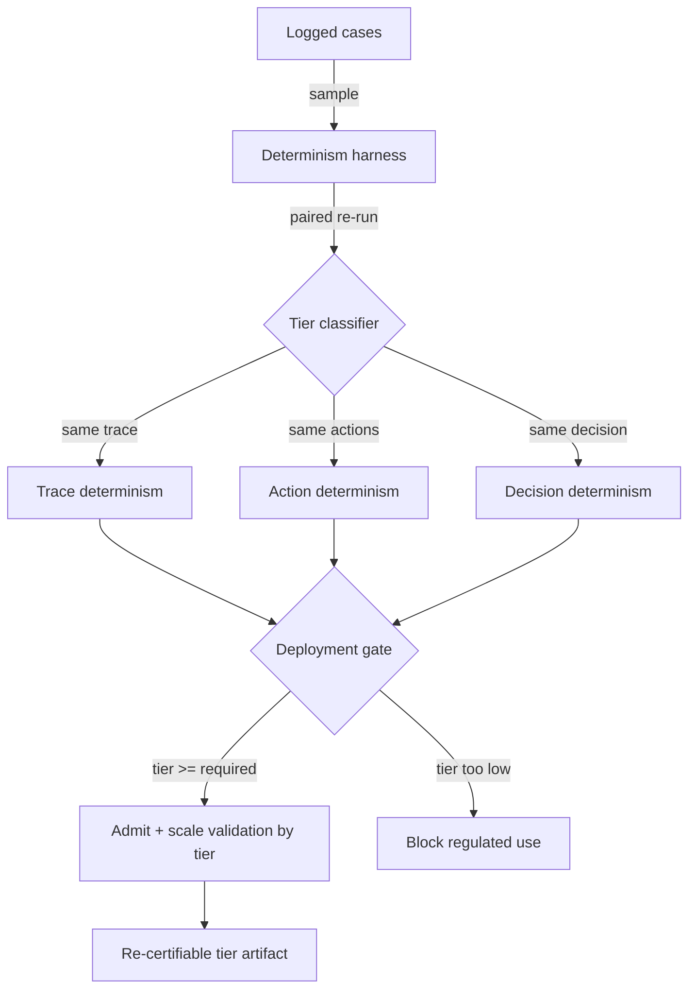

# Determinism-Tiered Replay Gate

**Also known as:** Decision-Determinism Gate, Graded Reproducibility Gate, Replay-Tier Deployment Gate

**Category:** Governance & Observability  
**Status in practice:** experimental

## Intent

Classify an agent into a reproducibility tier by re-running identical inputs, require the strictest decision-determinism tier for regulated decisions, and gate deployment and validation-sample size on the measured tier.

## Context

A tool-using agent makes decisions that an auditor or regulator may later re-examine, such as approving a transaction, scoring a credit application, or filing a report. Replay machinery already exists: inputs, prompts, model ids, and tool calls are captured so a past run can be re-executed. What is missing is a statement of how reproducible the agent actually is. Re-running the same inputs can yield an identical tool sequence, the same sequence with drifting arguments, or merely the same final decision by a different path, and nobody has measured which.

## Problem

Replay being mechanically possible does not mean a re-run converges. Sampling temperature, tool-ordering races, clock and retrieval drift, and model-version changes all let two runs of identical inputs diverge, and the divergence may stop at the reasoning trace or reach the decision itself. Treating all agents as equally reproducible lets one whose final decision flips on re-run pass the same governance bar as one that is bit-for-bit stable, so a regulator who replays a logged case can get a different answer than the customer received, with no prior signal that this was possible.

## Forces

- An auditor cares that the agent reaches the same conclusion on re-run, even when the internal reasoning path legitimately varies, so strict trace-level reproducibility is stronger than compliance strictly needs.
- Sampling and tool concurrency that raise answer quality also lower reproducibility, so the determinism tier trades against capability rather than being free.
- A less reproducible agent needs a larger validation sample and tighter monitoring to bound its decision-flip rate, so the assurance cost rises as the tier weakens.
- Measuring the tier requires many paired re-runs, which costs compute and must be repeated whenever the model or tools change.

## Therefore

Therefore: measure each agent against graded determinism tiers, treat the achieved tier as a deployment gate, and let regulated decisions through only at the decision-determinism tier while scaling validation and monitoring to whatever tier weaker agents reach.

## Solution

Define an ordered ladder of reproducibility tiers measured by paired re-runs on identical inputs: trace determinism (the same tool sequence and arguments), action determinism (the same tool sequence with arguments allowed to vary within tolerance), and decision determinism (the same final decision regardless of path). A determinism harness re-runs a held-out sample of logged cases, compares each re-run against the original at every tier, and reports the strictest tier the agent satisfies above a confidence threshold. A gate maps the measured tier to a release decision: regulated decisions are admitted only at the decision-determinism tier or stricter, advisory or internal uses may ship at weaker tiers, and the required validation-sample size and monitoring frequency scale inversely with the tier so a weaker agent must clear a larger sample and a tighter drift watch. The measured tier is recorded as a re-certifiable assurance artifact and re-measured on every model or tool change, since either can silently drop the agent to a lower tier.

## Structure

```
Logged cases --sample--> Determinism harness --paired re-run--> Tier classifier (trace / action / decision) --measured tier--> Gate (admit if tier >= required for use class; scale validation sample + monitoring by tier) --> Re-certifiable tier artifact
```

## Diagram



*A harness re-runs logged cases to classify the agent's reproducibility tier; the gate admits a use only when the measured tier meets that use's required bar and scales validation by the tier.*

## Example scenario

A bank runs an agent that approves or declines small business loans. Before launch, a determinism harness replays two thousand logged applications twice each and finds the agent gives the same approve/decline outcome on 99.4 percent of re-runs but rarely the same tool sequence. It is classified at the decision-determinism tier, so it clears the gate for regulated decisions, while a sister agent that summarises calls only reaches action determinism and is allowed out for internal drafting but draws a larger validation sample and weekly drift checks.

## Consequences

**Benefits**

- A regulator who replays a logged regulated decision is guaranteed the same conclusion, because only decision-determinism agents were admitted for that use class.
- Assurance effort is spent where reproducibility is weakest: a low-tier agent automatically draws a larger validation sample and tighter monitoring instead of a uniform bar.
- A model or tool change that quietly lowers reproducibility is caught at re-measurement before it reaches a regulated decision.

**Liabilities**

- Paired re-runs to measure the tier cost compute and must be repeated on every model or tool change, adding a standing assurance bill.
- Forcing decision determinism can require lowering sampling temperature or serialising tool calls, trading answer quality for reproducibility.
- A tier measured on a held-out sample can overstate reproducibility if production inputs drift away from the sampled distribution.

## Failure modes

- Tier inflation — the harness samples easy or stale cases, reports decision determinism, and the agent flips on the harder live inputs it was never tested against.
- Stale certification — the model or a tool is updated without re-measuring, so the recorded tier no longer describes the deployed agent.
- Trace-fixation — the gate demands identical reasoning traces where decision determinism is the real requirement, blocking capable agents whose conclusions are stable.

## What this pattern constrains

An agent that has not been measured at the decision-determinism tier must not be admitted for a regulated decision, and the recorded tier may not stand once the model or any tool the agent calls has changed without re-measurement.

## Applicability

**Use when**

- An agent makes decisions a regulator or auditor may later replay and expect the same conclusion.
- Replay machinery exists but the agent's actual reproducibility under re-run has never been measured.
- Different uses warrant different reproducibility bars, so a single deployment gate cannot apply one rule to all of them.

**Do not use when**

- The agent's outputs are advisory or exploratory and no party will ever re-run a case expecting an identical result.
- Paired re-run measurement is infeasible because inputs cannot be captured or replayed faithfully.
- The decision is already produced by deterministic code rather than a sampled model, so a reproducibility tier is trivially the strictest.

## Components

- Determinism harness — re-runs a sampled set of logged cases on identical inputs to produce paired runs for comparison
- Tier classifier — compares each re-run against the original at trace, action, and decision level and reports the strictest tier met above a confidence threshold
- Use-class policy — maps each use (regulated decision, advisory, internal) to the minimum reproducibility tier it requires
- Deployment gate — admits or blocks the agent by comparing its measured tier against the required tier for the use class
- Validation scaler — sets the validation-sample size and monitoring frequency inversely to the measured tier so weaker agents are watched harder
- Tier artifact store — records the measured tier as a re-certifiable artifact and flags it stale on any model or tool change

## Tools

- Trace-capture and replay engine — captures per-step inputs, prompts, model id, and tool calls so a case can be re-run faithfully
- Provenance ledger — supplies the logged decisions and metadata the harness samples and compares against
- Statistical confidence estimator — turns paired-run agreement into a tier with a bounded confidence interval
- Model and tool version monitor — signals when a change invalidates the recorded tier and triggers re-measurement

## Evaluation metrics

- Decision-flip rate on re-run — fraction of paired re-runs whose final decision differs, the headline reproducibility measure
- Measured tier vs required tier per use class — whether each deployed use meets its reproducibility bar
- Tier stability across model and tool versions — how often a change drops the agent to a lower tier
- Held-out vs live decision-flip gap — how much the sampled tier overstates reproducibility on production inputs

## Known uses

- **[Replayable Financial Agents (determinism-faithfulness harness)](https://arxiv.org/abs/2601.15322)** _pure-future_ — Research harness that re-runs tool-using financial agents and grades reproducibility, arguing an auditor needs the same conclusion on replay even when reasoning paths differ.
- **[Determinism survey for financial AI](https://arxiv.org/abs/2605.23955)** _pure-future_ — Survey framing determinism in financial agents as an auditability requirement and laying out graded levels of reproducibility rather than a single bit-for-bit notion.

## Related patterns

- _complements_ **Journaled LLM Call** — Journaling records each non-deterministic step so a run can be replayed at all; this pattern measures whether such replays converge and gates deployment on the result.
- _complements_ **Replay / Time-Travel** — Replay/time-travel re-runs a captured trace for debugging; this pattern re-runs paired cases to classify a reproducibility tier and turns that tier into a release gate.
- _complements_ **Risk-Tiered Action Autonomy** — Both grade by stakes: action autonomy tiers an agent by an action's materiality, this tiers it by reproducibility, and a regulated decision needs to clear both axes.
- _uses_ **Provenance Ledger** — The tier harness consumes the logged inputs, decisions, and metadata the ledger captures, since it cannot re-run cases or compare conclusions without them.

## References

- [Replayable Financial Agents: A Determinism-Faithfulness Assurance Harness for Tool-Using LLM Agents](https://arxiv.org/abs/2601.15322) — Raffi Khatchadourian, 2026
- [From Accuracy to Auditability: A Survey of Determinism in Financial AI Systems](https://arxiv.org/abs/2605.23955) — Ruizhe Zhou et al., 2026
