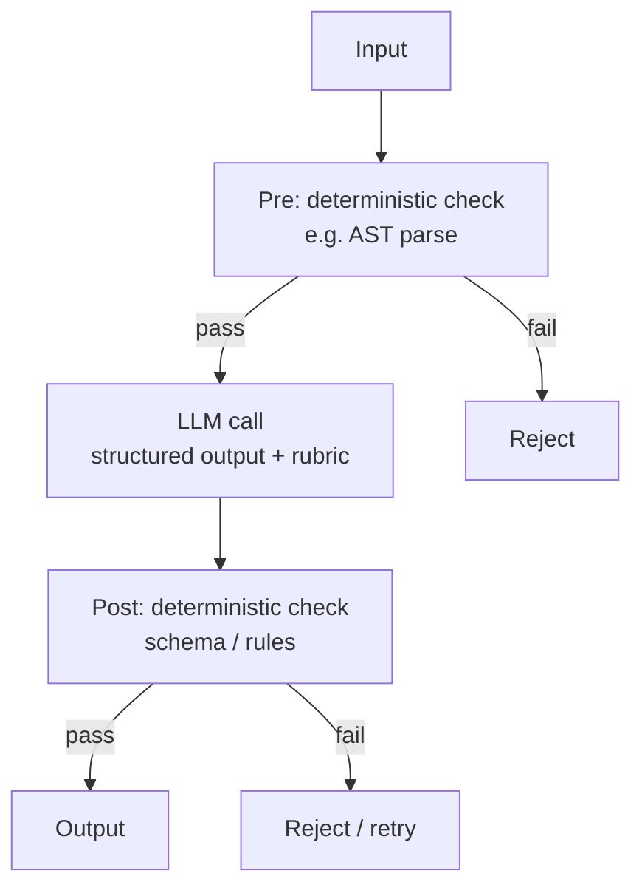

# Deterministic-LLM Sandwich

**Also known as:** Verification-and-Grounding Loop, Bracketed LLM Call, Verify LLM Output, Pre/Post Validation

**Category:** Verification & Reflection  
**Status in practice:** emerging

## Intent

Bracket every LLM call with deterministic checks on both sides.

## Context

A team uses a large language model at a point in the system where wrong output causes real damage: a knitting pattern with a wrong stitch count that wastes a customer's yarn, a database migration that breaks production, an insurance quote that omits a required coverage line. The model is genuinely useful at this step (it talks to the user fluently, or it transforms messy input into a tidy form) so removing it entirely is not the right answer. But every output is one hallucination away from causing harm.

## Problem

Trusting the model's output unconditionally accepts hallucination at exactly the moment where mistakes are most expensive, and there is no signal at the boundary distinguishing a correct generation from a confidently wrong one. Banning the model entirely loses everything it was good at and forces the team back to brittle templated text. Simple downstream validation (a try/catch on the database call, for example) catches some failures but only after side effects have begun or only by failing loudly to the user. The team needs a way to keep the model in the loop while bounding what kinds of output it can land.

## Forces

- Bracketing adds latency per call.
- Pre-checks must be cheap to be worth running.
- Post-checks must catch what the model gets wrong, not what is merely surprising.

## Therefore

Therefore: wrap the LLM call in cheap deterministic gates on both sides and only accept its output if the post-check passes, so that probabilistic generation is contained inside a verifiable envelope.

## Solution

Three layers. Pre: deterministic check decides whether the LLM should run at all (e.g. AST parse must succeed). LLM: produces a candidate output with structured-output schema and frozen rubric. Post: deterministic re-validation (parse, type-check, run tests). If post fails, the original is returned unchanged.

## Example scenario

A regulated insurance assistant generates policy quotes that occasionally include a coverage line the customer never asked for. Trusting the LLM blindly is unacceptable; banning it loses the conversational explanation users like. The team adopts a Deterministic LLM Sandwich: a deterministic step parses the user's request into a typed schema, the LLM operates only within that schema, and a deterministic post-step validates the quote against rule-engine-checked coverage limits before it's shown. The LLM still talks like an LLM, but cannot smuggle a coverage line past the brackets.

## Structure

```
Pre(input) -> {pass, fail} ; if pass: LLM(input) -> candidate ; Post(candidate) -> {accept, reject}.
```

## Diagram



## Consequences

**Benefits**

- Confidence at the correctness boundary; the model cannot land an unsafe artefact.
- Bug fixes go into the deterministic layer where they are testable.

**Liabilities**

- Building the deterministic checks is itself the bulk of the work.
- Over-strict post-checks reject valid outputs.

## What this pattern constrains

An LLM-produced artefact lands only after passing the post-check; otherwise the prior state is preserved.

## Applicability

**Use when**

- LLM output must be checked deterministically before being trusted (e.g. AST parse, type-check, test run).
- A pre-check can decide whether the LLM should run at all.
- Returning the original input on post-check failure is acceptable behaviour.

**Do not use when**

- No deterministic check exists for the output type (free-form prose, subjective ranking).
- Pre and post checks together cost more than the LLM call they bracket.
- There is no fallback when the post check fails and silent rejection would mislead.

## Known uses

- **Knitting-DSL Pipeline (Stash2Go)** — *Available*. deterministicReview.js -> scopedLlmFixer.js -> parse and revalidate.

## Related patterns

- *uses* → [frozen-rubric-reflection](frozen-rubric-reflection.md)
- *uses* → [structured-output](structured-output.md)
- *composes-with* → [code-execution](code-execution.md) — Post-check often runs code (parse/test) to validate output.

## References

- (doc) Guardrails AI, *Guardrails AI — Input and Output Guards*, 2024, <https://www.guardrailsai.com/docs>

**Tags:** verification, boundary, sandwich
