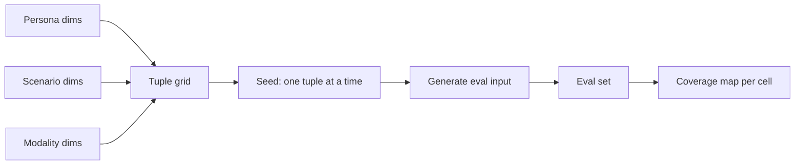

# Dimensional Synthetic Eval Set

**Also known as:** Tuple-Seeded Eval Generation, Dimensional Mode-Collapse Avoidance

**Category:** Verification & Reflection  
**Status in practice:** emerging

## Intent

Generate evaluation inputs not by free-form LLM prompting (which mode-collapses) but by enumerating tuples over explicitly named dimensions and seeding generation from each tuple.

## Context

A team needs to expand its evaluation set for an LLM application. Asking an LLM 'generate 200 evaluation prompts for this feature' produces a corpus that mode-collapses to a few archetypes the LLM finds most likely. The eval set looks varied but covers only a sliver of the actual input space.

## Problem

Free-form synthetic eval generation has a known failure mode: the generating LLM converges on its high-likelihood prompt shapes, and the resulting set is monotonous regardless of how many items are generated. The team's coverage of the genuine input space (different personas, different scenarios, different complexity levels, different modalities) is poor and the team cannot see this from the surface variety of the prompts.

## Forces

- Free-form generation mode-collapses; sampling more does not fix it.
- Coverage of named dimensions is the actual property the eval set needs.
- Naming dimensions explicitly is itself useful documentation.
- Tuple enumeration scales by the product of dimension cardinalities — needs sampling.

## Applicability

**Use when**

- Eval set is being expanded and coverage matters.
- Input space has natural dimensions the team can name.
- Mode-collapse in free-form generation has been observed or is suspected.

**Do not use when**

- Input space resists dimension naming — coverage cannot be checked any way.
- Real production traffic is large enough that synthetic generation is unneeded.
- Dimension cardinality cannot be sampled tractably.

## Therefore

Therefore: enumerate tuples over explicitly named dimensions (persona × feature × scenario × modality) and seed eval generation from each tuple, so coverage is auditable and edge cases are not silently skipped.

## Solution

List the named dimensions of the input space: persona (new user / power user / staff), feature (the feature variants the agent will face), scenario (success / failure / ambiguous), modality (text / voice / image). Generate the cross-product of tuples; sample if it's too large. For each tuple, ask the LLM to generate eval inputs grounded in that tuple's specifics. The resulting set covers the dimensions by construction. Coverage gaps are visible — the tuple grid shows which combinations are empty.

## Example scenario

A team building a customer-support agent names three dimensions: persona (new / returning / staff), scenario (success / blocked / ambiguous), product-area (billing / shipping / returns). The 3×3×3 = 27 tuple grid drives generation; each tuple produces 10 eval inputs. The 270-item eval set has visible coverage per cell. A subsequent review notices that the (staff × ambiguous × returns) cell is the weakest; the team adds focused items there.

## Diagram

## Consequences

**Benefits**

- Coverage is auditable as a tuple grid, not a vibe check.
- Mode-collapse cannot hide poor coverage on a named dimension.
- Adding a new dimension is an explicit decision, not an accident.

**Liabilities**

- Tuple cardinality explodes if too many dimensions are named.
- Some tuples are nonsensical and waste generation effort.
- Dimensions must actually capture meaningful variance, not be arbitrary axes.

## What this pattern constrains

Synthetic eval inputs must not be generated by free-form LLM prompting alone; generation is seeded from tuples over explicitly named dimensions to bound mode-collapse.

## Known uses

- **LLM Engineer's Handbook / Decoding AI (Iusztin) — Dimensional synthetic eval generation** — *Available* — <https://www.decodingai.com/p/generate-synthetic-datasets-for-ai-evals>
- **Anthropic / Scale AI eval-generation best practices** — *Available*

## Related patterns

- *uses* → [eval-harness](eval-harness.md)
- *composes-with* → [evaluation-driven-development](evaluation-driven-development.md)
- *composes-with* → [prompt-variant-evaluation](prompt-variant-evaluation.md)
- *complements* → [frozen-rubric-reflection](frozen-rubric-reflection.md)
- *complements* → [llm-as-judge](llm-as-judge.md)

## References

- (book) *LLM Engineer's Handbook*, Paul Iusztin, Maxime Labonne, 2024, <https://www.packtpub.com/en-us/product/llm-engineers-handbook-9781836200079>
- (blog) *Generate Synthetic Datasets for AI Evals*, Paul Iusztin, <https://www.decodingai.com/p/generate-synthetic-datasets-for-ai-evals>

**Tags:** evaluation, synthetic-data
