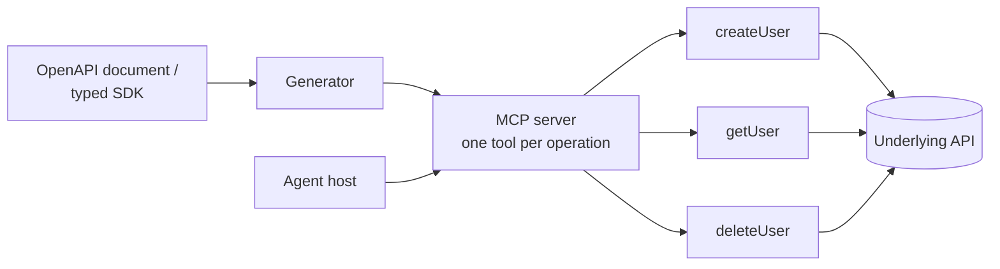

# Direct API Wrapper

**Also known as:** Direct Translation, 1:1 API-to-MCP Mapping, Thin MCP Wrapper, API-to-MCP Wrapper

**Category:** Tool Use & Environment  
**Status in practice:** emerging

## Intent

Expose an existing API as MCP tools by mapping each operation one-to-one to a tool, so a stable API becomes agent-callable with minimal wrapper logic.

## Context

An organisation already runs a stable, well-documented HTTP API and wants agents to call it without re-implementing business logic. The API has an OpenAPI document or a typed SDK, and the team wants the fastest path to making every operation reachable from MCP-speaking hosts.

## Problem

Agents cannot call a raw HTTP API through MCP; something must translate the API surface into the protocol's typed tool contract. Hand-writing an MCP tool for every endpoint is repetitive and drifts from the API as it changes, while skipping the wrapper leaves the API unreachable from any MCP host. The team needs the operations exposed quickly without inventing new semantics or maintaining a parallel hand-coded layer.

## Forces

- Speed of integration competes with the quality of the agent-facing interface.
- A one-to-one mapping is cheap to generate but can flood the agent with many low-level tools.
- Endpoint names and error shapes were designed for programmers, not for a model choosing among tools.
- Generated wrappers stay in sync with the contract but inherit its granularity.
- Auth and rate limits of the underlying API now apply per individual tool call.

## Applicability

**Use when**

- An existing API is stable and described by an OpenAPI document or typed SDK.
- The goal is the fastest route to making the API agent-callable.
- The API surface is small enough that one tool per operation does not overwhelm the model.
- The team wants the tool set to track the API automatically rather than be hand-maintained.

**Do not use when**

- The API is large and a one-to-one mapping would produce an unwieldy tool list — see composite-service-mcp.
- Tasks span several endpoints that the model would have to orchestrate itself — see composite-service-mcp.
- The endpoint names and error shapes are too programmer-oriented for reliable tool selection without re-design.

## Therefore

Therefore: generate one MCP tool per API operation directly from the API's contract, so the existing API becomes agent-callable without a hand-maintained translation layer.

## Solution

Map each API operation to a single MCP tool, deriving the tool name, input schema, and output shape from the API contract — an OpenAPI document or a typed SDK. A generator reads the contract and emits the server, so the tool surface tracks the API rather than a hand-written copy: FastMCP's from_openapi/from_fastapi, fastapi-mcp, and the Speakeasy and Stainless generators all follow this shape, and API gateways such as Kong can autogenerate the same server from any REST API. This is the thinnest wrapper and the baseline against which composite-service-mcp is the next step once the one-to-one surface proves too granular; when the orchestration itself is better written as code, mcp-as-code-api applies. Keep the wrapper free of new business logic so regeneration stays cheap.

## Structure

OpenAPI document / typed SDK -> [generator] -> MCP server (one tool per operation) -> agent host -> underlying API.

## Example scenario

A team owns a stable customer API described by an OpenAPI document. Rather than hand-write an MCP tool per endpoint, they run a generator that emits one tool for each operation — createCustomer, getCustomer, listInvoices — and serve them over MCP. An agent in Claude Desktop can now call the API the same day, and when the API adds an endpoint the team regenerates the server instead of editing tool code by hand.

## Diagram

## Consequences

**Benefits**

- Fastest path from an existing API to an agent-callable tool surface.
- Low maintenance: regenerate from the contract when the API changes.
- Works for any OpenAPI-described API regardless of implementation language.
- No new semantics for the team to design or document.

**Liabilities**

- Tool sprawl: a large API becomes a long list of low-level tools that crowds the model's choice.
- Programmer-oriented operation names and error shapes can mislead tool selection.
- No orchestration or error smoothing: multi-step tasks still require the model to chain calls.
- Inherits the API's chattiness; token cost rises with the number of round-trips.
- Per-call auth and rate-limit handling is duplicated across every generated tool.

## What this pattern constrains

The server may expose only the operations the underlying API already provides, one tool per operation; it must not add orchestration, merge endpoints, or invent capabilities the API does not have.

## Known uses

- **FastMCP (from_openapi / from_fastapi)** — Generates an MCP server with one tool per route directly from an OpenAPI 3.x document or a running FastAPI app. *Available* — [link](https://gofastmcp.com/integrations/fastapi)
- **FastAPI-MCP (tadata-org)** — Exposes existing FastAPI endpoints as MCP tools, reusing the app's dependencies and auth, as a native extension rather than a separate converter. *Available* — [link](https://github.com/tadata-org/fastapi_mcp)
- **Speakeasy MCP server generation** — Generates a standalone MCP server whose tools wrap the SDK methods produced from an OpenAPI document. *Available* — [link](https://www.speakeasy.com/product/mcp-server)
- **Stainless MCP from OpenAPI** — Produces an MCP server from an OpenAPI specification, bundled with the generated SDK package. *Available* — [link](https://www.stainless.com/docs/mcp/)
- **Kong AI Gateway** — Autogenerates an MCP server from any RESTful API at the gateway layer, adding traffic governance and observability. *Available* — [link](https://github.com/Kong/kong)

## Related patterns

- *specialises* → [mcp](mcp.md)
- *alternative-to* → [composite-service-mcp](composite-service-mcp.md)
- *complements* → [translation-layer](translation-layer.md)
- *complements* → [agent-adapter](agent-adapter.md)
- *complements* → [mcp-as-code-api](mcp-as-code-api.md)

## References

- *doc*: [FastMCP — FastAPI & OpenAPI integration](https://gofastmcp.com/integrations/fastapi) — Prefect / jlowin
- *blog*: [Should you wrap MCP around your existing API? (direct translation pattern)](https://www.scalekit.com/blog/wrap-mcp-around-existing-api) — Scalekit
- *doc*: [Generating MCP tools from OpenAPI: benefits, limits and best practices](https://www.speakeasy.com/mcp/tool-design/generate-mcp-tools-from-openapi) — Speakeasy

**Tags:** tool-use, mcp, openapi, api, code-generation, fastmcp
