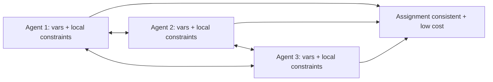

# Distributed Constraint Optimization

**Also known as:** DCOP, ADOPT, Distributed Constraint Reasoning

**Category:** Planning & Control Flow  
**Status in practice:** experimental

## Intent

A group of agents jointly assigns values to shared variables to minimise (or maximise) a global cost defined by inter-agent constraints, exchanging only the messages needed.

## Context

Several agents each hold private variables and constraints — meeting scheduling across users who don't want to expose calendars, resource allocation across teams that don't share budgets, sensor coordination across nodes that can't centralise. The global cost depends on all variables, but no single agent has the right to see them all.

## Problem

Centralising the whole problem is the easy answer but often illegal, expensive, or politically infeasible. Each agent solving locally produces solutions that violate global constraints. Without a distributed coordination algorithm that respects information boundaries, the team cannot find a global-cost-minimising assignment without surrendering privacy or autonomy.

## Forces

- Information cannot or should not be fully centralised.
- Local optima may violate global constraints.
- Message-passing has cost; communication must be bounded.
- Some algorithms guarantee global optimum (ADOPT) at high message cost; others are heuristic and faster.

## Applicability

**Use when**

- Several agents hold variables/constraints that cannot be centralised.
- Global cost depends on the joint assignment.
- Some algorithm in the DCOP family fits the cost/quality budget.

**Do not use when**

- Centralising is legal, cheap, and politically fine.
- Constraints cannot be factored across agents — DCOP needs factorisation.
- Communication cost dominates any optimisation benefit.

## Therefore

Therefore: cast the joint assignment as a DCOP and solve with a distributed algorithm that exchanges only the messages needed, so global cost is minimised without centralising private variables or constraints.

## Solution

Cast the problem as a DCOP: each agent owns variables; constraints are factored across agents. Run a distributed solver (ADOPT for optimal, DPOP, Max-Sum, or local-search heuristics for cheaper). Each agent communicates only with constraint-neighbours. The algorithm terminates with each agent holding an assignment that is consistent with the others and minimises (or approximately minimises) global cost. For LLM-agent applications, the LLM may serve as a propose-and-evaluate step at each agent, with a small DCOP-like backbone enforcing global consistency.

## Example scenario

Five team-calendar agents schedule a recurring cross-team meeting without exposing individual calendars. Each agent owns a variable (proposed slot) constrained by no-overlap with its team's commitments. They run Max-Sum: each agent proposes locally, exchanges aggregate cost messages with neighbours, and converges on a slot that minimises total conflict across teams without anyone seeing another team's calendar.

## Diagram

## Consequences

**Benefits**

- Global optimisation without centralising private data.
- Information boundaries respected by construction.
- Algorithm choice tunes communication cost vs solution quality.

**Liabilities**

- Optimal algorithms (ADOPT) have exponential worst-case message complexity.
- Constraint factorisation is itself a design problem.
- Heuristic solvers may stall in local optima.

## What this pattern constrains

Joint problems must not be centralised when information boundaries forbid it; agents exchange only the messages a distributed solver requires.

## Known uses

- **Multiagent Systems (Weiss) — Distributed Constraint Reasoning (Yokoo & Ishida chapter)** — *Available* — <https://mitpress.mit.edu/9780262731317/multiagent-systems/>
- **Sensor-network scheduling, distributed meeting scheduling research deployments** — *Available*

## Related patterns

- *complements* → [partial-global-planning](partial-global-planning.md)
- *alternative-to* → [blackboard](blackboard.md)
- *alternative-to* → [supervisor](supervisor.md)
- *complements* → [contract-net-protocol](contract-net-protocol.md)
- *alternative-to* → [world-model-as-tool](world-model-as-tool.md)
- *alternative-to* → [stigmergic-coordination](stigmergic-coordination.md)

## References

- (book) *Multiagent Systems, 2nd ed.*, Gerhard Weiss (ed.), 2013, <https://mitpress.mit.edu/9780262731317/multiagent-systems/>
- (doc) *Distributed constraint optimization*, <https://en.wikipedia.org/wiki/Distributed_constraint_optimization>

**Tags:** coordination, constraint, distributed
