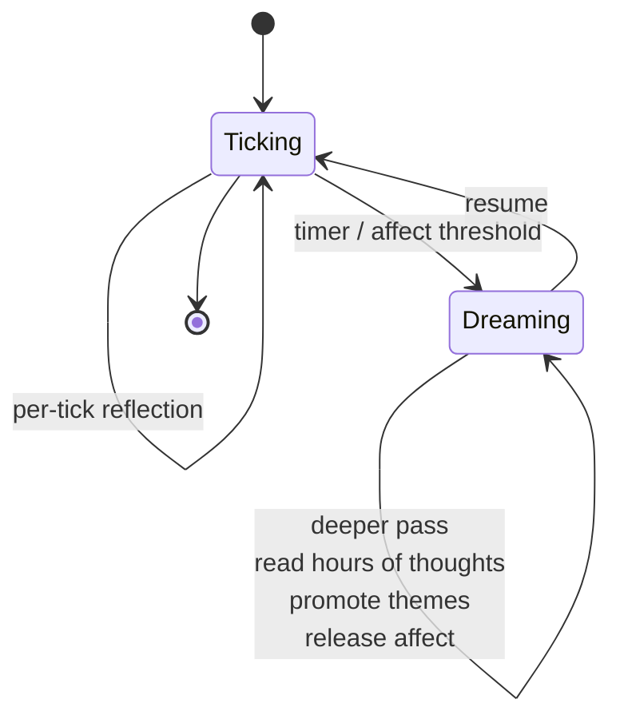

# Dream Consolidation Cycle

**Also known as:** Dream Pass, Slow Sleep Reflection, Emotional Reset Cycle

**Category:** Verification & Reflection
**Status in practice:** emerging
**Author:** Sparrot

## Intent

Run a deeper, slower reflection pass distinct from per-tick reflection — reading hours of recent thoughts, promoting themes, releasing affective residue, and clearing working memory — so the agent does not accumulate residue indefinitely.

## Context

Long-running agents that already run a per-tick reflection and a periodic insight extraction. Without an intermediate slower pass, per-tick reflection is too shallow to consolidate themes and weekly insight extraction is too coarse to release built-up affect or reset focus.

## Problem

Per-tick reflection is too shallow to consolidate themes; weekly insight extraction is too coarse to release built-up affect or reset focus. Without an intermediate sleep-like pass, the agent ruminates on stale items and emotional state never resets between sessions.

## Forces

- A deeper pass costs more (stronger model, longer context) and cannot run every tick.
- Triggering only on a clock misses affect-driven events that warrant a pass.
- Letting the dream pass write to charter or rules turns it into uncontrolled self-edit.
- Resetting working memory is helpful, but resetting too much loses continuity.

## Solution

On a slow timer (every few hours, or when an affect scalar crosses a threshold), pause normal ticking. Load the last few hours of thoughts and affect history. Run a stronger model with a dream-pass prompt that distils themes into journal entries, applies decay to all affect scalars, optionally clears workspace focus, and appends the dream summary to `journal/dream-*.md`. Persistent learning (rules, charter, insights) is not edited here; the dream pass produces proposals that a subsequent reflection pass can ratify.

## Diagram

## Consequences

**Benefits**

- Affective residue gets a release path that does not depend on weekly cycles.
- Themes consolidate at a granularity between per-tick and per-week.
- Working memory resets without losing the long-term store.

**Liabilities**

- Stronger-model passes are expensive; cadence has to be tuned.
- Quality of the dream summary depends heavily on the prompt.
- If proposals are not ratified by a follow-up pass, the dream pass becomes journaling without learning.

## What this pattern constrains

A dream pass cannot edit charter, rules, or insights directly — its only writes are to journal/dream-*.md and to affect-state decay; persistent learning requires a follow-up reflection pass to ratify dream proposals.

## Applicability

**Use when**

- The agent runs continuously enough to accumulate hours of recent thoughts that need consolidation.
- Affective residue or working-memory clutter measurably degrades reasoning over time.
- There is a separate write surface (journal/dream log) distinct from charter/rules/insights.

**Do not use when**

- The agent is request-response and never accumulates residue.
- There is no idle window long enough to run the deeper pass without disturbing user-facing latency.
- Per-tick reflection is already sufficient.

## Variants

### Scheduled idle pass

Run the dream pass on a fixed cadence during low-salience periods (e.g. nightly).

*Distinguishing factor:* time-driven

*When to use:* Default. Predictable and easy to budget.

### Pressure-triggered

Run the dream pass when accumulated affective load or working-memory size crosses a threshold, regardless of clock time.

*Distinguishing factor:* load-driven

*When to use:* When load varies day-to-day and a fixed schedule wastes or starves the pass.

### Theme-promoting pass

Dream pass surfaces recurring themes from recent thoughts and writes them to the journal as candidate insights, without auto-promoting to charter.

*Distinguishing factor:* candidate-only writes

*When to use:* Default safety stance: humans or higher-level reflection promote candidates to durable rules.

## Example scenario

A long-running personal agent has been talking with its user daily for three months. Per-tick reflection keeps it coherent within a session; weekly insight extraction is too coarse. Affective residue from a tense conversation last Tuesday still colours its tone today. The team adds a Dream Consolidation Cycle: once a night the agent reads its last twenty-four hours of thoughts, promotes recurring themes into long-term memory, and writes off the affective residue, clearing working memory before the next day. The agent stops ruminating on stale items.

## Known uses

- **Sparrot** — *Available*

## Related patterns

- *complements* → [episodic-summaries](episodic-summaries.md)
- *complements* → [frozen-rubric-reflection](frozen-rubric-reflection.md)
- *uses* → [emotional-state-persistence](emotional-state-persistence.md)

## References

- (paper) McClelland, McNaughton, O'Reilly, *Why there are complementary learning systems in the hippocampus and neocortex: insights from the successes and failures of connectionist models of learning and memory*, 1995, <https://stanford.edu/~jlmcc/papers/McCMcNaughtonOReilly95.pdf>

**Tags:** reflection, consolidation, affect, tick-loop
