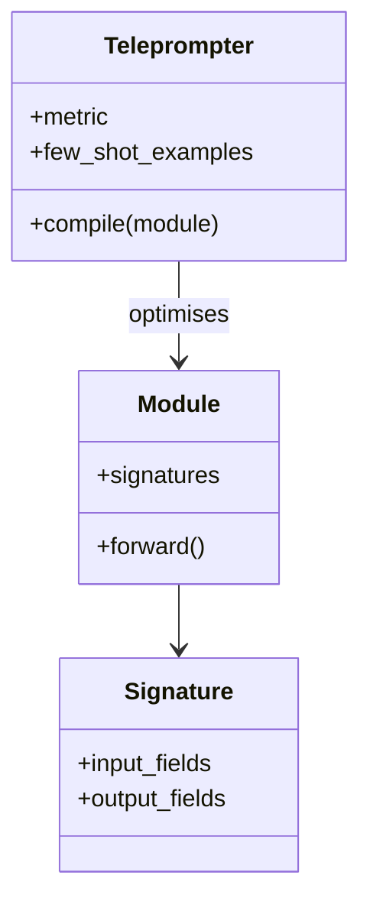

# DSPy Signatures

**Also known as:** Prompt Programs, Compiled Prompts

**Category:** Structure & Data  
**Status in practice:** emerging

## Intent

Specify agent behaviour as declarative typed signatures and modules; compile prompts and few-shot examples automatically against a metric.

## Context

Building reliable agent pipelines without hand-crafting prompts; treating prompts as the output of a compiler over typed specifications.

## Problem

Hand-crafted prompts are brittle, model-specific, and drift over time; teams reinvent the same prompt-engineering loop per pipeline.

## Forces

- Declarative coverage vs signature expressivity ceiling.
- Compile-time optimization vs metric/data availability.
- Portability vs per-model compilation gains.

## Therefore

Therefore: declare each step as a typed signature and let a metric-driven compiler produce the prompts, so that prompts become a reproducible build artefact instead of hand-tuned strings.

## Solution

Define each step as a typed signature (input fields → output fields). Compose signatures into modules. Run a teleprompter (optimizer) that generates few-shot examples and refines instructions against a held-out metric. The compiled artefact replaces hand-tuned prompts.

## Variants

- **BootstrapFewShot signature** — Compile signatures by sampling demonstrations from a labelled set and keeping those that score above a metric threshold.
- **MIPRO signature optimisation** — Joint Bayesian optimisation over instructions and demonstrations rather than demonstrations alone.
- **Assertion-guarded signatures** — Signatures carry runtime assertions (`dspy.Assert`); the optimiser learns to satisfy them, and violations trigger backtracking at inference.

## Example scenario

A team has six prompts across their pipeline and every model upgrade means rewriting all of them by hand against a vague vibes-test. They migrate to DSPy Signatures: each step is declared as a typed input/output module — for example summarise(article: str) -> Summary — and a compiler generates prompts and few-shot examples automatically against a metric they care about. When they swap models, the compiler re-optimises the prompts; the team stops hand-tuning strings.

## Diagram

## Consequences

**Benefits**

- Prompts become a reproducible build artefact.
- Metric-driven optimisation replaces vibes-based prompting.

**Liabilities**

- Compilation requires labelled or auto-evaluable data.
- Compiled artefacts drift with model upgrades; recompile regularly.

## What this pattern constrains

Module behaviour is constrained by its declared signature; ad-hoc string manipulation is replaced by typed input/output fields.

## Applicability

**Use when**

- Hand-crafted prompts are brittle and drift across model versions.
- A held-out metric exists that the optimizer can refine against.
- Composing pipelines from typed signatures fits the team's mental model.

**Do not use when**

- The pipeline is a single prompt and the DSPy machinery is overkill.
- No metric is available to drive optimisation and compiled prompts cannot be evaluated.
- The team needs full hand-control over prompt wording for compliance or explainability.

## Known uses

- **[Stanford DSPy](https://github.com/stanfordnlp/dspy)** — *Available*
- **DSPy production deployments at Replit, Databricks, Klarna** — *Available*

## Related patterns

- *uses* → [structured-output](structured-output.md)
- *uses* → [eval-harness](eval-harness.md)
- *complements* → [agent-skills](agent-skills.md)

## References

- (paper) Khattab, Singhvi, Maheshwari, Zhang, Santhanam, Vardhamanan, Haq, Sharma, Joshi, Moazam, Miller, Zaharia, Potts, *DSPy: Compiling Declarative Language Model Calls into Self-Improving Pipelines*, 2023, <https://arxiv.org/abs/2310.03714>

**Tags:** prompt-programs, dspy, compilation
