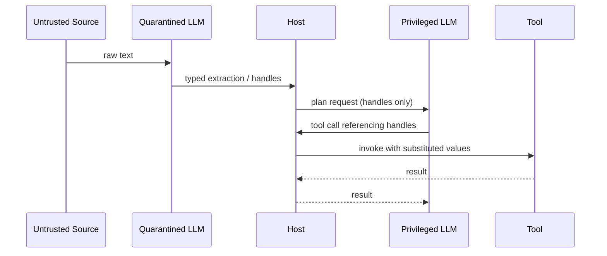

# Dual LLM Pattern

**Also known as:** Privileged/Quarantined LLM Split, Dual-Model Privilege Separation, Symbolic-Variable Handoff

**Category:** Safety & Control  
**Status in practice:** emerging

## Intent

Split agent work between a privileged model that holds tool access and a quarantined model that reads untrusted content, exchanging only opaque references between them.

## Context

Tool-using agents that must process attacker-controlled text (emails, web pages, document attachments, API responses) while also calling tools that can take consequential actions on the user's behalf.

## Problem

When the same model reads untrusted content and decides which tools to call, a single successful prompt injection in the untrusted text can hijack the action loop. Guardrails on the same model that performs both jobs cannot reliably tell trusted system instructions apart from instructions smuggled in via data.

## Forces

- Reading untrusted text is a normal, frequent operation; refusing to read it is not viable.
- Tool access is what makes the agent useful; removing it is not viable either.
- Filtering untrusted text before it reaches the model is unreliable — every filter has bypasses.
- Adding a second model raises cost, latency, and debugging complexity.

## Solution

Run two models with disjoint privileges. A **Privileged LLM** plans, holds tool access, and never sees raw untrusted content. A **Quarantined LLM** ingests the untrusted content but has no tools and cannot emit free-form actions. The two communicate through symbolic references: the Quarantined LLM extracts typed values (an email address, a date, a summary) and returns them as opaque handles; the Privileged LLM composes tool calls using those handles, with the host substituting the underlying values only at execution time.

## Diagram

## Example scenario

An email assistant must read inbound messages and draft replies that may include calendar invites. A Privileged model holds the calendar tool and the send-email tool but never sees the raw inbox; a Quarantined model reads each inbound message and returns a structured extraction — sender handle, requested date, body summary — as typed values. The Privileged model composes "reply to $SENDER suggesting $DATE" without ever ingesting the original attacker-controlled text. A prompt injection in the inbound message cannot drive a tool call because it never reaches the model that holds the tools.

## Consequences

**Benefits**

- Prompt injections in untrusted content cannot directly drive tool calls — the model that reads them has no tools.
- The trust boundary is enforced by the host, not by prompt instructions, so it survives clever wording.
- Symbolic handles make capability surface auditable: every tool call shows which handles it consumed and where they came from.

**Liabilities**

- Doubles model cost and adds at least one extra round trip per untrusted payload.
- Debugging spans two model transcripts that must be correlated.
- Handle plumbing is intrusive — every tool argument needs a typed slot or it has to fall back to raw text.
- Defends only against injection via the untrusted path; injection via tool outputs or system prompts is out of scope.

## What this pattern constrains

The privileged model may not receive untrusted content as raw text; the quarantined model may not call tools.

## Applicability

**Use when**

- Agent processes content from sources the operator does not control (email, web, third-party APIs).
- Tool calls in the agent can take consequential actions (send, write, pay, publish).
- Information from untrusted content can be reduced to typed values (addresses, dates, IDs, short strings) rather than free-form text the privileged model must reason over verbatim.

**Do not use when**

- The agent has no consequential tools — there is nothing to hijack.
- The untrusted content must be reasoned over verbatim and cannot be compressed to typed extractions.
- Cost and latency budgets cannot absorb a second model round trip per untrusted payload.

## Variants

- **Typed-extraction handoff** — Quarantined model emits a fixed schema (typed fields only); Privileged model composes tool calls over those fields. Recommended default.
- **Opaque-handle substitution** — Quarantined model returns opaque IDs (`$VAR1`, `$VAR2`); the host substitutes the underlying values only at tool-execution time so the privileged model never sees them. Use when even the extracted value could carry an injection payload.

## Known uses

- **Simon Willison, original proposal** — *Available*. Coined as a defence pattern for AI assistants that read email and call tools.
- **Beurer-Kellner et al., Design Patterns for Securing LLM Agents** — *Available*. Formalised as design pattern §3.1(4) — Dual LLM with symbolic variables.

## Related patterns

- *specialises* → [prompt-injection-defense](prompt-injection-defense.md)
- *complements* → [lethal-trifecta-threat-model](lethal-trifecta-threat-model.md) — trifecta names the risk; dual-LLM removes one of the three legs.
- *complements* → [input-output-guardrails](input-output-guardrails.md)
- *complements* → [sandbox-isolation](sandbox-isolation.md)

## References

- Simon Willison, *The Dual LLM pattern for building AI assistants that can resist prompt injection* (2023) — https://simonwillison.net/2023/Apr/25/dual-llm-pattern/
- Beurer-Kellner et al., *Design Patterns for Securing LLM Agents against Prompt Injections* (2025) — https://arxiv.org/abs/2506.08837

**Tags:** security, prompt-injection, privilege-separation, multi-model
