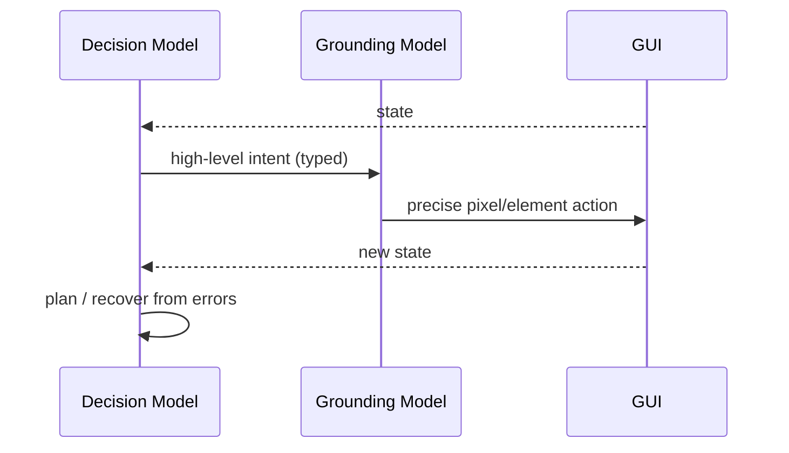

# Dual-System GUI Agent

**Also known as:** Decision-Plus-Grounding, Planner-and-Vision Split, Two-Model GUI Agent

**Category:** Tool Use & Environment  
**Status in practice:** emerging

## Intent

Split a GUI agent into two specialised models: a decision model that plans and recovers from errors, and a grounding model that observes pixels/elements and emits the precise action; route each subproblem to the model that handles it well.

## Context

Long, multi-step GUI tasks (web flows, phone apps) where planning needs flexibility and abstraction while grounding needs precise visual matching at action time.

## Problem

A single model that does both planning and grounding is dominated by the harder skill at any moment: a planning-strong model misclicks; a vision-strong model loops on local fixes when it should replan.

## Forces

- Planning skill and grounding skill are distinct in current models.
- Two models cost more per turn but can be smaller per task.
- Hand-off between models needs a clean intermediate representation.
- Error recovery has to know which model to blame.

## Solution

Define a clean intermediate representation: the decision model emits a high-level intent ("open the cart", "swipe left to next item") in a small, typed vocabulary; the grounding model receives that intent plus the current screenshot and emits the concrete action (tap(x,y), swipe coordinates, key press). The decision model holds the plan and replans on failure; the grounding model is stateless per action but specialised on screen interpretation. Errors at the grounding step are reported back to the decision model for replanning, not retried locally.

## Example scenario

A desktop-automation agent occasionally clicks the wrong menu item by a few pixels, and on other tasks plans well but loops endlessly trying to recover from a bad click. A single model is dominated by whichever skill is harder at the moment. The team splits it into a Dual-System GUI Agent: a strong planning model decides what to do and how to recover from errors, and a separate vision-grounding model translates 'click Save As' into the precise pixel coordinates. Each subproblem goes to the better-suited model.

## Structure

```
Screenshot -> Decision_Model -> intent (typed) -> Grounding_Model + Screenshot -> low-level action -> device -> next Screenshot.
```

## Diagram



## Consequences

**Benefits**

- Each model is sized to its skill; total parameters are smaller than a unified model.
- Error recovery has a clean attribution: planning vs. grounding.
- Decision-model planning generalises across desktop, web, phone; grounding model is per-surface.

**Liabilities**

- Two model calls per turn — latency and cost.
- Intent vocabulary design is a real engineering problem.
- Hand-off mistakes (decision says X, grounding hears Y) are hard to debug.

## What this pattern constrains

The decision model may not emit pixel-level actions; the grounding model may not change the plan or invent intents outside the typed vocabulary.

## Applicability

**Use when**

- A single GUI model is dominated by either planning or grounding and underperforms on the other skill.
- A clean intermediate vocabulary (open the cart, swipe left to next item) can express decisions for grounding.
- Two specialised models (decision and grounding) are available and routing between them is feasible.

**Do not use when**

- A single competent multimodal model handles both planning and grounding well enough.
- No clean intermediate vocabulary fits the task and the split would lose information.
- Routing overhead between two models exceeds the quality lift.

## Known uses

- **[AutoGLM (Zhipu)](https://xiao9905.github.io/AutoGLM/)** — *Available*. Decision model (GLM-4.7) plus grounding/vision model; web and Android variants.
- **Mobile-Agent-v2** — *Available*. Three-agent variant: planning + decision + reflection.

## Related patterns

- *specialises* → [computer-use](computer-use.md)
- *specialises* → [browser-agent](browser-agent.md)
- *complements* → [mobile-ui-agent](mobile-ui-agent.md)
- *uses* → [multi-model-routing](multi-model-routing.md)
- *uses* → [structured-output](structured-output.md)

## References

- (paper) *AutoGLM: Autonomous Foundation Agents for GUIs*, 2024, <https://arxiv.org/abs/2411.00820>
- (paper) Wang et al., *Mobile-Agent-v2: Mobile Device Operation Assistant with Effective Navigation via Multi-Agent Collaboration*, 2024, <https://arxiv.org/abs/2406.01014>

**Tags:** tool-use, gui-agent, china-origin, autoglm
