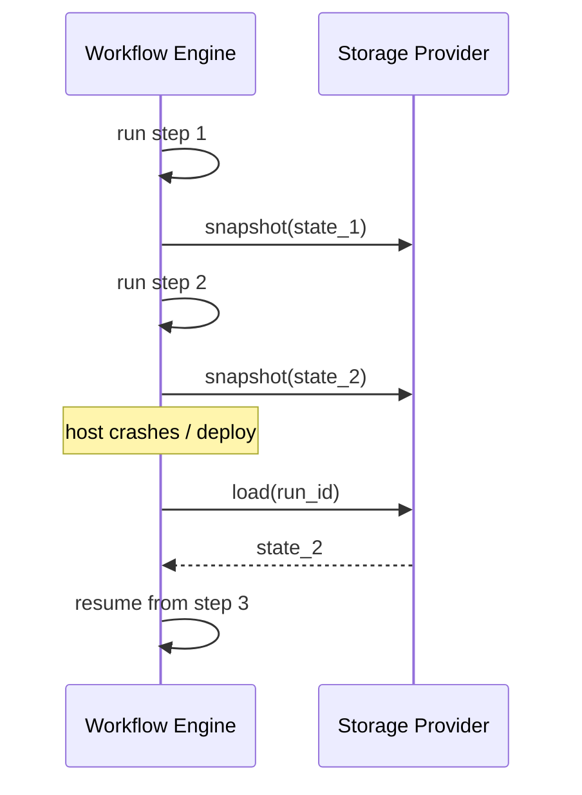

# Durable Workflow Snapshot

**Also known as:** Workflow Checkpointing, Storage-Backed Workflow State, Snapshot Persistence

**Category:** Governance & Observability  
**Status in practice:** emerging

## Intent

Capture workflow execution state as a snapshot in a pluggable storage provider so a paused run can resume across deployments, process restarts, and host crashes.

## Context

A team builds workflows that may run for hours or days and that frequently pause waiting on external signals: a human approving a loan, a slow third-party API returning a result, or a scheduled wake-up the next morning. These workflows have to keep running across application deploys, restarts of the worker processes, and the loss of individual hosts. The team has access to durable storage such as a Postgres database, an object store, or a vendor-managed snapshot service.

## Problem

Keeping the workflow state only in process memory is enough to survive a single crash that the same process recovers from, but not deploys that replace the binary, host failures that move work elsewhere, or pauses long enough that the original worker is gone. Without writing the full state out to durable storage at known checkpoints, every deploy or host loss vaporises in-flight runs and the work restarts from zero. The team is forced to choose between short workflows that fit in one process lifetime or accepting that long-running workflows will routinely lose hours of progress.

## Forces

- Workflow state grows with run length and must be serialisable to durable storage.
- Storage providers vary in latency, cost, and consistency guarantees.
- Schema versioning across deployments — a v1 snapshot may need to resume under v2 code.
- Snapshot frequency trades resume granularity against write cost.
- Snapshots are sensitive data; access control on the storage provider is part of the threat model.

## Applicability

**Use when**

- Runs span deploys (anything longer than a typical release cycle).
- Workflows may wait minutes-to-hours on external signals.
- Host loss must not lose user work.
- An audit trail of intermediate state is required.

**Do not use when**

- Workflows finish well inside a single process lifetime and idempotent retry is enough.
- State is too large to snapshot at every checkpoint and a different durability shape (event sourcing, append-only) fits better.
- Resuming with stale code under new deployments cannot be made safe.

## Therefore

Therefore: serialise the entire workflow state into a pluggable storage provider at well-defined checkpoints, so that a paused run can resume on a different host, after a deploy, or after a process crash by loading the snapshot.

## Solution

Treat the workflow runtime as a state machine whose state is fully serialisable. At checkpoints (after every step, on suspend, before risky actions) write a snapshot — `{step_index, local_state, awaited_signals, history}` — to a pluggable storage provider (Postgres, S3, Redis, vendor-managed). To resume, load the snapshot, rehydrate state, and continue from the recorded step. Version snapshot schemas; refuse to resume incompatible versions rather than corrupt the run. Pair with agent-resumption (the broader pattern), replay-time-travel (the auditor view), and provenance-ledger (linking snapshots to outputs).

## Structure

WorkflowEngine → checkpoint(snapshot) → StorageProvider. On startup: StorageProvider → load(run_id) → WorkflowEngine.resume(snapshot).

## Example scenario

A loan-origination agent runs for hours, pausing twice for human approval. Without durable snapshots, every nightly deploy kills in-flight runs and the work restarts from zero the next morning. The team adds durable workflow snapshots written to Postgres after each step: on deploy, in-flight runs resume from their last checkpoint, the awaited approval is rehydrated, and the worst-case loss is one step. Snapshot schemas are versioned; the new deploy refuses to resume a snapshot it cannot understand and emits an explicit recovery task instead.

## Diagram

## Consequences

**Benefits**

- Runs survive deployments, process restarts, and host loss.
- Pluggable storage lets the same workflow run against different durability tiers.
- Resume is observable: snapshots are inspectable artefacts.
- Long suspensions (human approval, slow APIs) become cheap — no compute spend while waiting.

**Liabilities**

- Snapshot schema versioning is real engineering work; mismatches must fail closed.
- Storage I/O on each checkpoint adds latency and cost.
- Resuming a snapshot under different code may reach states the new code does not expect.
- Sensitive data lands in the storage provider and inherits its access-control posture.

## What this pattern constrains

Workflow state must be fully serialisable into the storage provider at every checkpoint; no in-process-only data may participate in resumption, and snapshots are not allowed to resume under incompatible schema versions.

## Known uses

- **Mastra workflows (suspend-and-resume)** — Mastra workflows write snapshots to a configured storage provider; snapshots persist across deployments and application restarts. *Available* — [link](https://mastra.ai/docs/workflows/suspend-and-resume)
- **Temporal Workflows** — Temporal persists workflow execution history durably so workflows can run for years and survive process crashes. *Available* — [link](https://docs.temporal.io/workflows)
- **Inngest / Restate / DBOS** — Same durable-execution shape: workflow state in pluggable storage, resumable across deployments. *Available*

## Related patterns

- *specialises* → [agent-resumption](agent-resumption.md)
- *complements* → [replay-time-travel](replay-time-travel.md)
- *complements* → [provenance-ledger](provenance-ledger.md)
- *complements* → [scheduled-agent](scheduled-agent.md)

## References

- *doc*: [Mastra — Suspend and Resume Workflows](https://mastra.ai/docs/workflows/suspend-and-resume) — Mastra
- *doc*: [Temporal — Workflows](https://docs.temporal.io/workflows) — Temporal Technologies

**Tags:** governance-observability, durable-execution, checkpointing, mastra, temporal
