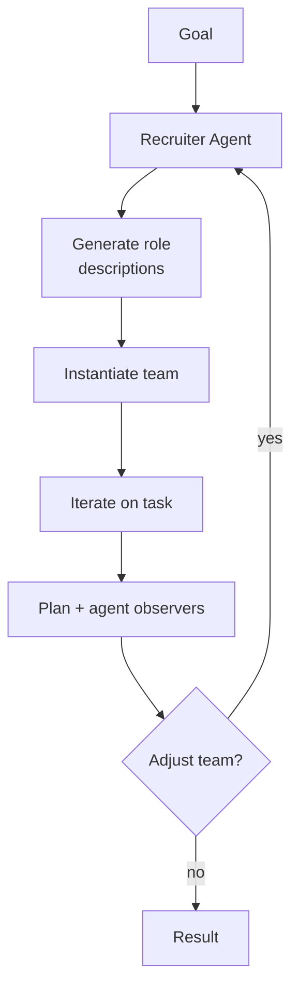

# Dynamic Expert Recruitment

**Also known as:** Recruiter Agent, Run-Time Team Assembly, Adaptive Role Generation

**Category:** Multi-Agent  
**Status in practice:** experimental

## Intent

Generate the agent team — role descriptions and instances — at run time based on the specific task, then adjust team composition between iterations based on evaluation feedback.

## Context

A multi-agent platform accepts a wide range of tasks through one entry point — drafting a regulatory filing, refactoring a Python module, planning a marketing campaign — and the right team of specialists varies sharply from one task to the next. The platform cannot know the task type in advance and cannot afford to keep one large fixed crew always running.

## Problem

A hard-coded role list is brittle: the team that suits a legal filing is not the team that suits a code refactor, and the writer-reviewer-editor lineup that helped the first request is dead weight for the second. Over-provisioning a large fixed pool wastes tokens and creates noise. Under-provisioning misses the specialist the task actually needed. Without a way to assemble the team at run time, every workflow either drags around unnecessary roles or quietly skips work that should have happened.

## Forces

- Pre-specified roles are stable but mis-fit;
- Run-time generation costs an extra LLM call before any work begins;
- Adaptive composition risks instability: the team that solves step 1 may not solve step 5.

## Therefore

Therefore: let a recruiter agent generate the role descriptions and instantiate the team for the specific goal, and adjust composition between iterations on evaluator feedback, so that the team matches the task instead of the task being squeezed into a fixed team.

## Solution

Add a recruiter agent (or a meta-agent committee: planner + agent observer + plan observer). Stage 1 — Drafting: recruiter receives the goal, generates role descriptions matched to that goal, instantiates the team and an execution plan. Stage 2 — Execution: the team works. Stage 3 — Evaluation: a reviewer scores progress; if unsatisfactory, the recruiter adjusts the team (add, remove, replace roles) and the next iteration runs. The recruiter is the only meta-agent that mutates team composition.

## Example scenario

A multi-agent platform runs both 'draft a regulatory filing' and 'refactor this Python module' through the same hard-coded team of writer, reviewer, and editor. The reviewer is fine for prose but useless on code. They switch to Dynamic Expert Recruitment: a meta-agent reads the task and instantiates appropriate roles — for the filing, a compliance expert and a legal editor; for the refactor, a senior engineer and a unit-test author. After the first iteration's evaluation, the team composition is adjusted between rounds.

## Structure

```
goal -> Recruiter -> [role descriptions] -> instantiated agents -> joint execution -> Evaluator -> feedback -> Recruiter (adjust team) -> ...
```

## Diagram



## Consequences

**Benefits**

- Team matches the task instead of the task being squeezed into a fixed team.
- Adaptive composition closes the gap as the task evolves.
- Recruiter prompt is the only place the meta-policy lives.

**Liabilities**

- Recruiter quality is the bottleneck; a bad recruiter produces bad teams.
- Run-time team generation is non-deterministic; reproducibility suffers.
- Adjustment between iterations can churn (replace too aggressively).

## What this pattern constrains

No role may be instantiated outside the recruiter; agents may not unilaterally co-opt or invent peers.

## Applicability

**Use when**

- Hard-coded role lists are brittle because the right team varies wildly across tasks.
- A recruiter agent can generate role descriptions and instantiate the team based on the goal.
- Evaluation feedback can drive team composition adjustments between iterations.

**Do not use when**

- Tasks are homogeneous enough that one fixed team handles them all.
- Recruiter latency or cost outweighs the benefit of dynamic team composition.
- Stable, certified roles are required for compliance reasons.

## Known uses

- **[AgentVerse](https://github.com/OpenBMB/AgentVerse)** — *Available*. Recruiter agent generates expert descriptions per goal; team composition adjusted across iterations.
- **[AutoAgents](https://github.com/Link-AGI/AutoAgents)** — *Available*. Drafting stage with three meta-agents (Planner, Agent Observer, Plan Observer) synthesises the team.

## Related patterns

- *complements* → [supervisor](supervisor.md)
- *generalises* → [role-assignment](role-assignment.md) — Role assignment is the design-time special case.
- *alternative-to* → [mixture-of-experts-routing](mixture-of-experts-routing.md) — MoE routes to a fixed expert pool; this constructs the experts.
- *complements* → [orchestrator-workers](orchestrator-workers.md)
- *uses* → [evaluator-optimizer](evaluator-optimizer.md) — Evaluation step drives team adjustment.

## References

- (paper) Chen et al., *AgentVerse: Facilitating Multi-Agent Collaboration and Exploring Emergent Behaviors*, 2023, <https://arxiv.org/abs/2308.10848>
- (paper) Chen et al., *AutoAgents: A Framework for Automatic Agent Generation*, 2023, <https://arxiv.org/abs/2309.17288>

**Tags:** multi-agent, dynamic, china-origin, agentverse, autoagents
