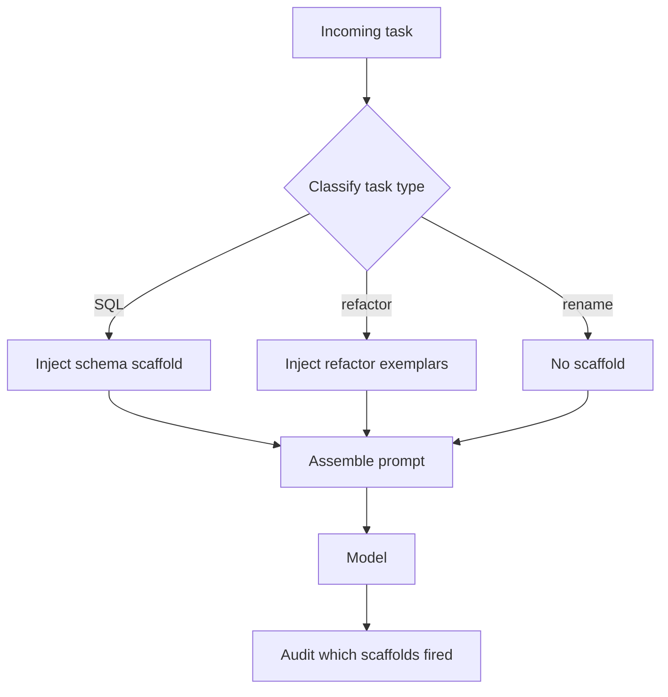

# Dynamic Scaffolding

**Also known as:** Adaptive Prompting, Just-in-Time Context

**Category:** Routing & Composition  
**Status in practice:** emerging

## Intent

Inject task-specific scaffolding (examples, hints, schemas) into the prompt only when the task type warrants it.

## Context

Agents handling heterogeneous tasks where always-present scaffolding wastes tokens and sometimes biases outputs.

## Problem

Static prompts either include everything (wasteful, sometimes misleading) or include nothing (under-scaffolded for hard cases).

## Forces

- Detection of when scaffolding helps is itself a problem.
- Scaffolding library curation effort.
- Compositional scaffolding (multiple scaffolds in one prompt) interacts unpredictably.

## Solution

Maintain a library of scaffolds (few-shot examples, schemas, hints) keyed by task type or feature. At runtime, classify the task and inject the matching scaffolds. Audit which scaffolds fired per request.

## Example scenario

A general-purpose coding assistant carries 4k tokens of examples, schemas, and hints in its prompt for every request, including 'rename this variable'. The scaffolding burns tokens on trivial tasks and is sometimes misleading. The team uses Dynamic Scaffolding: a lightweight classifier identifies the task type and only injects the relevant scaffolding — schemas for SQL tasks, refactor exemplars for refactor tasks, nothing extra for renames. Token cost drops on easy tasks and hard tasks get richer help than before.

## Diagram

## Consequences

**Benefits**

- Token efficiency.
- Targeted quality lift on hard cases.

**Liabilities**

- Scaffold library maintenance.
- Misclassification injects wrong scaffolds.

## What this pattern constrains

Scaffolds load only on matching task classification; default tasks see the bare prompt.

## Applicability

**Use when**

- Some tasks need few-shot examples, schemas, or hints and others do not — static prompts overshoot or undershoot.
- A library of scaffolds keyed by task type or feature can be maintained.
- Task classification at runtime is reliable enough to route the right scaffold.

**Do not use when**

- All tasks are similar enough that one static prompt suffices.
- Task classification is unreliable and wrong scaffolds would confuse the model.
- Scaffold library maintenance cost exceeds the prompt-quality gain.

## Known uses

- **Avramovic Dynamic Scaffolding pattern** — *Available*
- **DSPy compiled prompts (signature-driven scaffolding)** — *Available*

## Related patterns

- *uses* → [routing](routing.md)
- *complements* → [context-window-packing](context-window-packing.md)
- *complements* → [agent-skills](agent-skills.md)

## References

- (repo) *zeljkoavramovic/agentic-design-patterns*, <https://github.com/zeljkoavramovic/agentic-design-patterns>

**Tags:** prompting, scaffolding, dynamic
