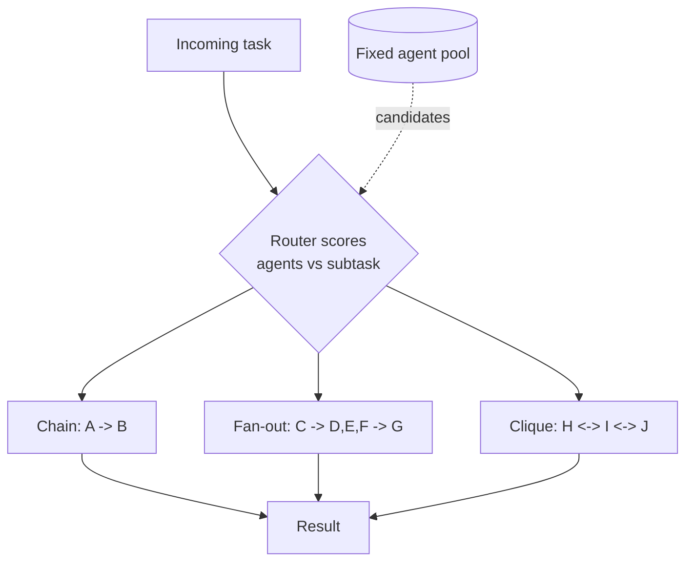

# Dynamic Topology Routing

**Also known as:** Adaptive Agent Topology, Optimizable Agent Graph, Runtime Graph Rewiring

**Category:** Multi-Agent  
**Status in practice:** experimental

## Intent

Form and dissolve the connections between agents at runtime by matching the task to candidate collaborators, instead of committing the multi-agent system to a fixed chain, star, or mesh up front.

## Context

A multi-agent system has a pool of specialised agents. The classic designs wire them into a fixed topology — a sequential chain, a star around an orchestrator, or a fully connected mesh — chosen before any task arrives. Different tasks, though, want different communication structures: some need a tight pipeline, others a wide fan-out, others a small debate among three peers. A topology that fits one task wastes messages or drops needed links on another.

## Problem

A fixed inter-agent topology is a compromise across all tasks the system will ever see. A mesh pays quadratic message and token cost even when a chain would do; a chain serialises work that could fan out; a star bottlenecks on its hub. Hard-wiring the structure at design time forces every task through the same shape, so some tasks over-communicate and others lack the links they need.

## Forces

- Different tasks want different communication shapes; one fixed topology fits none of them well.
- Denser topologies raise coordination quality but cost messages and tokens quadratically.
- Rewiring at runtime adds a routing decision that itself can be wrong or slow.
- The agent pool and their competencies are known; which links matter is task-specific.
- An adaptive graph is harder to reason about and debug than a static one.

## Therefore

Therefore: keep the agent pool fixed but choose the edges per task at runtime, matching each subtask to the agents best placed to handle it and connecting only those, so the topology fits the work rather than the other way round.

## Solution

Separate the agent pool from the communication graph over it. For each task (or each step), a routing layer scores candidate agents against the current subtask — by capability description, embedding similarity, or a learned router — and instantiates only the edges needed: a chain when the work is sequential, a fan-out when it is parallel, a small clique when it needs debate. As the task evolves, edges are added and dropped. Approaches range from per-step semantic matching (DyTopo) to treating the whole topology as an optimisable graph trained end to end (GPTSwarm). The static chain, star, and mesh become special cases the router can choose, not the only option.

## Structure

```
Agent pool (fixed) + Router (per-task/per-step) -> scores agents vs subtask -> instantiates edges (chain | fan-out | clique) -> agents communicate over the chosen graph -> edges revised as task evolves.
```

## Diagram



*A fixed agent pool, but the router instantiates a different communication graph for each task.*

## Example scenario

A research platform keeps a pool of a dozen specialist agents — retrieval, code, math, critique, writing. For a simple lookup it wires a two-agent chain; for a contested claim it stands up a three-agent debate clique; for a survey it fans out to five retrievers and a synthesiser. The same pool serves all three because a router reads each task and instantiates only the edges that task needs, instead of forcing everything through one standing mesh.

## Consequences

**Benefits**

- Communication cost tracks the task instead of the worst case.
- Each subtask reaches the agents actually suited to it.
- Static chain, star, and mesh remain available as router choices.
- An optimisable graph can be tuned for accuracy or cost over a workload.

**Liabilities**

- The router is a new failure point: a bad routing decision wires the wrong agents.
- Runtime rewiring adds latency and decision cost to every task.
- A graph that changes shape is harder to trace and reproduce than a fixed one.
- Learned topologies need training data and can overfit a benchmark.
- Pathological routing can oscillate or rebuild edges every step.

## What this pattern constrains

Agents must not assume a fixed set of peers or a standing communication structure; who they talk to is decided by the routing layer per task and may change between steps. An agent must not open links the router has not granted for the current subtask.

## Applicability

**Use when**

- The system serves tasks that want genuinely different communication shapes.
- A fixed mesh is too costly and a fixed chain too rigid for the workload.
- Agents carry clear, machine-comparable capability descriptions to route against.
- You can afford a routing decision per task or per step.

**Do not use when**

- A single fixed topology already fits every task the system sees.
- The agent pool is two or three agents where any structure is cheap.
- Reproducibility and easy tracing outweigh adaptivity.
- There is no signal to route on and the router would guess blindly.

## Known uses

- **[GPTSwarm](https://github.com/metauto-ai/GPTSwarm)** — *Available* — Represents a multi-agent system as an optimisable graph and learns the edges/topology end to end, rather than fixing them by hand.
- **[GPTSwarm (Zhuge et al., arXiv:2402.16823)](https://arxiv.org/abs/2402.16823)** — *Available* — Language Agents as Optimizable Graphs: formalises agents and their connections as a graph that can be optimised for a task.
- **[VoltAgent awesome-ai-agent-papers (DyTopo)](https://github.com/VoltAgent/awesome-ai-agent-papers)** — *Available* — Catalogues Dynamic Topology Routing, which rewires agent connections at runtime via semantic matching.

## Related patterns

- *alternative-to* → [orchestrator-workers](orchestrator-workers.md) — Orchestrator-workers fixes a star around a hub; dynamic topology routing chooses the shape per task, of which the star is one option.
- *complements* → [decentralized-swarm-handoff](decentralized-swarm-handoff.md) — Swarm handoff transfers control along existing peer links; topology routing decides which links exist in the first place.
- *complements* → [contract-net-protocol](contract-net-protocol.md) — Contract-net bids allocate a task to an agent; topology routing wires the resulting collaborators into a task-specific graph.

## References

- (paper) Mingchen Zhuge et al., *GPTSwarm: Language Agents as Optimizable Graphs*, 2024, <https://arxiv.org/abs/2402.16823>
- (repo) VoltAgent, *VoltAgent/awesome-ai-agent-papers (2026 agent papers, incl. DyTopo)*, 2026, <https://github.com/VoltAgent/awesome-ai-agent-papers>

**Tags:** multi-agent, topology, routing, orchestration, graph
