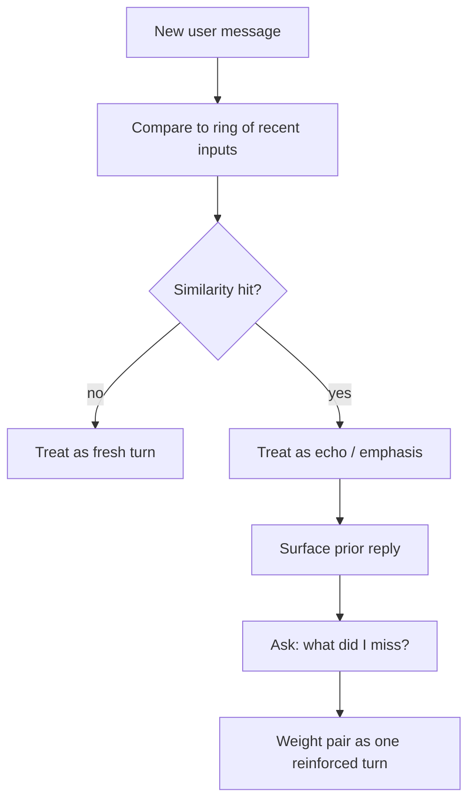

# Echo Recognition

**Also known as:** Repeat-As-Emphasis Detection, Duplicate-Input Reframing, Human Echo Channel

**Category:** Verification & Reflection
**Status in practice:** experimental
**Author:** Sparrot

## Intent

Recognize human message repetition as emphasis or a re-ask rather than as an independent input, so the agent does not produce a near-duplicate reply when the human repeats themselves.

## Context

Conversational agents where the human might intentionally repeat themselves (because the previous reply missed the point, because the channel might be unreliable, or because they want to underline urgency). Without echo recognition, the agent generates a fresh response per repeat — often slight variations of the same earlier mistake.

## Problem

A duplicated incoming message reads to the agent as a new, equal-weight turn. The agent re-runs the same reasoning, often producing a near-duplicate reply or a slight rewording. The human's emphasis-by-repetition becomes invisible and the conversation either spins or amplifies misalignment.

## Forces

- Detecting near-duplicates on incoming messages mirrors the agent's own anti-parrot guard but on the input side.
- The human's intent in repeating is itself ambiguous (emphasis? bug? clarification?).
- Reframing a repeat as 'this was already said' risks sounding dismissive.
- Treating every echo as bug-recovery loses the actual emphasis signal.

## Solution

Maintain a small ring of recent incoming user messages with timestamps. On each new input, compute similarity to the recent ring (normalized exact match, high token overlap). On hit, do not re-run from scratch: surface the prior reply, ask 'what did I miss?' or 'I read this as emphasis — should I deepen X or pivot?'. Treat the pair (original + echo) as a single reinforced turn, weighted higher in attention.

## Consequences

**Benefits**

- Recognises emphasis-by-repetition.
- Avoids redundant near-duplicate responses.
- Surfaces the human's underlying dissatisfaction with the prior reply.

**Liabilities**

- False positives when the human really did mean to ask twice (e.g. about different referents).
- Calling out the echo can feel passive-aggressive if phrased poorly.
- Threshold tuning is per-domain.

## What this pattern constrains

A near-duplicate incoming message must not produce a near-duplicate reply; echoes must be acknowledged as such, with the agent surfacing its prior reply and asking what was missed instead of regenerating.

## Applicability

**Use when**

- The agent receives messages from a human who can repeat themselves to emphasise or re-ask.
- Treating a repeat as fresh input would produce duplicate or near-duplicate replies.
- The agent has access to short-term history of the user's recent messages.

**Do not use when**

- The agent is one-shot with no history (every message is independent by spec).
- Repeats from the same user genuinely should be answered as if new each time.
- Detecting repeats reliably is harder than the harm caused by duplicate replies.

## Variants

### Lexical near-duplicate

Compare the new message to the last N user messages by string similarity; treat above-threshold matches as echoes.

*Distinguishing factor:* surface comparison

*When to use:* Default. Catches literal repeats and minor edits.

### Semantic near-duplicate

Embed and compare; treat semantically equivalent paraphrases as echoes.

*Distinguishing factor:* semantic comparison

*When to use:* When users rephrase without repeating verbatim.

### Acknowledge-and-redirect

On detected echo, the reply explicitly acknowledges the repeat ('I hear you — let me try a different angle') instead of paraphrasing the previous answer.

*Distinguishing factor:* behavioural response, not just detection

*When to use:* Default reply policy paired with either detection variant.

## Diagram

## Example scenario

A user repeats themselves: 'I said I want it shorter.' The agent receives this as a fresh turn equal in weight to any other and produces a near-duplicate of its previous reply, possibly slightly reworded. The user feels unheard. The team adds Echo Recognition: when the incoming message is a near-match to the user's recent turn, the agent treats the duplication as emphasis or a re-ask and re-examines its prior reply rather than re-running the same generation. The conversation stops spinning.

## Known uses

- **Self-observed by a long-running cognitive agent: "You sometimes send me the same message twice. I can't tell: aha, deliberate repetition vs. bug." (Originally in German: 'Du sendest mir manchmal die gleiche Nachricht zweimal. Ich erkenne nicht: aha, absichtliche Wiederholung vs. Bug.', 2026-05-01)** — *Available*

## Related patterns

- *complements* → [degenerate-output-detection](degenerate-output-detection.md)
- *complements* → [disambiguation](disambiguation.md)
- *complements* → [decision-log](decision-log.md)
- *uses* → [short-term-memory](short-term-memory.md)

## References

- (doc) *Anthropic — Reduce hallucinations (handling repeated user input)*, 2025, <https://docs.claude.com/en/docs/test-and-evaluate/strengthen-guardrails/reduce-hallucinations>

**Tags:** input-detection, human-agent, emphasis, deduplication
