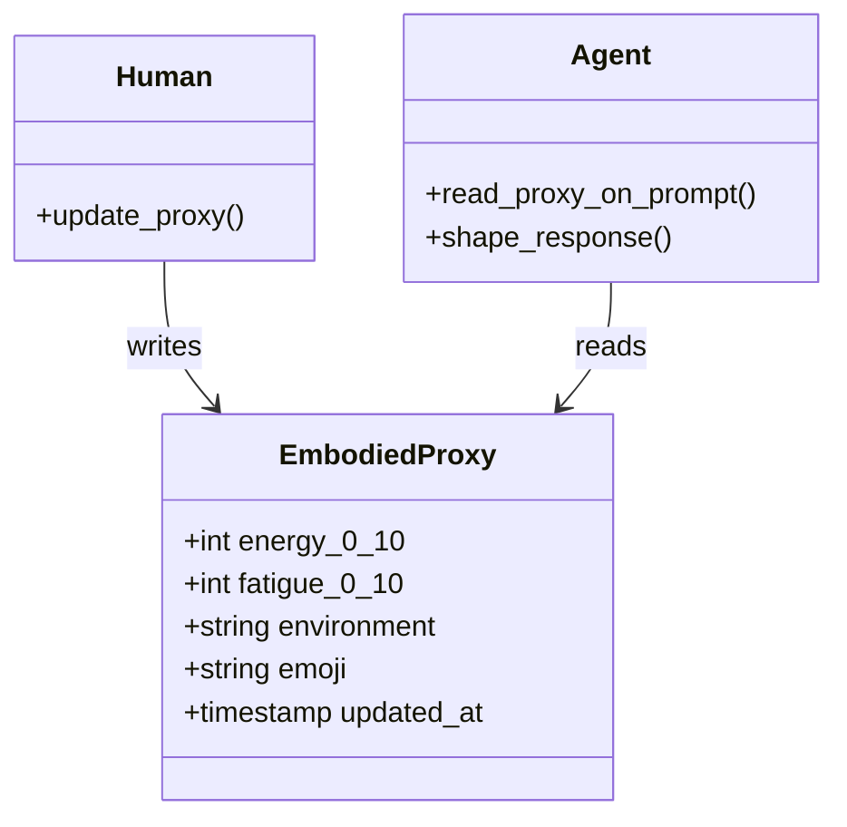

# Embodied-Proxy Handoff

**Also known as:** Body-State Share, Human-Side Telemetry

**Category:** Streaming & UX
**Status in practice:** experimental

## Intent

Enable the human to share embodied state (energy, fatigue, environment) so the agent tailors response shape to the actual person rather than to a context-free abstract user.

## Context

Long-running text-only agents conversing with a human whose physical and ambient state shapes the meaning of their words. The agent has no sensors; the human has sensors but no obligation to narrate.

## Problem

The agent reads only text, so it projects flat affect onto whatever the human writes. A 'fine' typed at 6 AM after a poor night's sleep reads identically to 'fine' typed at 3 PM after a good lunch. Without a proxy for embodied state the agent paces, holds, or pushes against an imagined human, not the actual one.

## Forces

- The agent has no perception of the human's body or environment.
- Asking for full context every turn is friction.
- A single one-line proxy at session start carries surprising amount of signal.
- Updating the proxy on shift, not every turn, balances cost and freshness.

## Solution

Define a minimal proxy schema (energy 0-10, fatigue 0-10, environment one-word, optional emoji). Store the latest proxy in a small persistent file the agent reads on every prompt assembly. The human updates it at session start, after a long break, or when state changes meaningfully. The agent surfaces the proxy when it shapes the response (paces shorter for low energy, stays present for tired, doesn't open new threads for winding-down).

## Consequences

**Benefits**

- Agent paces conversation against actual human state.
- Reduces 'why is the agent so chipper when I'm exhausted' friction.
- Cheap to maintain; one line per shift.

**Liabilities**

- Privacy: the proxy is sensitive personal data.
- Stale proxies are worse than none if the agent over-trusts.
- Burden on the human to keep it current.

## What this pattern constrains

When embodied state is shared, response shape must reflect it; identical pacing across high-energy, fatigued, and winding-down states is a bug.

## Applicability

**Use when**

- The agent is conversational and reply shape (length, density, tone) noticeably affects user experience.
- Users will plausibly share embodied state (energy, fatigue, mood, environment) if asked or invited.
- The agent runs across long enough sessions that the same user is in different states at different times.

**Do not use when**

- The agent is transactional and reply shape is fixed by spec.
- Privacy or trust constraints forbid storing or reasoning about user affect.
- Users find embodied questions intrusive in this product context.

## Variants

### Self-reported state

User explicitly states fatigue, energy, environment ('I'm tired, keep it short') and the agent retains it for the session.

*Distinguishing factor:* explicit user statement

*When to use:* Default. Simplest and most consensual.

### Inferred from cues

Agent infers state from message length, typo rate, time of day, latency between turns; adjusts shape without asking.

*Distinguishing factor:* implicit inference

*When to use:* When asking would feel intrusive but the cues are reliable enough to act on.

### Sensor-fed

External device or app feeds embodied signals (sleep score, calendar busyness) directly into the agent's prompt.

*Distinguishing factor:* third-party sensor stream

*When to use:* When the agent is part of a quantified-self or wellness product with the user's consent.

## Diagram

## Example scenario

A coaching agent reads only the user's text and projects the same flat affect onto every 'I'm fine'. A user typing at 6 AM after three hours of sleep gets pushed the same way as the same user typing at 3 PM well-rested. The team adds an Embodied Proxy Handoff: the user (or a wearable) shares lightweight signals — sleep, fatigue, location, current focus — and the agent tailors response shape, depth, and pace accordingly. The agent stops pacing against an imagined human.

## Known uses

- **Long-running personal agent loops (private deployment)** — *Available*

## Related patterns

- *complements* → [awareness](awareness.md)
- *complements* → [bidirectional-impulse-channel](bidirectional-impulse-channel.md)
- *complements* → [now-anchoring](now-anchoring.md)
- *complements* → [liminal-state-detection](liminal-state-detection.md)

## References

- (paper) Rosalind W. Picard, *Affective Computing (foundational survey)*, 2000, <https://mitpress.mit.edu/9780262661157/affective-computing/>

**Tags:** human-agent, embodiment, context, ux
