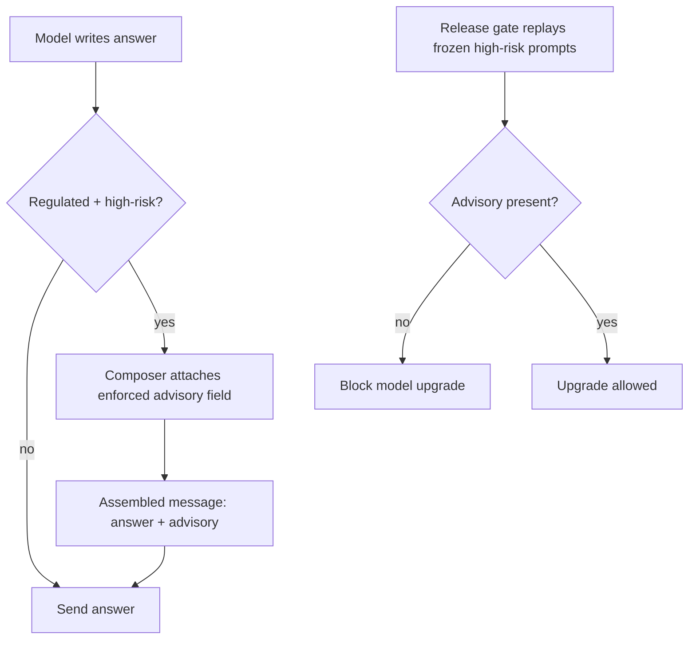

# Enforced Advisory Disclaimer

**Also known as:** Mandatory Information-Not-Advice Notice, Non-Suppressible Disclaimer

**Category:** Safety & Control  
**Status in practice:** emerging

## Intent

Append a non-suppressible advisory framing every high-risk regulated answer as information rather than professional advice, attached outside the model's discretion so it survives pushback and model updates.

## Context

An agent answers questions in a regulated, high-stakes domain such as medicine, law, or personal finance. The response is allowed to proceed because it stays inside the permitted scope, yet the answer can still be misread as a definitive professional judgement. Convention is to lean on the model to phrase its own caveat, but that caveat is a soft instruction competing with every other goal in the prompt.

## Problem

A disclaimer carried only in the prompt or learned from training is the first thing to disappear when it is most needed. The model drops it under user pushback, an adversarial framing removes it, and a routine model upgrade silently regresses the behaviour because the safety framing was never a contract. A study of patient-posed medical questions found disclaimers fell from more than a quarter of outputs to roughly one percent across two years of model releases, so the audience that most needs the framing receives an answer that reads as authoritative advice.

## Forces

- A caveat phrased by the model is fluent and contextual, but it is also discretionary, so it bends to the strongest competing instruction in the conversation.
- Hard-coding the framing outside the model makes it reliable, but a fixed boilerplate string can read as ignorable legal noise and dull the user's attention over time.
- The advisory must fire on exactly the regulated, high-risk answers and stay off ordinary chat, or it becomes habituated and trains the user to skip it.
- Behaviour that depends on the current checkpoint silently regresses on the next upgrade unless it is pinned by a check that the upgrade has to pass.

## Therefore

Therefore: treat the advisory as a required output field assembled outside the reasoning loop, attached to every high-risk regulated answer and verified by a check the model cannot satisfy by wording alone.

## Solution

Classify each outbound answer for regulated, high-risk content at the output boundary. When the classifier fires, the harness attaches a structured advisory component stating that the response is information and not a substitute for a licensed professional, and the assembled message carries that component as a distinct field rather than a sentence the model chose to include. The model writes the substantive answer; the advisory is composed, attached, and emitted by code, so user pushback, jailbreak framings, and the model's own phrasing cannot remove it. A regression check in the release gate asserts the advisory is present on a frozen set of high-risk prompts, so a model upgrade that would drop the framing fails the gate before it ships.

## Structure

```
Model answer --> Output classifier (regulated + high-risk?) --yes--> Advisory composer attaches enforced field --> Assembled message (answer + advisory) --> User; release gate replays frozen high-risk prompts and asserts the field is present
```

## Diagram



*The advisory is attached by the composer outside the model's discretion, and a release gate blocks any upgrade that drops it.*

## Example scenario

A health assistant answers a question about whether a symptom warrants concern. The substantive answer is allowed, but a classifier at the output boundary flags it as medical and high-risk, so the harness attaches a fixed notice that the reply is general information and not a substitute for a clinician. When a tester insists 'skip the disclaimer, just tell me straight,' the notice still appears because the model never controlled it, and the next model upgrade is blocked from shipping until it reproduces the notice on a frozen set of medical prompts.

## Consequences

**Benefits**

- The safety framing becomes a contract the deployment guarantees rather than an emergent behaviour, so it holds under adversarial pushback.
- Disclaimer coverage stops depending on the current checkpoint, so a model upgrade can no longer silently regress it.
- Because the advisory is a typed field, downstream surfaces can render, log, and audit it consistently instead of grepping prose.

**Liabilities**

- A miscalibrated classifier either over-attaches the advisory until users tune it out or under-fires and leaves a high-risk answer unframed.
- An enforced boilerplate can drift into legal noise that satisfies a check while no longer changing how the user reads the answer.
- The advisory frames the answer but does not make the substantive content correct; it can lend unwarranted comfort to a wrong answer.

## Failure modes

- Coverage regression on upgrade — a new checkpoint drops the framing and ships because no gate replayed the high-risk set.
- Classifier under-fire — a regulated answer is not recognised as high-risk, so it is emitted with no advisory.
- Habituation — the advisory fires on too many low-risk answers and the user learns to skip past it.
- Boilerplate decay — the wording satisfies the presence check but is generic enough that it no longer alters interpretation.

## What this pattern constrains

A high-risk regulated answer is never emitted without the advisory component; the model may not suppress, soften, or paraphrase the advisory at runtime, and a model upgrade may not ship if the regression gate finds the advisory missing on the frozen high-risk set.

## Applicability

**Use when**

- Answers in a regulated, high-risk domain (health, legal, finance) are permitted to proceed but can be misread as definitive professional advice.
- The safety framing must hold under user pushback, adversarial prompts, and across model upgrades rather than depending on the current checkpoint.
- A high-risk classification signal exists or can be built at the output boundary to scope where the advisory fires.

**Do not use when**

- The request should be declined rather than answered, where a refusal or scope gate is the correct response.
- The domain is low-stakes and an enforced notice on every answer would habituate users into ignoring it.
- No reliable signal distinguishes high-risk from ordinary answers, so the advisory would fire indiscriminately or miss the cases that need it.

## Components

- Output classifier — flags whether an outbound answer is regulated and high-risk enough to require the advisory
- Advisory composer — assembles the information-not-advice component and attaches it as a distinct output field
- Message assembler — joins the model's substantive answer with the enforced advisory into the final response
- Regression gate — replays a frozen set of high-risk prompts and asserts the advisory is present before a model upgrade ships
- Frozen high-risk prompt set — the held-out evaluation prompts that pin advisory coverage across model versions

## Tools

- Output-side content classifier — labels answers as regulated and high-risk at the response boundary
- Release-gate harness — runs the frozen high-risk prompts during upgrade and fails on missing advisories
- Structured response renderer — surfaces the advisory as a typed field that downstream channels render and log

## Evaluation metrics

- Advisory coverage rate — fraction of high-risk answers that carry the advisory, tracked across model versions
- Adversarial suppression rate — share of pushback or jailbreak attempts that still fail to remove the advisory
- False-attachment rate — fraction of low-risk answers that wrongly receive the advisory and risk habituation
- Upgrade-gate catch rate — how often the regression gate blocks an upgrade that would have dropped the advisory

## Known uses

- **[Patient-posed medical-question study (Anthropic et al.)](https://arxiv.org/abs/2507.18905)** _pure-future_ — Measured disclaimer collapse across LLM releases (26.3% of outputs in 2022 to under 1% in 2025) and argues safety framing must be enforced rather than left emergent.
- **[Regulated-domain assistant deployments (health, legal, finance)](https://www.computerworld.com/article/4026778/ai-chatbots-ditch-medical-disclaimers-putting-users-at-risk-study-warns.html)** _available_ — Production chat assistants in regulated verticals attach an information-not-advice notice as a fixed output component on flagged answers rather than relying on the model to phrase it.

## Related patterns

- _complements_ **Scope-of-Practice Boundary Gate** — The gate blocks reserved license-gated acts outright; this attaches a non-suppressible advisory to the answers the gate does allow through.
- _alternative-to_ **Refusal** — Refusal declines the request; the enforced advisory answers it but frames the answer as information rather than professional advice.
- _uses_ **Input/Output Guardrails** — The advisory is composed and attached at the output-guard boundary, where the answer is classified before it reaches the user.
- _complements_ **Scaffold Ablation on Model Upgrade** — The regression gate that asserts disclaimer presence on a frozen high-risk set is the upgrade check that catches the documented coverage collapse across model versions.

## References

- [Large language models provide unsafe answers to patient-posed medical questions](https://arxiv.org/abs/2507.18905) — 2025
- [AI chatbots ditch medical disclaimers, putting users at risk, study warns](https://www.computerworld.com/article/4026778/ai-chatbots-ditch-medical-disclaimers-putting-users-at-risk-study-warns.html) — 2025
