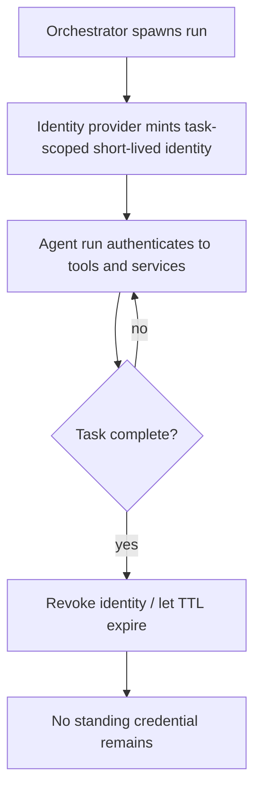

# Ephemeral Agent Identity

**Also known as:** Just-in-Time Agent Identity, Self-Dissolving Agent Identity

**Category:** Safety & Control  
**Status in practice:** emerging

## Intent

Mint each agent run a short-lived identity of its own, scoped to one task and provisioned just-in-time, then revoke it on completion so no standing credential outlives the work.

## Context

An orchestrator spawns agents and sub-agents at machine speed to do bounded work: a research sweep, a data pull, a single transaction. Each run needs to authenticate to tools, services, and other agents, so it needs an identity. The reflex is to reuse a long-lived service account or a shared API key, because creating, scoping, and retiring an identity per run is slow when humans drive identity governance. The agent's own self is treated as if it were either a person logging in or a static integration account, when it is neither.

## Problem

An agent that authenticates as a static service account holds a credential that persists long after its task is done, is scoped far wider than the one run required, and is shared across every run that reuses it. A compromised session token then surfaces on the network as a fully legitimate identity with valid access, indistinguishable from a real agent, and there is no clean task boundary at which to revoke it. Treating the agent's own identity as either a human user or a permanent integration account leaves no identity class that is born with the run, bounded to it, and gone when it ends.

## Forces

- Per-run identity provisioning gives the tightest blast radius, but minting and retiring an identity for every short task adds latency and load to the identity provider.
- A long-lived shared account is cheap to set up, yet it cannot be scoped to one task and cannot be cleanly revoked when one run is compromised.
- An identity must outlive the request long enough to authenticate every step of the task, but must not outlive the task itself or it becomes an orphaned standing credential.
- Attribution wants one identity per run so each action traces to a specific agent execution, but auditing wants stable lineage across the many ephemeral identities a single workload produces.

## Therefore

Therefore: provision each agent run its own task-scoped identity just-in-time at spawn, bind it to that run alone, and revoke or let it expire the moment the task completes.

## Solution

Treat the agent's own identity as a first-class non-human identity class, distinct from human users and from static service accounts, with a lifecycle tied to the task rather than to a deployment. When the orchestrator spawns a run, it requests a fresh identity from the identity provider: a short-lived credential or workload token scoped to exactly the resources this task needs, stamped with the spawning run's lineage so later audit can group it. The agent authenticates every step under that identity. When the task returns, the orchestrator revokes the identity or lets its short lifetime expire, so nothing remains to be reused, leaked, or escalated. Scoping, issuance, and revocation run at machine speed inside the spawn and teardown path, not through a human approval queue, so identity governance keeps pace with the rate at which agents are created.

## Structure

```
Orchestrator --spawn--> Identity provider mints task-scoped short-lived identity --> Agent run authenticates to tools/services under it --> task returns --> Orchestrator revokes / identity expires (nothing standing left behind)
```

## Diagram



*Each run gets a task-scoped identity at spawn and loses it at completion, leaving nothing standing.*

## Example scenario

A finance team runs a swarm of short-lived agents that each reconcile one vendor's invoices overnight. Instead of sharing one broad service account, the orchestrator asks the identity provider to mint each run a token scoped to that vendor's ledger entries, valid for ninety seconds, stamped with the nightly batch id. When a run finishes, its token is revoked. A token stolen mid-run buys an attacker read access to one vendor for under a minute, and the next morning the audit shows exactly which run touched which ledger.

## Consequences

**Benefits**

- A leaked token is worthless past the task: it is scoped to one run's resources and expires or is revoked at task end, so a compromise is contained instead of becoming a standing foothold.
- No orphaned over-privileged accounts accumulate, because every identity has a defined birth and death tied to a task rather than living indefinitely.
- Each action traces to a specific agent run, and runs sharing a lineage stamp can still be grouped for audit.

**Liabilities**

- Minting and retiring an identity per run loads the identity provider; high-fan-out workloads can hit issuance rate limits or teardown backlogs.
- If revocation fails silently, a short-lived identity quietly becomes a long-lived one, recreating the very sprawl the pattern prevents.
- Per-run identities multiply the audit log; without a lineage stamp, reconstructing what one workload did across hundreds of ephemeral identities is hard.

## Failure modes

- Revocation drift — teardown is skipped or fails, so a task-scoped identity outlives its task and becomes a standing credential nobody owns.
- Lifetime overshoot — the credential's TTL is set far longer than any task runs, so 'short-lived' is short in name only.
- Scope creep at issuance — the spawn path requests broad scopes 'to be safe', so each ephemeral identity is over-privileged for the one task it serves.
- Lineage loss — identities are minted without a stable workload stamp, so audit cannot tie the swarm of ephemeral identities back to a single run.

## What this pattern constrains

An agent run must not authenticate under a long-lived or shared identity; it may act only under an identity minted for that single task, scoped to that task's resources, and revoked or expired at task completion.

## Applicability

**Use when**

- Agents and sub-agents are spawned frequently for bounded tasks, so a per-task identity lifecycle is feasible and worthwhile.
- The identity provider can issue and revoke scoped, short-lived credentials at machine speed without a human approval step.
- Blast radius matters: a leaked credential must not grant standing access beyond the task it was minted for.

**Do not use when**

- A workload is a single long-running service whose identity legitimately spans its whole deployment rather than per-task.
- The identity provider cannot mint or revoke fast enough, so per-run provisioning would throttle the workload more than the blast-radius gain justifies.
- The agent must act under a human principal's delegated authority, where delegated-agent-authorization is the load-bearing concern rather than the agent's own identity class.

## Components

- Orchestrator — spawns each agent run and drives the mint-at-start, revoke-at-end identity lifecycle
- Identity provider — issues task-scoped, short-lived credentials just-in-time and supports fast central revocation
- Ephemeral agent identity — the per-run non-human identity, distinct from human users and static service accounts, under which the run authenticates
- Scope policy — defines the minimal resources a given task type's identity may access at issuance time
- Revocation / expiry path — retires the identity at task completion, by explicit revoke or by short TTL
- Lineage stamp — a stable workload identifier carried on each ephemeral identity so audit can group the runs of one workload

## Tools

- Identity provider with workload identity federation or token exchange (for example Okta, Entra ID, Auth0, a cloud STS) — mints and revokes the per-run credentials
- Short-lived token mechanism (OAuth access tokens, SPIFFE/SVID, signed JWTs with short TTL) — carries task-scoped authority that expires on its own
- Audit log keyed by identity and lineage stamp — records which ephemeral identity took which action under which workload

## Evaluation metrics

- Median credential lifetime vs task duration — how tightly identity lifetime tracks the work it serves
- Standing-credential count — number of agent identities still valid after their task ended (target near zero)
- Revocation success rate — fraction of runs whose identity was confirmed revoked or expired at completion
- Issuance latency and rate-limit headroom — whether the provider keeps pace with spawn rate without throttling
- Blast-radius scope — average breadth of resources a single ephemeral identity could reach, tracked over time

## Known uses

- **[Non-Human Identity governance (security-insider.de)](https://www.security-insider.de/ki-agenten-identitaet-non-human-identity-governance-a-e6e78d8d8129836af0147d3b0d8e764c/)** _planned_ — German practitioner coverage arguing agents need dynamic, per-agent identities rather than static accounts, because a compromised session token of a static-account agent appears on the network as a fully legitimate identity.
- **[Agentic identity as a distinct class (datensicherheit.de)](https://www.datensicherheit.de/identitaetsmanagement-spannungsfeld-mensch-maschine-agent-ki-persona)** _planned_ — Positions autonomous agents and machine personas as their own identity class alongside human users and machines, with identity becoming fluid as systems gain autonomy and act independently on behalf of people or organisations.
- **[Aembit (Workload IAM for AI agents)](https://aembit.io/glossary/ai-agent/)** _available_ — Workload IAM platform that gives AI agents attested, verifiable non-human identities and brokers per-request access; "Agents receive short-lived, scoped credentials or secretless access, ensuring no static secrets or embedded keys" — ephemeral tokens scoped to one access request that expire shortly after the work is done.
- **[Astrix Security (Agentic Identity governance)](https://astrix.security/glossary/what-is-an-agentic-identity/)** _available_ — Defines and governs the per-agent identity class directly: "Agentic identity is a digitally ephemeral identity assigned to an AI agent — a software-based system that performs tasks autonomously or semi-autonomously", discovering and scoping these ephemeral identities to prevent over-privileged, orphaned credentials.
- **[Microsoft Entra Agent ID](https://learn.microsoft.com/en-us/entra/agent-id/what-is-microsoft-entra-agent-id)** _available_ — Treats agents as a first-class non-human identity class distinct from human users and from static service principals: agents need "purpose-built identity constructs to authenticate, authorize, govern, and protect these nonhuman identities", with lifecycle management, blueprints, and short-lived OAuth 2.0 / workload-identity-federation tokens.
- **[Token Security (AI Agent Identity Lifecycle Management)](https://www.token.security/news/token-security-extends-identity-governance-to-autonomous-ai-with-launch-of-ai-agent-identity-lifecycle-management)** _available_ — Manages the birth-to-death lifecycle of agent identities, assigning ownership and retiring stale ones: it "retires or deprovisions dormant/orphan agents before they become long-term risks" and governs each agent "throughout their entire lifecycle from discovery to deprovisioning" — the direct counter to standing-credential sprawl.

## Related patterns

- _complements_ **Delegated Agent Authorization** — Delegation scopes the authority an agent exercises on behalf of a principal; ephemeral identity scopes the agent's own self that carries that authority, and gives it a task-bounded lifecycle.
- _complements_ **Agent Credential Vault** — The vault brokers the secrets an identity uses; this pattern governs the lifecycle of the identity itself, minting and retiring it per task.
- _conflicts-with_ **Agent Identity Sprawl** — Sprawl is the accumulation of long-lived over-privileged agent identities; per-task minting with revocation at completion is the direct counter to it.
- _conflicts-with_ **Static Role for a Dynamic Agent** — Pinning a dynamic agent to a fixed static role is the anti-pattern this replaces with an identity born and retired with each run.
- _alternative-to_ **Identity Impersonation** — Giving the agent its own task-bounded identity class is the cure for treating the agent's self as the user's self.

## References

- [KI-Agenten absichern: Dynamische Identitäten statt Accounts](https://www.security-insider.de/ki-agenten-identitaet-non-human-identity-governance-a-e6e78d8d8129836af0147d3b0d8e764c/) — 2026
- [Identitätsmanagement im Spannungsfeld zwischen menschlichen Nutzern, Maschinen, Agenten und KI-Personas](https://www.datensicherheit.de/identitaetsmanagement-spannungsfeld-mensch-maschine-agent-ki-persona) — 2026
- [Agentic AI Identity Management Approach](https://cloudsecurityalliance.org/blog/2025/03/11/agentic-ai-identity-management-approach) — Ken Huang (Cloud Security Alliance), 2025
- [Who Governs the Machine? A Machine Identity Governance Taxonomy (MIGT) for AI Systems Operating Across Enterprise and Geopolitical Boundaries](https://arxiv.org/abs/2604.06148) — Andrew Kurtz, Klaudia Krawiecka, 2026
- [OWASP Non-Human Identities Top 10](https://owasp.org/www-project-non-human-identities-top-10/) — 2025
