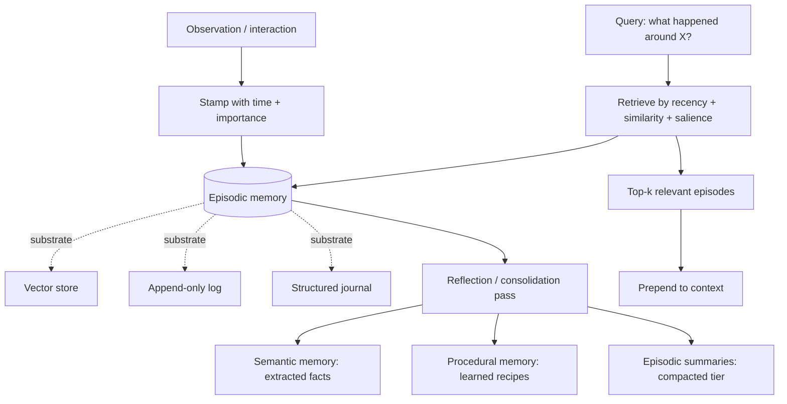

# Episodic Memory

**Also known as:** Event Memory, Experience Store, Memory Stream

**Category:** Memory  
**Status in practice:** mature

## Intent

Record past events as time-stamped first-person experiences the agent can recall later, separately from extracted facts (semantic) and learned how-to (procedural).

## Context

An agent needs to remember what happened — when, in what order, with what context and outcome. This is the autobiographical layer: a record that yesterday the user asked about X, the agent answered Y, the user pushed back, and the two converged on Z. Whether the events are conversations, tool calls, observations, or internal reasoning steps, the function is the same: preserve the temporal-experiential structure of past interactions so the agent can reflect, learn, and surface relevant prior episodes.

## Problem

If the agent has only a fact store, it can answer 'what is true' but not 'what happened' — it loses the ability to learn from specific past interactions, to surface relevant prior episodes by recency or salience, or to reflect on its own behaviour. If the agent collapses every interaction into facts at write-time, it destroys the causal chain — the user said this, then the agent did that, then it broke — that makes debugging and reflection possible. The CoALA framework names episodic memory as a distinct long-term type for this reason: the agent needs a layer that preserves events as events, with their temporal structure intact.

## Forces

- Episodic stores grow unboundedly with time — needs compaction, paging, or salience-based pruning.
- Retrieval by similarity alone misses temporal queries ('what did I do yesterday') and recency-sensitive queries.
- Raw episode replay is too noisy for prompt context — needs salience scoring, summarisation, or reflection passes to be useful.
- Privacy and tenant isolation: episodes contain user content and must respect session and user boundaries.

## Applicability

**Use when**

- The agent needs to recall specific past interactions, not just distilled facts.
- Reflection or consolidation passes need raw episodes as input to derive insights or procedures.
- Temporal queries ('what did I do yesterday', 'what changed since last week') matter.

**Do not use when**

- Retention or privacy constraints make event logs untenable and only extracted facts are allowed.
- Session is single-turn and there is no future to reflect from.
- Storage and compaction infrastructure cannot be maintained at the required scale.

## Therefore

Therefore: maintain an append-only episodic store of time-stamped events, retrievable by some combination of recency, similarity, and salience, and feed it into compaction or reflection passes that distil reusable insights into the semantic and procedural layers.

## Solution

Park et al.'s Generative Agents memory stream (2023) is the canonical implementation: every observation is logged with a timestamp and an importance score; retrieval combines recency, relevance, and importance; a periodic reflection pass derives higher-level insights from clusters of recent episodes. LangMem's episodic channel stores past interactions for few-shot retrieval and procedure distillation. Substrate is orthogonal to function: vector store ([vector-memory](vector-memory.md)), append-only log ([append-only-thought-stream](append-only-thought-stream.md)), or structured journal can all back episodic memory. Compaction is typically delegated to [episodic-summaries](episodic-summaries.md); consolidation into facts feeds [semantic-memory](semantic-memory.md); consolidation into skills feeds [procedural-memory](procedural-memory.md).

## Example scenario

A coding agent has worked with a developer across hundreds of tickets over six months. The developer later asks the agent to explain how the team ended up with the weird workaround in the auth module. A pure semantic store would return facts like (auth-module, uses-workaround, true) — useless. An episodic store returns the actual sequence: on 2026-02-14 the developer flagged a CVE, on 2026-02-15 the agent proposed a fix, the proposed fix broke a downstream test, on 2026-02-16 they agreed on a workaround instead with a TODO. The agent can now answer the why. The episodic store also feeds a weekly reflection pass that consolidates 'workaround in auth-module' into a semantic fact and 'CVE-flag → propose fix → test → workaround-with-TODO' into a procedural template.

## Diagram

## Consequences

**Benefits**

- Causal chains survive — the agent can reconstruct what happened, in order, with context.
- Reflection and consolidation become possible: episodes feed semantic and procedural extraction.
- Temporal queries ('what did I do yesterday', 'what changed since last week') are answerable directly.

**Liabilities**

- Unbounded growth — needs compaction, decay, or tiered storage.
- Raw episode prompts are noisy — direct injection without salience scoring degrades reasoning.
- Privacy and retention boundaries are harder to enforce on event logs than on extracted facts.

## What this pattern constrains

Forbids collapsing every interaction into facts at write-time. Episodes keep their identity (timestamp, context, outcome) and are queried as events; extraction into facts or skills is a separate, downstream step.

## Known uses

- **Generative Agents memory stream (Park et al. 2023)** — *Available* — <https://arxiv.org/abs/2304.03442>
- **LangChain LangMem SDK — episodic channel** — *Available* — <https://www.langchain.com/blog/langmem-sdk-launch>
- **CoALA framework — episodic memory as second long-term type** — *Available* — <https://arxiv.org/abs/2309.02427>
- **Letta recall and archival memory — partial implementation (episodic + semantic conflated)** — *Available* — <https://docs.letta.com/>

## Related patterns

- *complements* → [semantic-memory](semantic-memory.md)
- *complements* → [procedural-memory](procedural-memory.md)
- *uses* → [vector-memory](vector-memory.md) — Vector store is one substrate option for episodic memory.
- *uses* → [append-only-thought-stream](append-only-thought-stream.md) — Append-only log is one substrate option preserving causal order.
- *uses* → [episodic-summaries](episodic-summaries.md) — Summarisation is the standard compaction mechanism for episodic stores.
- *complements* → [salience-attention-mechanism](salience-attention-mechanism.md)
- *complements* → [hippocampal-rehearsal](hippocampal-rehearsal.md)

## References

- (paper) Park, O'Brien, Cai, Morris, Liang, Bernstein, *Generative Agents: Interactive Simulacra of Human Behavior*, 2023, <https://arxiv.org/abs/2304.03442>
- (paper) Sumers, Yao, Narasimhan, Griffiths, *Cognitive Architectures for Language Agents (CoALA)*, 2023, <https://arxiv.org/abs/2309.02427>
- (doc) *LangGraph Memory Concepts — semantic, episodic, procedural types*, 2025, <https://docs.langchain.com/oss/python/concepts/memory>
- (blog) *LangMem SDK launch — semantic, episodic, procedural channels*, 2025, <https://www.langchain.com/blog/langmem-sdk-launch>

**Tags:** memory, long-term, events, coala, function-level
