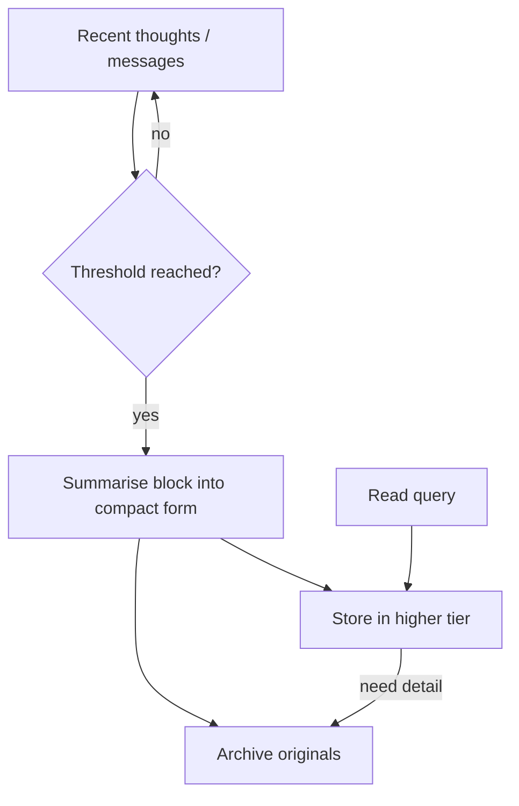

# Episodic Summaries

**Also known as:** Compaction, Conversation Summarisation, Chunk Summaries, Reduce Token Cost, Shrink Context, Cuts Token Use, Too Many Tokens Reduction

**Category:** Memory  
**Status in practice:** mature

## Intent

Compress past episodes into summaries that preserve gist while shedding token cost.

## Context

A long-running agent has accumulated more conversation history, tool results, and intermediate reasoning than fits in the model's context window. Replaying the raw history on every turn is impossible because of size, and even when it would fit, it is wasteful to re-read all of it for what is usually a small follow-up step.

## Problem

Without some form of compaction, the agent has only two bad options. Either the context grows unboundedly until it overflows the window, at which point the call fails or the most recent state is silently dropped. Or a sliding-window strategy truncates the oldest content, which lets important early facts (the original task, an early decision the agent made, a constraint the user stated up front) fall off the back even though the agent still needs them. The team needs a way to summarise older history into compact episodes that retain the load-bearing facts while shedding the verbatim noise.

## Forces

- Token savings vs summary fidelity loss.
- Compaction LLM cost vs context-window relief.
- Single source of truth vs raw-archive availability.

## Therefore

Therefore: compress older episodes into tiered summaries while keeping originals archived, so that recent reasoning stays cheap to load and old reasoning stays recoverable on demand.

## Solution

On a schedule (or at thresholds), summarise blocks of recent thoughts/conversation into compact representations. Store summaries in a higher tier; archive originals. Reads consult summaries first, originals on demand.

## Example scenario

A long-running customer-success agent has accumulated forty-five conversation episodes with one account over six months. The full history blows the context window; a sliding window drops the early conversation where the customer's renewal terms were set. The team uses Episodic Summaries: each closed episode is compressed into a few sentences capturing what happened, what was decided, and any open threads, and the summaries replace the raw transcripts in the prompt. Token cost stays bounded and the renewal-terms decision survives.

## Diagram

## Consequences

**Benefits**

- Bounded effective context size despite unbounded history.
- Summaries are easier to embed and search.

**Liabilities**

- Summary errors are sticky; the agent reasons over the summary, not the original.
- Compaction policy is its own configuration burden.

## What this pattern constrains

Past events older than the compaction horizon are accessible only via summary, not raw.

## Applicability

**Use when**

- Conversation or thought history grows unboundedly without compaction.
- Summaries can preserve gist while shedding token cost meaningfully.
- Summarised tiers are consulted first with originals available on demand.

**Do not use when**

- History is naturally bounded and never approaches token limits.
- Lossy summarisation would drop critical facts the agent needs verbatim.
- Originals are not retained and summarisation errors would be irrecoverable.

## Known uses

- **Generative Agents (Park et al. 2023)** — *Available*

## Related patterns

- *used-by* → [five-tier-memory-cascade](five-tier-memory-cascade.md)
- *complements* → [reflexion](reflexion.md)
- *used-by* → [context-window-packing](context-window-packing.md)
- *complements* → [short-term-memory](short-term-memory.md)
- *complements* → [self-archaeology](self-archaeology.md)
- *complements* → [salience-attention-mechanism](salience-attention-mechanism.md)
- *complements* → [dream-consolidation-cycle](dream-consolidation-cycle.md)

## References

- (paper) Park, O'Brien, Cai, Morris, Liang, Bernstein, *Generative Agents: Interactive Simulacra of Human Behavior*, 2023, <https://arxiv.org/abs/2304.03442>

**Tags:** memory, summarisation, compaction
