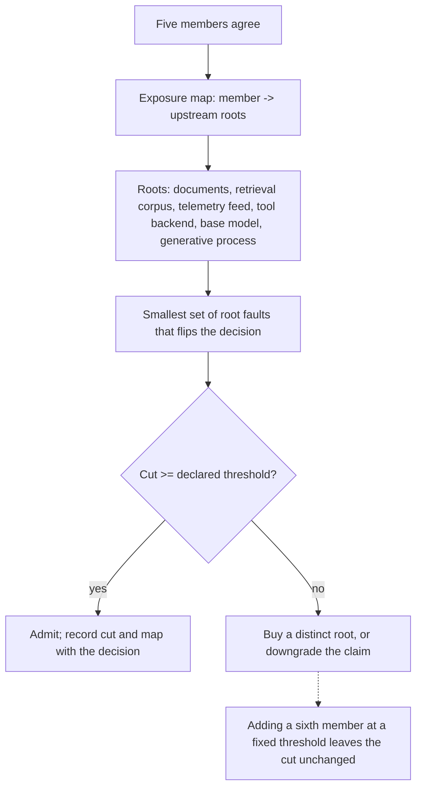

# Epistemic Fault-Domain Quorum

**Also known as:** Epistemic Sybil Resistance, Independence-Counted Quorum, Evidence-Root Quorum

**Category:** Multi-Agent  
**Status in practice:** emerging

## Intent

Credit a multi-agent quorum only with the resilience its distinct upstream roots justify, admitting the coalition when the number of independent root faults needed to compromise it clears a declared threshold.

## Context

A team routes a high-stakes decision through several agents and treats their agreement as evidence that the decision is sound. The members may run on different models, different prompts and different vendors, and the count of members that agreed is what gets written into the approval record. Behind those members sits shared upstream material: the same retrieved documents, the same telemetry feed, the same tool backend, the same base model, sometimes the same pre-training corpus. The dependency graph from members back to those origins is rarely written down anywhere.

## Problem

Members that descend from a common upstream root do not supply independent observations; they relay one observation several times, and the tally cannot tell the difference. Holding a single evidence root fixed while report multiplicity rises from 1 to 32 collapses naive posterior coverage from 0.940 to 0.263, so confidence grows precisely where information does not. The structural version is worse: an arbitrarily large quorum can still have a minimum root-fault cut of one, meaning a single stale feed or a single corrupted document flips a unanimous verdict. Adding voters at a fixed threshold cannot raise that cut, so the usual remedy for a shaky decision buys nothing.

## Forces

- Adding another member is cheap and visibly raises the vote count, while adding a genuinely distinct evidence root is expensive and changes no number anyone currently reports.
- Vendor and architecture labels are the available proxy for independence, yet measured across 38 models it is inferred generative-process diversity rather than vendor difference that tracks correlated failure, at a cross-benchmark partial rank association of -0.216 with a 95% interval of [-0.309, -0.122], negative on all ten benchmarks.
- Shared roots frequently sit below the model layer entirely — one telemetry feed, one retrieval corpus, one tool backend — so decorrelating by model family leaves the cut exactly where it was.
- Letting members read one another restores agreement fast: proposals from different model families converge within a single round, spending on coordination the diversity the coalition was assembled for.
- Recognising a shared ancestor can only lower the credited resilience, never raise it, so honest accounting is locally unattractive to whoever is seeking the approval.

## Therefore

Therefore: write down which upstream roots each member actually depends on, compute the smallest set of root faults that would compromise the decision, and admit the quorum only when that number meets a declared threshold.

## Solution

Treat independence as something measured at admission rather than assumed from headcount. For each member, enumerate the roots it depends on — the source documents it read, the retrieval corpus behind them, the telemetry feed, the tool backends it called, the base model and the generative process that produced it — and record the result as an exposure map built from what ran, not from declared configuration. The resilience the coalition may be credited with is then the smallest set of root faults that would compromise the decision, not the number of members that agreed. Compare that cut against a threshold declared in advance for the class of decision. A coalition below the threshold is repaired by buying a distinct root — a second corpus, a second tool backend, a separate model lineage — or by downgrading the claim to what the evidence supports; enlarging the membership at a fixed threshold is provably not a repair. Keep members from reading each other's complete outputs before they commit, because exchange collapses the very diversity being counted. Store the map and the cut with the decision so an auditor can recompute both.

## Structure

```
Members --exposure map--> roots (documents, retrieval corpus, telemetry feed, tool backend, base model, generative process). Credited resilience = minimum root-fault cut, not member count. Cut >= declared threshold ? admit and record : add a distinct root or downgrade the claim.
```

## Diagram



*Credited resilience is the minimum number of distinct root faults that would compromise the decision, not the number of members that agreed.*

## Example scenario

A bank asks five review agents to sign off on a change to its fraud rules, and all five approve, which the change log records as unanimous. Four of them read the same nightly risk report, and that report was built from a feed that had gone stale a day earlier. When the change misfires, the postmortem finds the five approvals rested on two sources of information rather than five, and that the stale feed on its own was enough to flip the verdict.

## Consequences

**Benefits**

- A coalition that looks like many observations but descends from one root is caught at admission instead of after that root fails.
- The repair becomes specific and purchasable: a distinct corpus, tool backend or model lineage raises the cut, while another member at a fixed threshold cannot.
- The claim travels with the decision as a number an auditor can recompute from the exposure map.
- Effort can be sized: with report count held fixed, raising evidence-root multiplicity from 1 to 16 closes the coverage gap, and the aggregators become statistically indistinguishable at that point.

**Liabilities**

- The exposure map is an estimate, and a root nobody enumerated — a shared fine-tuning corpus, a common upstream data vendor — leaves the cut overstated in exactly the way the pattern exists to prevent.
- Honest accounting almost always reports a smaller number than the headcount it replaces, which makes the pattern unwelcome where the headcount was already used to justify a decision.
- Distinct roots cost money: a second corpus, a second tool backend or a second model lineage, and some domains have only one usable source of record.
- Generative-process diversity has to be inferred from behaviour, and semantic-similarity checks over outputs miss the population structure that actually predicts correlated failure.
- Isolating members preserves independence at the cost of the error correction that reading each other would have provided.

## Failure modes

- Vendor labels are counted as roots, so three products that all wrap the same base model are recorded as three fault domains.
- Members exchange complete outputs before committing, converge within one round, and the tally is taken after the independence has already been spent.
- The retrieval layer serves every member the same top-k documents, so the cut is one document no matter how many members vote.
- The threshold is declared once and never revisited as the deployment consolidates onto a single tool backend or a single model provider.
- The map is assembled from declared configuration rather than from what each member actually read and called at run time, and the two diverge silently.
- A quorum below the threshold is enlarged rather than diversified, and the extra members are reported as an improvement.

## What this pattern constrains

A quorum cannot be credited with more resilience than its smallest root-fault cut, a coalition whose cut is below the declared threshold must not be admitted, and adding members at a fixed threshold never raises the cut.

## Applicability

**Use when**

- Several agents must agree before a high-stakes or irreversible action, and the number that agreed is treated as the strength of the result.
- Members draw on retrieval corpora, telemetry feeds or tool backends that may be shared without anyone having written the dependency down.
- The decision has to be defended later to a reviewer who will ask what the agreement actually established.

**Do not use when**

- A single agent produces the answer and no independence is being claimed on its behalf.
- The quorum is a procedural sign-off for accountability rather than an evidential claim about the world.
- Every member demonstrably reads one prepared brief, in which case the honest move is to stop calling the result a quorum rather than to map it.

## Components

- Root registry — enumerates the upstream origins a decision can descend from: source documents, retrieval corpora, telemetry feeds, tool backends, base models and generative processes
- Exposure map — records which members depended on which roots at run time rather than by declared configuration
- Cut calculator — computes the smallest set of root faults that would compromise the decision
- Admission gate — compares the computed cut against the threshold declared for the decision class and refuses coalitions below it
- Diversity estimator — infers generative-process distance between members instead of trusting vendor or architecture labels
- Isolation boundary — prevents members from reading each other's complete outputs before they commit their positions
- Decision record — stores the cut and the map beside the verdict so the claimed resilience can be recomputed later

## Tools

- Retrieval provenance logging — records which documents each member actually read, so a shared corpus appears in the map
- Model and tool inventory — resolves vendor-branded endpoints to the base model and backend they share
- Minimum-cut solver over the exposure graph — turns the map into a single credited-resilience number
- Behavioural diversity estimator — scores generative-process distance across members from their outputs rather than from labels
- Isolation harness — runs members without a shared scratchpad so positions are formed before any exchange

## Evaluation metrics

- Epistemic cut — the smallest number of distinct root faults needed to compromise the decision, and the ceiling on what may be credited
- Root multiplicity per decision — how many genuinely distinct upstream origins the members drew on, as opposed to how many members voted
- Posterior coverage under a fixed root — whether stated confidence stays calibrated as reports multiply without new evidence
- Disagreement surviving exchange — how much member divergence remains after one round of reading each other
- Overstatement gap — the difference between the resilience claimed at approval time and the cut recomputed from the run-time map

## Known uses

- **[Evidence-root aggregation for agent reports (arXiv 2609.01873)](https://arxiv.org/abs/2609.01873)** _pure-future_ — Formalises multiplied reports from one evidence root as a Sybil problem: holding the root fixed while reports rise from 1 to 32 collapses naive posterior coverage from 0.940 to 0.263, and holding reports fixed while root multiplicity rises to 16 closes the gap.
- **[Epistemic fault-domain cut over agentic quorums (arXiv 2609.02925)](https://arxiv.org/abs/2609.02925)** _pure-future_ — Proves that arbitrarily large quorums can retain a cut of one, that recognising shared ancestry never increases credited resilience, and that adding voters at a fixed threshold cannot increase the cut under compatible exposure extensions.
- **[Inferred generative-process diversity across 38 language models (arXiv 2609.03422)](https://arxiv.org/abs/2609.03422)** _pure-future_ — Supplies the diversity estimator the admission gate needs, showing that architecture or vendor difference is not the same as generative-process diversity and that semantic-similarity checks miss the population structure predicting correlated failure.
- **[AWS fault isolation boundaries](https://docs.aws.amazon.com/whitepapers/latest/aws-fault-isolation-boundaries/abstract-and-introduction.html)** _available_ — The engineering precedent for the accounting: infrastructure quorums are sized by distinct fault domains rather than by replica count. The boundaries are physical and network dependencies rather than evidential ones, so the discipline transfers but the root taxonomy does not.

## Related patterns

- _complements_ **Voting-Based Cooperation** — That pattern defines how ballots are collected and tallied; this one decides whether the ballots were causally independent enough for the tally to carry the meaning assigned to it.
- _complements_ **Heterogeneous-Model Council with Synthesis Judge** — Decorrelates along a single axis, model architecture; here architecture is one root among several, and the shared root is often upstream telemetry or a common tool backend rather than the model at all.
- _complements_ **Quorum on Mutation** — Sets how many endorsements a mutation needs before it lands; this pattern asks how many distinct upstream roots those endorsements descend from.
- _complements_ **Self-Consistency** — Samples one model on one prompt, so its root-fault cut is one by construction; naming that makes explicit what sampling buys and what it cannot.
- _complements_ **Consensus-Averaging Over Expertise** — There the cost of averaging is dilution of a known expert; here it is double-counting of a hidden shared ancestor.
- _complements_ **Hidden Distributed Monolith (Multi-Agent)** — The same false decoupling found in the deployment topology; this pattern finds it in the evidence the members read.
- _complements_ **Clone Fan-Out Research** — Identical workers fanned out over one corpus multiply reports without multiplying evidence roots, which is the case this pattern is designed to price correctly.

## References

- [Epistemic Sybil Resistance: Multiplying AI Agents Without Multiplying Evidence](https://arxiv.org/abs/2609.01873) — 2026
- [The Illusion of Independent Quorums: Epistemic Fault Domains and Correlated Cognitive Failures in Agentic Quorums](https://arxiv.org/abs/2609.02925) — 2026
- [Inferred Generative-Process Diversity Predicts Correlated Failure Across Language Models](https://arxiv.org/abs/2609.03422) — 2026
- [The Interaction Tax: When Communication Erases Diversity in Multi-Agent Teams](https://arxiv.org/abs/2608.23541) — 2026
- [AWS Fault Isolation Boundaries](https://docs.aws.amazon.com/whitepapers/latest/aws-fault-isolation-boundaries/abstract-and-introduction.html)
