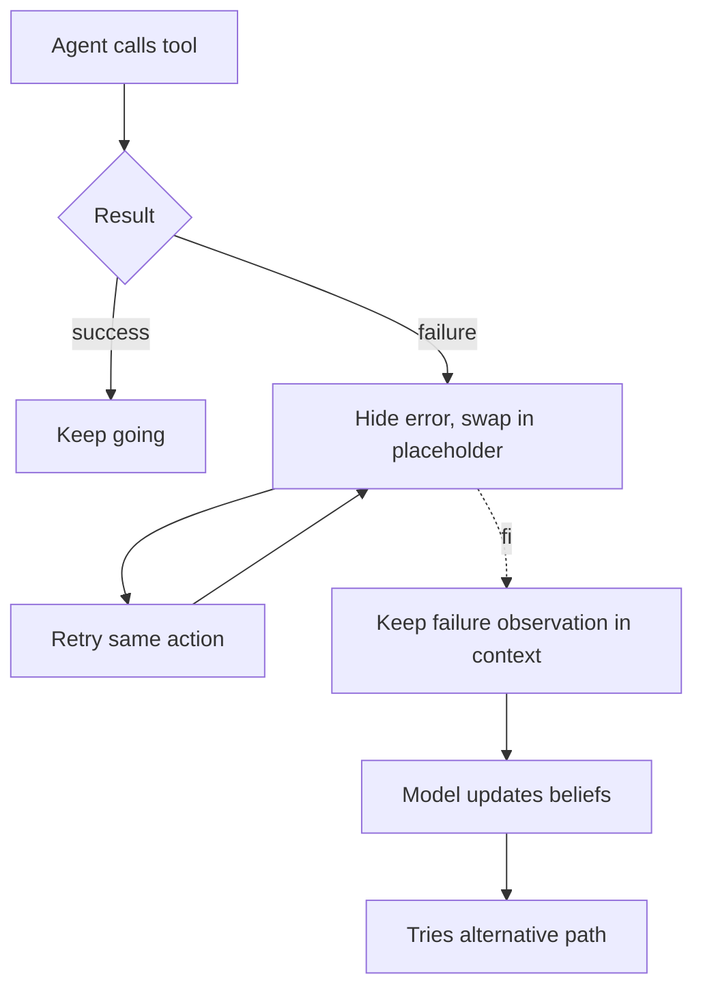

# Errors Swept Under the Rug

**Also known as:** Error Hiding, Failure Erasure, Clean Trace Anti-Pattern

**Category:** Anti-Patterns  
**Status in practice:** deprecated

## Intent

Anti-pattern: scrub failed actions, stack traces, and error observations from the agent's own context so the trace looks clean, leaving the model with no evidence of what did not work.

## Context

An agent takes many tool actions per task and naturally accumulates failures — a tool returns an HTTP 500, a command exits non-zero, an API call is rejected. The team wants short, tidy prompts and clean-looking transcripts, so the wrapper either retries silently, replaces the failed tool output with a generic placeholder like 'retrying...', or strips stack traces before they ever reach the model's context. The intent is usually a mix of cosmetics, token economy, and a feeling that errors are noise.

## Problem

The error message, stack trace, or rejection reason is exactly the signal the model needs to revise its plan and stop repeating the same call. When it is scrubbed before re-prompting, the agent re-attempts the failed action turn after turn, sometimes in tight loops, because nothing in its visible context contradicts the choice. After-the-fact debugging is also harder, because the transcript no longer shows whether a run succeeded cleanly or was salvaged across several hidden failures.

## Forces

- Failed turns inflate context length and look untidy in transcripts.
- Retries are easier to log as a single clean event than as fail-then-retry.
- Models are sensitive to recency and adapt when they see the wrong turn explicitly.
- Compliance reviewers may misread visible errors as system bugs rather than agent learning.

## Applicability

**Use when**

- Never. Hiding errors removes the signal the model needs to adapt.
- Read this entry as a warning, then preserve failure observations in the agent's running context.
- Compress only at run boundaries, not mid-loop.

**Do not use when**

- Always do not use. There is no scenario in which scrubbing failure evidence from the agent's own context helps the agent.
- Cosmetic transcript cleanliness is not a reason to delete failure observations — separate the audit trail from working context instead.

## Therefore

Therefore: keep failed actions, stack traces, and rejection messages in the agent's own context as first-class observations, so that the model has the evidence it needs to update its beliefs and avoid repeating the failed path.

## Solution

Don't. Treat failure observations as load-bearing context, not noise. Preserve stack traces, tool-error returns, and rejection messages in the agent's running transcript. Compress only after the run is done, not mid-loop. See decision-log and provenance-ledger for keeping the audit trail separate from the working context.

## Example scenario

An ops agent calls a deployment tool that fails with a 500. The wrapper catches the error, replaces the failed observation with a generic 'retrying...' string, and lets the agent try again. The agent retries the same call eight times because the context shows eight clean attempts in progress and no evidence that anything is wrong. The team flips the policy: the failed response body, status code, and stack trace are inserted verbatim into the agent's transcript. On the next run the agent reads the 500, switches to the documented fallback endpoint, and succeeds in two steps.

## Diagram

## Consequences

**Liabilities**

- Agent repeats the same failed action because no evidence of failure persists.
- Loop-detection heuristics misfire because the surface trace looks like progress.
- Post-incident analysis cannot distinguish a clean run from a salvaged run.

## What this pattern constrains

By definition, this anti-pattern imposes no useful constraint; the missing constraint — that failure observations must remain in context — is the failure mode.

## Known uses

- **Manus (named as a deliberate design rejection)** — Manus's context engineering essay explicitly argues against hiding failed actions; the team leaves wrong turns in context so the model updates its internal beliefs. *Available* — [link](https://manus.im/blog/Context-Engineering-for-AI-Agents-Lessons-from-Building-Manus)

## Related patterns

- *alternative-to* → [decision-log](decision-log.md)
- *alternative-to* → [provenance-ledger](provenance-ledger.md)
- *alternative-to* → [replan-on-failure](replan-on-failure.md)
- *complements* → [unbounded-loop](unbounded-loop.md)

## References

- *blog*: [Context Engineering for AI Agents — Lessons from Building Manus](https://manus.im/blog/Context-Engineering-for-AI-Agents-Lessons-from-Building-Manus) — Yichao "Peak" Ji, 2025

**Tags:** anti-pattern, safety-control, context-engineering, manus
