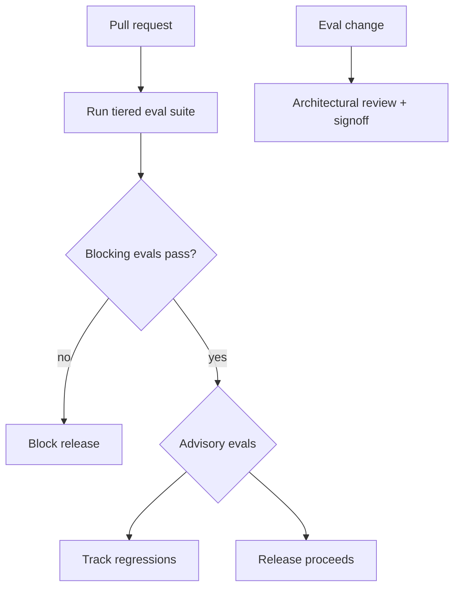

# Eval as Contract

**Also known as:** Test-Driven Agent, Eval-Gated Release

**Category:** Governance & Observability  
**Status in practice:** mature

## Intent

Treat the eval suite as the contract the agent must satisfy; releases ship only if evals pass.

## Context

A team ships an agent to real users and is expected to keep a stable quality bar release after release. They have an evaluation suite — a held-out set of inputs paired with expected outputs or rubric checks — that already gives them a numeric read on quality. Stakeholders such as product, customers, and compliance depend on that bar holding from one release to the next.

## Problem

If the eval suite is something the team runs by hand and looks at when they remember to, regressions slip through silently: a prompt tweak goes out on Tuesday, the eval suite is not run, and by Thursday quality has dropped without anyone noticing. The suite turns into aspirational documentation rather than an actual constraint on releases. The team is forced to choose between trusting vibes between deploys or treating the eval suite the way they would treat a failing unit test.

## Forces

- Contract authoring is up-front work.
- Eval-suite drift if not maintained.
- Calibration: which evals are blocking, which are advisory.

## Therefore

Therefore: split the eval suite into blocking and advisory tiers and wire the blocking tier into CI as a release gate, so that quality regressions stop a release the same way a failing test does.

## Solution

Define a tiered eval suite: blocking evals (must pass for release), advisory evals (tracked but not blocking). Wire blocking evals into CI. Block PRs and releases when blocking evals fail. Treat eval changes as architectural changes (review, signoff).

## Example scenario

A team improves their support agent's planning prompt and ships the change on a Tuesday. By Thursday, the agent's tool-selection accuracy on three known regressions has dropped, but no one notices because there's no gate. They adopt Eval-as-Contract: the held-out eval suite is treated as the release contract — every PR runs it, and any regression below threshold blocks the deploy. The eval suite stops being optional documentation and starts being the thing the agent has to satisfy.

## Diagram

## Consequences

**Benefits**

- Quality bar is enforced, not aspirational.
- Eval suite earns its seat by being load-bearing.

**Liabilities**

- Bad evals block legitimate releases.
- Calibration is empirical.

## What this pattern constrains

Releases are forbidden when blocking evals fail; bypassing requires explicit operator override.

## Applicability

**Use when**

- An eval suite exists that can be tiered into blocking and advisory.
- CI can be wired so blocking eval failures actually prevent release.
- The team is willing to treat eval changes as architectural changes (review and signoff).

**Do not use when**

- There is no eval suite robust enough to gate releases on.
- Blocking-eval failures would be routinely overridden, hollowing out the contract.
- Release cadence cannot tolerate blocking gates and a softer signal is preferred.

## Known uses

- **AI-Standards Eval as Contract pattern** — *Available*

## Related patterns

- *specialises* → [eval-harness](eval-harness.md)
- *complements* → [shadow-canary](shadow-canary.md)
- *conflicts-with* → [perma-beta](perma-beta.md)
- *used-by* → [prompt-versioning](prompt-versioning.md)
- *complements* → [automatic-workflow-search](automatic-workflow-search.md)

## References

- (repo) *ai-standards/ai-design-patterns (Eval as Contract)*, <https://github.com/ai-standards/ai-design-patterns>

**Tags:** eval, release, contract
