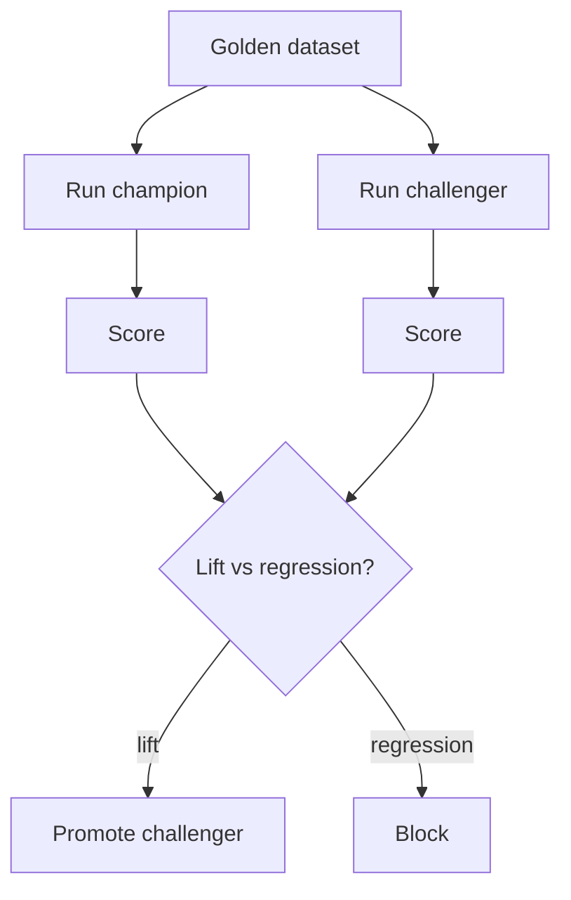

# Eval Harness

**Also known as:** Golden Dataset Suite, Champion-Challenger, Regression Suite

**Category:** Governance & Observability  
**Status in practice:** mature

## Intent

Run a held-out dataset against agent versions to detect regressions and measure improvement.

## Context

Agents are non-deterministic and prompt-sensitive; without an eval harness, every change is a guess.

## Problem

A change that 'feels better' often isn't; without measurement, the system regresses silently.

## Forces

- Dataset construction is expensive and ages.
- Judging open-ended outputs needs a metric or judge.
- Champion-challenger is fairer but doubles cost.

## Therefore

Therefore: run a held-out golden dataset against both the current champion and any proposed challenger before promotion, so that regressions are caught on a fixed yardstick rather than detected in production.

## Solution

Build a golden dataset of (input, expected output) pairs. Run candidate versions against the dataset; score each. Compare champion (current) against challenger (proposed). Promote on quality lift, blocked on regression. Re-run on every meaningful change.

## Example scenario

A team intuits that switching from one model to another 'feels better' for their RAG agent and pushes the change. Two days later, users complain that summaries are now missing key facts. They build an Eval Harness: a held-out dataset of representative queries, a scoring function for each, and a runner that scores any candidate version. Now changes that 'feel better' get a number; the regression on factual recall would have been visible before deploy.

## Diagram

## Consequences

**Benefits**

- Quality becomes measurable, comparable, and trendable.
- Releases gain a quantitative gate.

**Liabilities**

- Dataset bias means high scores can hide real-world failures.
- LLM-as-judge has its own calibration cost.

## What this pattern constrains

Releases are blocked if the harness flags a regression beyond tolerance.

## Applicability

**Use when**

- A change that 'feels better' is regressing quality silently in your system.
- A golden dataset of (input, expected output) pairs can be constructed.
- Champion-vs-challenger comparison drives promotion decisions.

**Do not use when**

- No expected outputs exist (open-ended creative tasks) and scoring would be subjective.
- Dataset cost or maintenance exceeds the regression risk it would catch.
- There is no release process to gate on quality lift in the first place.

## Known uses

- **Bobbin (Stash2Go)** — *Planned*. Eval harness flagged as the explicit next step; in beta because of this gap.
- **Ragas, DeepEval, Langfuse Evals** — *Available*

## Related patterns

- *uses* → [llm-as-judge](llm-as-judge.md)
- *generalises* → [eval-as-contract](eval-as-contract.md)
- *complements* → [shadow-canary](shadow-canary.md)
- *alternative-to* → [perma-beta](perma-beta.md)
- *used-by* → [dspy-signatures](dspy-signatures.md)
- *complements* → [model-card](model-card.md)
- *used-by* → [agent-as-judge](agent-as-judge.md)
- *used-by* → [automatic-workflow-search](automatic-workflow-search.md)

## References

- (repo) *explodinggradients/ragas*, <https://github.com/explodinggradients/ragas>
- (doc) *Anthropic: Building Effective Agents (eval section)*, 2024

**Tags:** eval, regression, harness
