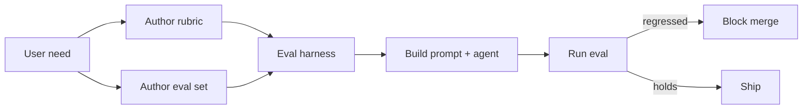

# Evaluation-Driven Development

**Also known as:** EDD, Eval-First Development, Test-First for LLM Apps

**Category:** Governance & Observability  
**Status in practice:** emerging

## Intent

Forbid building the LLM application before its evaluation harness exists; freeze the eval set first and let those metrics drive model selection, prompting, and every subsequent change.

## Context

A team starts an LLM application — RAG over policy documents, an agent that fills CRM fields, a chatbot for a narrow workflow. The first instinct is to prototype the prompt, see if it 'feels right', then circle back to evaluation when stakeholders ask for numbers.

## Problem

Eval-after-build collapses for three reasons. The team converges on prompts that look good on hand-picked demos; the evaluation written later is shaped by what the prompt already does well rather than by the user need. Model swaps, prompt refactors, and tool changes have no comparator — every commit is a vibe check. When a stakeholder finally demands quality numbers, building the harness retroactively requires re-running every prior change, which never happens. The application ships with no defensible quality story.

## Forces

- Building eval first feels slower than prototyping but is faster once the first regression appears.
- Eval sets must be frozen before changes start, or every change moves the bar.
- Eval sets shaped after the prompt encode the prompt's biases.
- Without eval, model swaps and prompt edits have no comparator.

## Applicability

**Use when**

- Starting an LLM application that will change prompts, models, or tools over its lifetime.
- Multiple engineers will work on the same prompt and need a comparator.
- Quality regressions are user-visible and must be caught before deployment.

**Do not use when**

- Throwaway prototype with a one-week lifespan.
- No agreed definition of 'good' is reachable in the project's timeframe.
- The application has no notion of correct answer (purely creative outputs with no rubric).

## Therefore

Therefore: build the evaluation harness and a frozen eval set before the first prompt commit, so every subsequent change is judged against a stable target rather than against author taste.

## Solution

Before authoring the first prompt, write the eval. Define what 'good' means as a checkable rubric (an expected-output set, a judge prompt against a frozen rubric, a deterministic checker, or a mix). Build the eval set from real user inputs or synthetic inputs that span the named dimensions of the task. Pin the rubric and the set as a versioned artifact. Run every prompt change, model swap, and tool edit through that harness; any drop is a blocker.

## Example scenario

A team building a contract-clause-summarisation agent freezes a 200-item eval set drawn from real contracts the legal team flagged. The judge rubric scores three named properties (faithfulness, named-entity coverage, length). The first prompt scores 71%. Every prompt edit, every model upgrade from one Sonnet generation to the next, every retrieval tweak runs through the harness; any drop is a blocker. Three months in the team has comparable numbers for nine prompt variants and three models.

## Diagram

## Consequences

**Benefits**

- Model swaps, prompt edits, and tool changes have a single comparator.
- Surfaces regressions early; every commit is a measurement.
- Forces explicit articulation of 'what good looks like' before development begins.

**Liabilities**

- Front-loaded eval work delays first shippable prototype.
- Eval sets drift away from production traffic if not periodically refreshed.
- Frozen rubric can become a goal in itself, gameable by overfitting prompts.

## What this pattern constrains

The application must not be developed before its evaluation harness exists; the frozen rubric and eval set are authored first and changes are gated on them.

## Known uses

- **AI Engineering (Huyen) — Evaluation-Driven Development chapter** — *Available* — <https://www.oreilly.com/library/view/ai-engineering/9781098166298/>
- **Production LLM teams running rubric-judged eval gates on every prompt commit** — *Available*

## Related patterns

- *uses* → [eval-harness](eval-harness.md)
- *uses* → [frozen-rubric-reflection](frozen-rubric-reflection.md)
- *uses* → [llm-as-judge](llm-as-judge.md)
- *complements* → [shadow-canary](shadow-canary.md)
- *composes-with* → [dimensional-synthetic-eval-set](dimensional-synthetic-eval-set.md)
- *alternative-to* → [demo-to-production-cliff](demo-to-production-cliff.md)
- *complements* → [bayesian-bandit-experimentation](bayesian-bandit-experimentation.md)
- *complements* → [sampled-prompt-trace-eval](sampled-prompt-trace-eval.md)
- *composes-with* → [prompt-variant-evaluation](prompt-variant-evaluation.md)

## References

- (book) *AI Engineering*, Chip Huyen, 2024, <https://www.oreilly.com/library/view/ai-engineering/9781098166298/>

**Tags:** evaluation, process, governance
