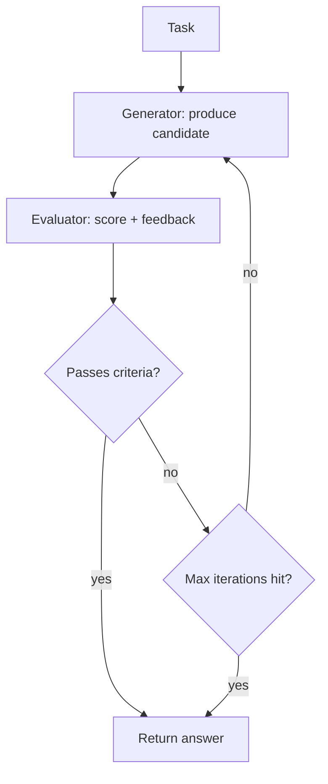

# Evaluator-Optimizer

**Also known as:** Generator-Critic Loop, LLM-as-Judge Refinement

**Category:** Verification & Reflection  
**Status in practice:** mature

## Intent

One LLM generates; another evaluates and feeds back; loop until criteria are met.

## Context

Tasks with measurable evaluation criteria where iterative refinement beats single-pass generation.

## Problem

Single-shot generation tops out below what an evaluator-corrected loop achieves.

## Forces

- The evaluator must be calibrated; a bad judge teaches bad lessons.
- Loop budget caps cost.
- Generator and evaluator can collude (especially if same model, same prompt family).

## Therefore

Therefore: split generation from evaluation into two prompts with different roles and a bounded loop between them, so that the optimizer pushes against an explicit, calibrated target rather than its own approval.

## Solution

Generator produces a candidate. Evaluator scores it against criteria with feedback. Generator revises with the feedback. Loop until evaluator passes or max iterations.

## Example scenario

A code-generation agent produces a function that compiles but fails three of the team's unit tests. Single-shot generation has topped out. The team wraps the generator in an Evaluator-Optimizer loop: a second LLM (or a deterministic test runner) reads the candidate, returns specific failure feedback, and the generator revises against it. The loop runs up to five times or until tests pass. Average pass-rate on the same tasks rises substantially without changing the underlying model.

## Diagram

## Consequences

**Benefits**

- Quality climbs predictably with iterations.
- Evaluator can be reused as an offline regression suite.

**Liabilities**

- Cost = (generator + evaluator) x iterations.
- Convergence is not guaranteed.

## What this pattern constrains

Generator outputs are accepted only after the evaluator passes; an unbounded loop is forbidden by the iteration cap.

## Applicability

**Use when**

- Single-shot generation tops out below the quality the task requires.
- An evaluator can score candidates against criteria with actionable feedback.
- Iteration budget (max iterations or pass threshold) is acceptable in the latency model.

**Do not use when**

- Single-shot generation already meets quality targets.
- No evaluator exists that can produce useful feedback on the output type.
- Latency budget allows only one generation pass.

## Known uses

- **Anthropic Building Effective Agents (Workflow #5)** — *Available*
- **Cursor auto-fix loops** — *Available*
- **Cline auto-iterate** — *Available*
- **Aider lint-then-fix loop** — *Available*

## Related patterns

- *generalises* → [reflection](reflection.md)
- *alternative-to* → [best-of-n](best-of-n.md)
- *composes-with* → [planner-executor-observer](planner-executor-observer.md)
- *uses* → [llm-as-judge](llm-as-judge.md)
- *conflicts-with* → [same-model-self-critique](same-model-self-critique.md)
- *alternative-to* → [self-refine](self-refine.md)
- *used-by* → [crag](crag.md)
- *used-by* → [dynamic-expert-recruitment](dynamic-expert-recruitment.md)

## References

- (blog) *Anthropic: Building Effective Agents*, 2024, <https://www.anthropic.com/research/building-effective-agents>
- (paper) Yue Liu, Sin Kit Lo, Qinghua Lu, Liming Zhu, Dehai Zhao, Xiwei Xu, Stefan Harrer, Jon Whittle, *Agent design pattern catalogue: A collection of architectural patterns for foundation model based agents* (2025) — https://doi.org/10.1016/j.jss.2024.112278

**Tags:** evaluator, loop, judge
