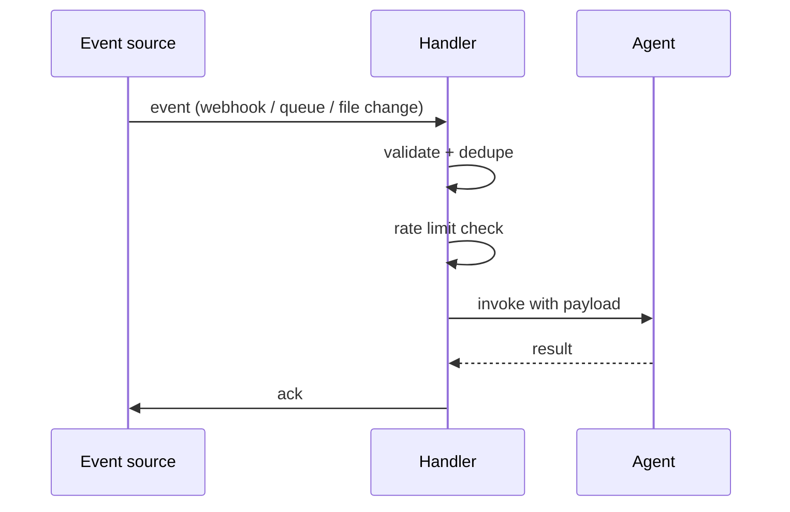

# Event-Driven Agent

**Also known as:** Event Subscriber, Reactive Agent, Webhook Agent

**Category:** Planning & Control Flow  
**Status in practice:** mature

## Intent

Trigger the agent on external events (webhooks, message queues, file changes) instead of user requests or schedules.

## Context

A team operates an agent whose job is to react to things happening in the wider system — a pull request opened on a repository, a customer message arriving in a queue, a monitoring alert firing, a file appearing in a watched folder. The work should happen when the event occurs, not when a human remembers to ask and not on a fixed schedule. An event source (webhook, message queue, file watcher) is already available or can be added.

## Problem

If the agent has to discover these events by polling a status endpoint on a schedule, most polls find nothing and burn tokens and quota; the few that find something arrive up to one polling-interval late. Inviting the agent only on user demand misses everything that happens overnight. Wiring the agent naively to an event firehose without validation, deduplication, or rate limits exposes it to event storms, replayed deliveries, and spurious triggers that can drain budgets or cause duplicate side effects.

## Forces

- Event source reliability.
- Burst handling: event storms can overwhelm.
- Dedup of events that fire multiple times.

## Therefore

Therefore: subscribe to a validated event stream and invoke the agent only on deduplicated, rate-limited events, so that the agent reacts at event time without paying for idle polling.

## Solution

Subscribe to event source (webhook, queue, watcher). On event, validate, deduplicate, and invoke the agent with event payload as input. Apply rate limiting and idempotency. Acknowledge after successful processing.

## Example scenario

A monitoring agent polls a status endpoint every thirty seconds to see whether a build has finished. Most polls find nothing, burning tokens. The team flips to Event-Driven Agent: the build system fires a webhook on completion, and the agent wakes up only when an event arrives. Latency to react drops from up to thirty seconds to roughly the webhook round-trip, and idle cost drops to near zero.

## Diagram

## Consequences

**Benefits**

- Timely action without polling cost.
- Composes with downstream automations naturally.

**Liabilities**

- Event-source failures stop the agent silently.
- Idempotency is its own engineering.

## What this pattern constrains

The agent runs only on validated events; spurious or duplicate events are filtered.

## Applicability

**Use when**

- An external event source (webhook, queue, file watcher) exists and pulling on a schedule wastes effort.
- Events can be validated, deduplicated, and processed idempotently.
- Acknowledgement after successful processing is supported by the event source.

**Do not use when**

- No event source exists and polling is the only available trigger.
- Event volume is so low that a daily cron is simpler than a subscription.
- Idempotency cannot be guaranteed and duplicate events would cause harm.

## Known uses

- **GitHub Actions agent triggers** — *Available*
- **Pub/Sub-driven agent platforms** — *Available*

## Related patterns

- *alternative-to* → [scheduled-agent](scheduled-agent.md)
- *complements* → [rate-limiting](rate-limiting.md)
- *complements* → [agent-resumption](agent-resumption.md)
- *complements* → [salience-triggered-output](salience-triggered-output.md)

**Tags:** events, reactive, webhook
