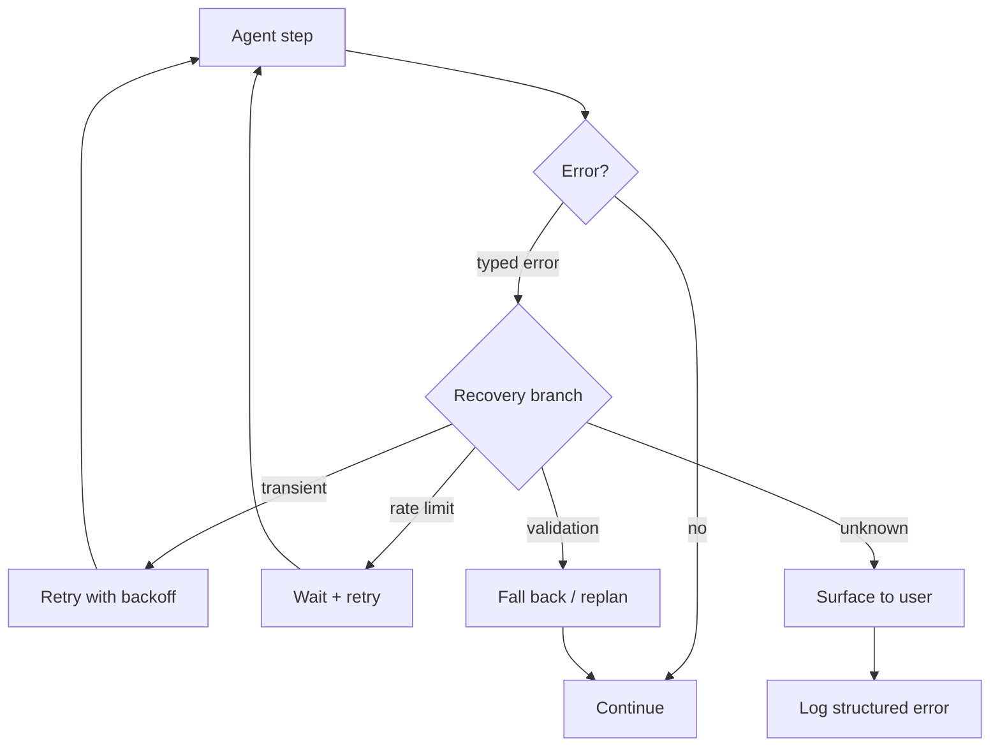

# Exception Handling and Recovery

**Also known as:** Error Recovery, Failure Mode Handler

**Category:** Safety & Control  
**Status in practice:** mature

## Intent

Catch and react to predictable failure modes (tool errors, rate limits, validation failures) with structured recovery paths.

## Context

Production agents face many failure modes (API down, rate-limited, malformed responses, permission denied); each needs a defined response.

## Problem

Untyped errors bubble up as agent confusion; the agent retries randomly, hallucinates explanations, or stalls.

## Forces

- Recovery logic must not mask bugs.
- Some errors are user-visible; others should be silent.
- Retry storms on transient errors.

## Solution

Catalogue failure modes. For each, define: detect (typed error), respond (retry / fall back / surface to user / replan), and log. The agent receives a structured error message and can react with a typed branch in its loop.

## Example scenario

A research agent calls a search tool that returns a rate-limit error. Without typed handling the error string flows back into the conversation as an opaque blob; the agent invents a plausible-sounding explanation and stalls. The team adds Exception Recovery: each tool wraps known failure modes (rate-limit, auth, validation, timeout) into typed error envelopes, and the agent's prompt has explicit recovery branches — back off and retry on rate-limit, switch tool on validation, escalate on auth. Failures stop becoming silent confusion.

## Diagram

## Consequences

**Benefits**

- Failure modes become first-class.
- Reliability under partial failures rises.

**Liabilities**

- Exception-handling code is its own surface to maintain.
- Hidden retries can mask deeper issues.

## What this pattern constrains

Errors must arrive at the agent as typed events from the catalogue; untyped errors are escalated to the operator.

## Applicability

**Use when**

- Tool errors, rate limits, or validation failures occur often enough that random retries waste effort.
- Failure modes can be catalogued with typed errors and structured recovery responses.
- The agent loop can branch on typed error messages.

**Do not use when**

- Failures are rare enough that a single generic retry handles them.
- Failure modes change faster than the catalogue can be maintained.
- The agent has no loop to react in (single-shot pipelines).

## Known uses

- **Production agent platforms** — *Available*
- **Gulli Exception Handling pattern** — *Available*

## Related patterns

- *complements* → [fallback-chain](fallback-chain.md)
- *complements* → [circuit-breaker](circuit-breaker.md)
- *complements* → [replan-on-failure](replan-on-failure.md)
- *generalises* → [graceful-degradation](graceful-degradation.md)

## References

- (book) *Agentic Design Patterns (Gulli)*, 2025

**Tags:** safety, error, recovery
