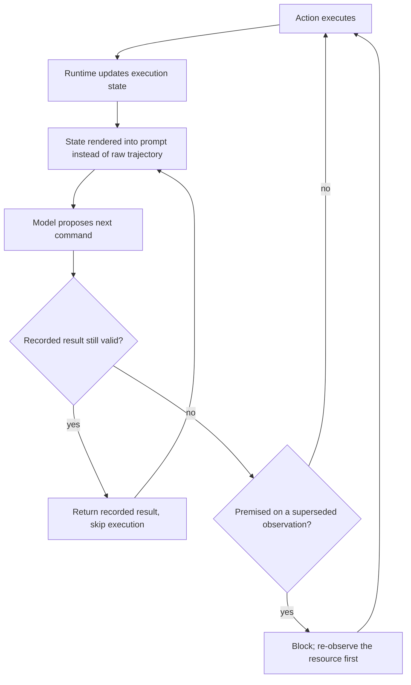

# Execution-State Ledger

**Also known as:** Execution State Layer, Runtime Execution State, Derived Validity Index

**Category:** Memory  
**Status in practice:** emerging

## Intent

Maintain an execution state outside the model that records what the run has observed, changed and attempted, and consult it before each step so stale observations are refused and still-valid results are reused.

## Context

A long-horizon agent works in an environment it also modifies — a repository, a filesystem, a terminal, a live service. Every step appends an action and an observation to the trajectory, and after a few hundred steps that trajectory is the only account the model has of the situation it is acting in. Each entry was accurate at the moment it was taken, and the run's own later writes are what made some of them wrong. The harness controls both boundaries of a step: what is rendered into the prompt, and which command is allowed to execute.

## Problem

A trajectory records what happened; nothing in it says which observations still describe the environment as it currently stands. Before every decision the model has to infer the current execution status from raw history, and that inference degrades as the history grows. When it falls short the agent acts on file contents that its own later edit superseded, or re-runs work whose result was still perfectly valid. Both failures are invisible at the step where they occur: the stale action succeeds, the redundant command returns the same answer, and the cost shows up as a wrong patch and a long, expensive run.

## Forces

- The trajectory is a faithful record of what happened, which is exactly why it cannot state what is currently true — every observation in it was correct when it was taken.
- Leaving the current state to be inferred by the model costs nothing to build but is paid on every step and degrades with length; replacing the history with derived state raised Pass@1 from 56.2% to 64.2% on all 500 SWE-bench Verified instances while cutting total cost by 28.9%.
- Maintaining the state in the runtime keeps it deterministic and adds no model calls, but the invalidation rules have to be written by hand for each kind of action and each kind of resource.
- Dropping the raw trajectory from the prompt saves tokens and removes distractors, but it also removes the evidence the model would need to notice that the derived state itself is wrong.

## Therefore

Therefore: derive an explicit execution state from the run's own actions inside the runtime, put that state in front of the model in place of the raw trajectory, and check every proposed command against it before it is allowed to run.

## Solution

The runtime keeps a structured record of the run's own execution alongside the trajectory: which resources have been observed and when, which have been modified since, and which commands have been attempted with what result. The record is maintained deterministically from the action stream, not written by the model, so it costs no extra model calls and can be inspected and tested like any other runtime component. It is then consulted at both boundaries of every step. On the way in, the prompt carries the current execution state — what is true now, what is still open — instead of the accumulated history. On the way out, each proposed command is checked against that state before it executes: a command whose recorded result is still valid is answered from the record rather than re-run, and a command premised on an observation that a later write has superseded is blocked so the agent re-observes first. The raw log can still be kept for audit; it simply stops being the thing the model reasons over.

## Structure

```
Action stream --> runtime state builder --> execution state {observed resources + validity, modifications, attempts + results}. Step in: state rendered into prompt instead of trajectory. Step out: proposed command --> gate --> reuse recorded result | block as superseded | execute and update state.
```

## Diagram



*The runtime derives execution state from the action stream, renders it in place of the trajectory, and gates each proposed command: reuse a still-valid result, block one premised on a superseded observation, otherwise execute and update the state.*

## Example scenario

An agent is fixing a failing test in a large repository. Early in the run it reads a configuration file, forty steps later it edits that same file, and near the end it proposes a change based on the version it read at the start. A record of what the run has touched marks the first read as superseded, so the agent re-reads the file instead of writing over its own edit.

## Consequences

**Benefits**

- An action premised on an observation the run itself invalidated is stopped before it executes instead of being discovered later through the damage it did.
- Work whose recorded result is still valid is returned from the state rather than re-run, which is where the reported cost reduction of roughly 29% to 32% comes from.
- The step's input carries a short statement of what is currently true instead of a record of everything that happened, so prompt size stops growing with the length of the run.
- Because the runtime maintains the state deterministically and without additional model calls, the decision to block or reuse is reproducible and can be unit-tested.

**Liabilities**

- The invalidation rules are hand-written and partial, so anything that changes the environment outside the harness's view leaves the state confidently wrong.
- A stale entry marked valid is worse than no entry at all, because the reused result now carries the runtime's authority rather than being one more guess the model might question.
- Replacing the trajectory with derived state removes the raw evidence a reader or the model would use to catch an error in the derivation itself.
- The state schema has to be designed per environment; the measured gains come from harnesses built for repository and terminal work and do not transfer unchanged to other domains.

## Failure modes

- An external process changes a file the run recorded, the state still marks that observation current, and the agent overwrites the change.
- The invalidation rule is too coarse, every write supersedes everything, and the run re-executes as much work as it did before the state existed.
- The state is rendered into the prompt but the pre-action check is skipped, so the model is told an observation is superseded and acts on it regardless.
- Reuse is keyed on command text alone, so a nondeterministic command, or one that reads a resource the run has since modified, returns a result that was never valid to reuse.

## What this pattern constrains

The raw trajectory is no longer what the model reasons over, and no command may execute without being checked against the execution state first: an action premised on an observation the state marks superseded must be blocked until the resource is re-observed, and a command whose recorded result is still valid must not be re-executed.

## Applicability

**Use when**

- The run is long enough that early observations stop describing the environment before the task finishes.
- The agent's own actions mutate the resources its earlier observations described, such as a repository, a filesystem or a live service.
- The same command is likely to be issued more than once because different steps happen to need the same result.
- The harness can be modified to intercept proposed actions and to control what is rendered into the prompt.

**Do not use when**

- The run is short enough that the whole trajectory still describes the current situation.
- Actions are read-only, so nothing the run does can supersede what it has already observed.
- The environment changes for reasons the harness cannot observe, so a derived validity marking would be wrong more often than raw history is.
- What is needed is an account of what happened rather than of what is true now, as in audit or post-hoc analysis.

## Components

- Execution state — the runtime's account of what the run has observed, modified and attempted, derived from the action stream rather than written by the model
- Validity index — marks each recorded observation as current or superseded by a later write to the same resource
- Attempt record — keys past commands to their results so a still-valid result can be returned instead of re-executed
- Invalidation rules — the deterministic mapping from a mutating action to the observations it supersedes
- Pre-action gate — checks each proposed command against the state before it runs and blocks the ones premised on superseded observations
- State renderer — formats the current state for the prompt in place of the raw trajectory

## Tools

- Filesystem and process instrumentation — supplies the write events that drive invalidation
- Content hashes or modification timestamps — decide whether a recorded observation still describes the resource
- Harness middleware — the interception point where state is rendered into the prompt and each proposed command is checked
- Structured state store — holds the state as typed records rather than prose so the checks stay deterministic

## Evaluation metrics

- Stale-action rate — share of executed actions premised on an observation the run had already superseded
- Redundant re-execution rate — share of commands re-run whose recorded result was still valid
- Task success rate against a baseline without the state layer — Pass@1 or equivalent on a long-horizon benchmark
- Tokens and cost per solved task — whether replacing the trajectory with derived state pays for itself
- State-check overhead — added latency and any extra model calls introduced by maintaining the state

## Known uses

- **[Ledger (runtime layer for long-horizon coding agents)](https://arxiv.org/abs/2608.00808)** _pure-future_ — Turns interaction history into an explicit execution state and adds no language-model calls; across all 500 SWE-bench Verified instances it raised Pass@1 from 56.2% to 64.2% with GPT-5 mini and from 75.8% to 81.0% with MiniMax M2.5 while cutting total cost by 28.9% and 31.8%.
- **[SKILL.state](https://arxiv.org/abs/2608.26263)** _pure-future_ — Replaces append-only conversational history with an explicit, mutable execution state; at each step the model receives only the immutable skill specification, the current structured state and the latest observation, reporting higher accuracy at lower token consumption.
- **[StateM (agent-native runtime)](https://arxiv.org/abs/2608.15089)** _pure-future_ — Organises execution around durable states, phase-local context, checked transitions, recoverable runbooks and versioned procedural practices that agents and users can inspect together; reports 95.3% raw accuracy on Terminal-Bench 2.1.

## Related patterns

- _complements_ **Append-Only Thought Stream** — That pattern makes the log immutable so history cannot be rewritten; this one is the derived index of validity computed over such a log, saying which of its entries still describe the environment.
- _alternative-to_ **Context Compaction** — Compaction answers a long trajectory with a model-written digest that preserves decisions and commitments; this pattern answers it with a runtime-maintained record of current execution status. A digest is still an account of what happened.
- _complements_ **Stateless Reducer Agent** — The reducer is the programming model that derives state from an event log; this pattern says what that derived state must contain for a mutating environment and how it gates each step.
- _complements_ **Memo-As-Source Confusion** — That anti-pattern is what an agent does without this record: it cites its own earlier observation as current fact. The validity index is the cheap staleness signal it says is missing.
- _complements_ **Tool Result Caching** — Caching reuses results keyed by arguments and a time-to-live for tools declared deterministic; here reuse is keyed by whether the run's own later writes have superseded what the earlier call read.
- _complements_ **World-Model Graph Memory** — That store models the world for planning; this one models the run's own execution — what has been observed, changed and attempted — and is consulted for validity rather than for inference.
- _complements_ **Agent Resumption** — Resumption persists state so a run survives a restart; the problem here is staleness inside a single live run, where nothing crashed and the record is simply out of date.
- _complements_ **Scratchpad** — A scratchpad holds free-form notes the model writes and may forget to update; the execution state is maintained by the runtime from the action stream, so it does not depend on the model remembering.

## References

- [Turning Interaction History into Execution State: A Runtime Layer for Long-Horizon Coding Agents](https://arxiv.org/abs/2608.00808) — 2026
- [SKILL.state: Scalable Long-Horizon Agent Skills](https://arxiv.org/abs/2608.26263) — 2026
- [StateM: Reaching 95.3% Raw Accuracy, or a $15 Frontier Run, on Terminal-Bench 2.1 via Harness Scaling](https://arxiv.org/abs/2608.15089) — 2026
