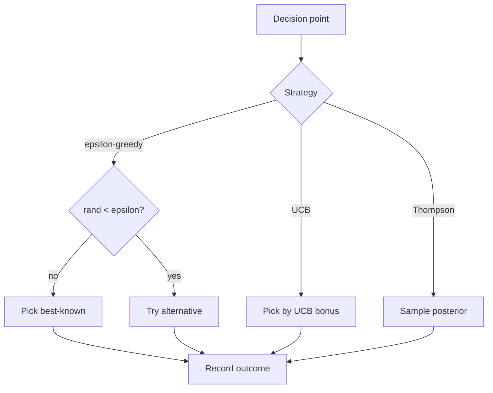

# Exploration vs Exploitation

**Also known as:** Exploration & Discovery, Curiosity-Driven Action

**Category:** Planning & Control Flow  
**Status in practice:** emerging

## Intent

Balance taking the best-known action (exploit) with trying alternatives that might be better (explore).

## Context

A team runs a long-lived agent that repeatedly chooses among a set of options — which tool to call, which prompt template to use, which strategy to try — and can observe an outcome signal after each choice (success, reward, user thumbs-up). Over time the agent should get better at the choice, not just freeze the first decent option in place. This is the classical multi-armed-bandit setting applied to agent decision points.

## Problem

An agent that always picks whatever is currently the best-known option (pure exploitation) locks in at whatever local optimum it stumbled into early and never discovers that a different tool or template would have worked better. An agent that always tries something new (pure exploration) burns budget on unproven options and never compounds what it has already learned. Picking the trade-off informally — by gut feel or by occasional manual override — gives neither the predictable improvement of a scheduled policy nor the statistical guarantees that bandit theory provides.

## Forces

- Exploration costs (failed attempts) are real.
- Reward signals must exist to shape the trade-off.
- Schedule (epsilon-greedy, UCB, Thompson sampling) is its own design.

## Therefore

Therefore: govern the agent's choice between the best-known and the under-tried option by an explicit policy (epsilon-greedy, UCB, Thompson), so that improvement compounds with experience instead of locking in at a local optimum.

## Solution

Pick a strategy: epsilon-greedy (exploit with probability 1-ε), upper-confidence-bound (favor under-explored options with bonus), Thompson sampling (sample from posterior). Apply across tools, strategies, prompts. Track outcomes and adjust.

## Example scenario

An agent that recommends customer-support replies has a strong default template that wins most of the time, so it's used 100% of the time. New phrasings that might be better are never tried, and the system silently sits at a local optimum. The team adds Exploration-Exploitation: 90% of replies use the current best template (exploit) and 10% sample from candidate variants (explore), with outcomes tracked. Within weeks the system surfaces a variant that outperforms the previous best, which then becomes the new exploit.

## Diagram

## Consequences

**Benefits**

- Avoids local optima.
- Improves with experience.

**Liabilities**

- Requires reward signal.
- Strategy choice is empirical.

## What this pattern constrains

The agent's action distribution must follow the chosen strategy; unconditional exploitation is forbidden.

## Applicability

**Use when**

- The agent chooses repeatedly among options (tools, strategies, prompts) and outcomes can be tracked.
- Pure exploitation is locking the agent into local optima.
- A strategy (epsilon-greedy, UCB, Thompson sampling) can be picked and tuned.

**Do not use when**

- Each task is one-shot — no loop in which to balance explore and exploit.
- Exploration cost (trying alternatives) is unaffordable in the deployment.
- No outcome signal exists to update beliefs about which option is best.

## Known uses

- **Voyager (Minecraft skill discovery)** — *Available*
- **Gulli ch.21 Exploration & Discovery** — *Available*

## Related patterns

- *complements* → [lats](lats.md)
- *complements* → [skill-library](skill-library.md)

## References

- (book) *Agentic Design Patterns (Gulli)*, 2025

**Tags:** planning, rl, exploration
