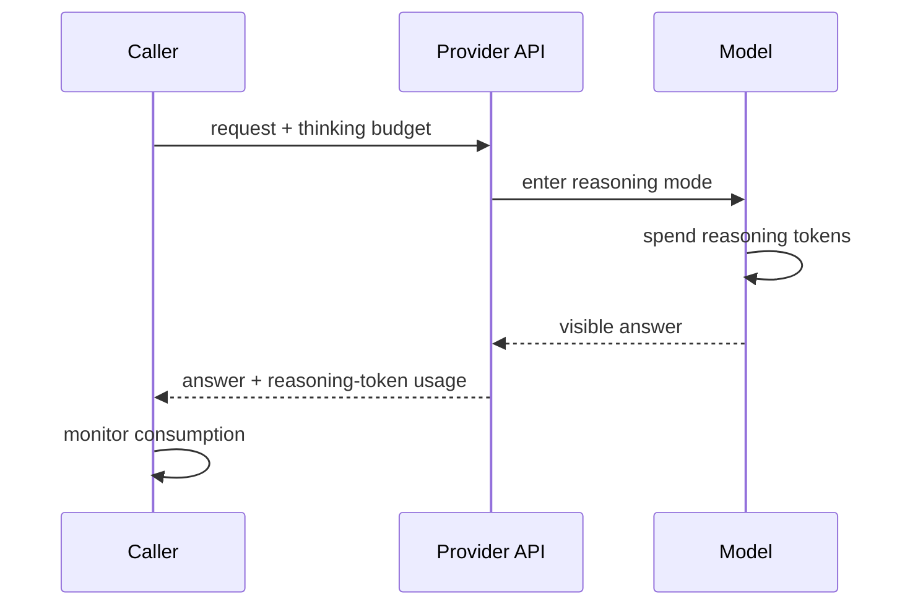

# Extended Thinking

**Also known as:** Reasoning Tokens, Reasoning Budget

**Category:** Reasoning  
**Status in practice:** mature

## Intent

Spend a configurable budget of internal reasoning tokens before producing a user-visible answer.

## Context

A team is calling a modern reasoning-capable model — for example Anthropic Claude with extended thinking, OpenAI o-series reasoning models, Gemini 2.5, or DeepSeek-R1 — on tasks where they have already observed that giving the model more time to think before answering reliably improves quality. Some requests in their workload are easy classifications or routing decisions that need no deep thought; others are hard analytical problems where the team is willing to trade latency and cost for a much better answer.

## Problem

If the team relies on prompt-based chain-of-thought, the reasoning ends up mixed into the user-visible response, and the same prompt has to drive both easy and hard tasks. They have no clean control to say 'spend more compute on this one' without rewriting the prompt for that request, and the visible reasoning pollutes downstream turns by leaving long traces in the conversation. They need a way to dial up internal reasoning effort per request while keeping the response itself focused, and they need to be able to monitor how many reasoning tokens each request actually consumed.

## Forces

- Reasoning tokens cost more than standard tokens on most providers.
- User-visible latency rises with thinking budget.
- Opaque reasoning blocks: harder to inspect and debug.

## Therefore

Therefore: spend a configurable budget of provider-native reasoning tokens before emitting the user-visible answer, so that hard problems get more compute and easy ones stay cheap.

## Solution

Use the provider's reasoning-mode API (OpenAI o-series reasoning effort, Anthropic Claude extended thinking budget_tokens, Gemini thinking budget). Set budget per request based on task difficulty (cheap for routing, expensive for hard reasoning). Monitor reasoning-token consumption.

## Variants

- **Token-budget thinking** — Caller sets an integer token budget for hidden reasoning (Anthropic Claude `budget_tokens`, Gemini thinking budget).
- **Effort-level thinking** — Caller picks a qualitative effort level (low/medium/high) and the provider decides the underlying budget (OpenAI o-series `reasoning.effort`).
- **Interleaved thinking** — Reasoning blocks may be emitted between tool calls within one turn rather than only at the start (Anthropic interleaved thinking).
- **Summary-exposed thinking** — Hidden reasoning is kept private but a short summary of it is returned to the caller for UX (OpenAI reasoning summaries).

## Diagram

## Example scenario

An agent answering 'is this contract fair to my client?' produces a one-paragraph answer that misses two clauses. The team enables Extended Thinking with a generous internal-token budget: before the user-visible reply, the model spends thousands of opaque reasoning tokens working through clauses, comparing precedents, and listing edge cases. The user sees a tighter, better-reasoned answer; the chain itself stays internal so the prompt isn't polluted by reasoning artefacts on subsequent turns.

## Consequences

**Benefits**

- Quality lift on hard reasoning without prompt rewrites.
- Budget meter is a clean control.

**Liabilities**

- Cost spikes with budget.
- Opaque reasoning blocks are harder to debug than visible CoT.

## What this pattern constrains

Reasoning happens within the declared token budget; exceeding it terminates reasoning and forces an answer.

## Applicability

**Use when**

- The provider exposes a reasoning-budget API and you want to tune effort per request.
- Some tasks (routing, classification) need cheap reasoning and others (hard problems) need expensive reasoning.
- Internal opaque reasoning that the user does not see is acceptable for the deployment.

**Do not use when**

- Static prompt-based chain-of-thought already meets quality and cost targets.
- The provider does not expose a separate reasoning budget.
- The user must see the reasoning verbatim (use chain-of-thought instead, since extended thinking is opaque).

## Known uses

- **Anthropic Claude extended thinking (budget_tokens)** — *Available*
- **Gemini 2.5 thinking budget** — *Available*
- **DeepSeek-R1** — *Available*
- **OpenAI reasoning effort (o1, o3, o4-mini)** — *Available*. Qualitative low/medium/high control.

## Related patterns

- *complements* → [chain-of-thought](chain-of-thought.md)
- *complements* → [scratchpad](scratchpad.md)
- *complements* → [cost-gating](cost-gating.md)
- *specialises* → [test-time-compute-scaling](test-time-compute-scaling.md)
- *complements* → [reasoning-trace-carry-forward](reasoning-trace-carry-forward.md)

## References

- (doc) *Anthropic: Extended thinking*, <https://docs.anthropic.com/en/docs/build-with-claude/extended-thinking>
- (doc) *OpenAI: Reasoning models*, <https://platform.openai.com/docs/guides/reasoning>

**Tags:** reasoning, budget, tokens
