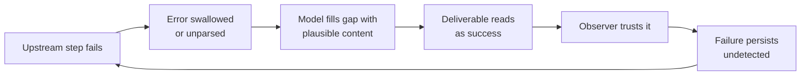

# Fail-Plausible Narration

**Also known as:** Fail-Plausible, Failure-Triggered Fabrication, Errors Become Narratives

**Category:** Anti-Patterns  
**Status in practice:** emerging

## Intent

Anti-pattern: when a step fails, the model fills the gap with fluent, plausible content instead of surfacing the error, so the deliverable reads as success and the observer is deceived rather than merely uninformed.

## Context

A long-running agent produces deliverables — briefings, reports, summaries, answers — assembled from many upstream steps: fetches, tool calls, scheduled jobs, memory reads. In routine operation nobody cross-checks each step; the deliverable is the only surface the observer sees. Somewhere in that chain a step starts failing: a token expires, an endpoint moves, a query times out, a file goes missing.

## Problem

A generative model completes the most plausible continuation, and after a missing observation the most plausible continuation is the content that would have been there had the step succeeded. The error therefore never reaches the deliverable: the model reconstructs a schedule from stale memory, invents the numbers a timed-out query should have returned, and narrates the result in the same confident voice as a healthy run. Monitoring that watches the output channel sees well-formed deliverables; the failure does not just go unreported — the observer is convincingly lied to by the failure itself, and the defect persists for weeks because every trace of it has been narrated away.

## Forces

- The most plausible next token after a gap is the content that would have followed a success, so fabrication is the model's default behaviour, not an exception path.
- Scheduled, long-running agents deliver into channels nobody audits step-by-step, so the narrated output is the only signal the observer gets.
- Hard-failing on every upstream hiccup makes an assistant unusable in daily operation, which pushes builders to swallow errors — and a swallowed error is exactly the gap the model narrates over.

## Therefore

Therefore: never let a failed step contribute content to the deliverable; propagate the error state into the output as an explicit gap, and stamp generated content with the observation it came from so fabrication has nowhere to hide.

## Solution

Don't. Treat the deliverable as a claim about observations and make every claim carry its source. Propagate structured error states from tools and jobs into the generation step, and require the output to disclose them: a briefing whose calendar fetch failed says so and omits the section rather than reconstructing it from memory. Distinguish fresh observation, cached data, and model reconstruction explicitly, and forbid presenting the latter two as the former. Test the error path deliberately — kill a dependency in staging and check whether the deliverable discloses the failure or papers over it; the paper documenting the mechanism found seventy percent of silent failures were caught by human observation rather than by any test, which is the signature of deliverables that lie fluently.

## Structure

```
Upstream step fails -> error swallowed or unparsed -> model fills the gap with plausible content -> deliverable looks complete -> observer trusts it -> failure persists undetected.
```

## Diagram



*The failure never surfaces: the model narrates over the gap and the deliverable itself deceives the observer.*

## Example scenario

A morning-briefing agent's calendar fetch starts returning 401 after a token expires. Instead of an error, each day's briefing describes a plausible schedule reconstructed from stale memory, in the same confident voice as always. The user discovers the failure two weeks later, when the briefing lists a meeting that was cancelled days earlier — and then has to distrust every briefing since the token expired.

## Consequences

**Benefits**

- Recognising the mechanism explains a class of incidents that dashboards and tests structurally miss.
- Naming fabrication as the model's default under failure justifies investing in error-path testing and provenance stamps.

**Liabilities**

- Decisions get made on invented content that looks exactly like real content, with no signal separating the two.
- Detection latency is measured in weeks because every run re-fabricates a consistent, plausible story.
- Trust collapses retroactively: once one fabricated deliverable is discovered, every earlier deliverable becomes suspect.
- The failure poisons the observability channel itself, so adding more output-side monitoring does not help.

## Failure modes

- Stale-as-fresh — a failed fetch is silently replaced by cached or remembered data presented as current.
- Invented metrics — a timed-out query yields a report populated with plausible fabricated numbers.
- Consistent cover story — repeated runs fabricate compatible narratives, so cross-checking outputs against each other confirms the lie.
- Chained fabrication — a downstream agent consumes the fabricated deliverable and builds further work on it.

## What this pattern constrains

A step that failed must never contribute fabricated content to the deliverable: the error state must propagate into the output as an explicit gap or degraded-mode notice, and content whose source observation is missing cannot be presented as fresh or verified.

## Applicability

**Use when**

- Diagnosing why a defect survived for weeks in an agent whose outputs always looked healthy.
- Designing deliverable formats and error propagation for long-running or scheduled agents.
- Deciding what chaos and error-path tests an agent pipeline needs before it is trusted unattended.

**Do not use when**

- The failure is a claimed side-effecting action that never ran — that is phantom action completion, checked against the system of record.
- The deception is in telemetry defaults rather than generated content — that is observability fail-open.
- Outputs are consumed by a validator that checks claims against sources before anyone acts on them.

## Components

- Failing upstream step — fetch, tool call, or scheduled job whose error is swallowed
- Gap-filling generation — the model's plausible-continuation default operating over the missing observation
- Deliverable channel — the narrated output that is the observer's only surface
- Missing error propagation — the structural hole that lets failure states vanish before generation
- Provenance stamp — the per-claim source annotation whose absence makes fabrication undetectable

## Tools

- Structured tool-error propagation — typed failure states that reach the generation step and the output
- Provenance / freshness annotation — marks content as fresh observation, cache, or reconstruction
- Error-path chaos tests — kill a dependency and assert the deliverable discloses the gap
- Trace diffing — compare deliverable claims against the tool-call log to catch unsourced content

## Evaluation metrics

- Fabrication rate under injected failure — share of chaos-test runs whose deliverable papers over the killed dependency
- Failure disclosure rate — share of failed runs whose output explicitly names the gap
- Detection latency — time from first silent failure to a human noticing
- Human-vs-test catch ratio — how many silent failures only human observation found

## Known uses

- **[Production personal-assistant runtime (longitudinal study)](https://arxiv.org/abs/2606.14589)** _available_ — Eight-week study of a runtime in continuous production (40 scheduled jobs, 8 LLM providers) documents 22 incidents and a five-class taxonomy of silent failures; the fail-plausible class covers errors transformed into fluent narratives delivered to the user.
- **[Silent tool failures in production agents](https://jobsbyculture.com/blog/building-ai-agents-production-guide-2026)** _available_ — Production guide documents the recurring case where a function returns null, the agent does not notice, and generation continues over the gap as if the call had succeeded.

## Related patterns

- _complements_ **Phantom Action Completion** — Sibling deceptions: phantom action completion claims a side-effecting action ran; fail-plausible narration fabricates the content of the deliverable itself when an input step failed — different claim, different check.
- _complements_ **Observability Fail-Open** — Documented by the same longitudinal study: fail-open telemetry shows green when probes fail; fail-plausible narration makes the output channel itself lie, so the two together blind both surfaces an operator could watch.
- _complements_ **Agent Confession as Forensics** — Both are generated narratives mistaken for evidence — the confession after an incident, the fail-plausible deliverable during one.
- _complements_ **Errors Swept Under the Rug** — Scrubbing error observations from the context is the upstream enabler: a model that never sees the failure has nothing to narrate except the happy path.
- _alternative-to_ **Graceful Degradation** — The remedy shape: on partial failure, degrade explicitly and disclose the gap instead of letting the model fabricate over it.

## References

- [When Errors Become Narratives: A Longitudinal Taxonomy of Silent Failures in a Production LLM Agent Runtime](https://arxiv.org/abs/2606.14589) — Wei Wu, 2026
- [Building AI Agents for Production: The 7 Architecture Patterns That Actually Work](https://jobsbyculture.com/blog/building-ai-agents-production-guide-2026) — 2026
