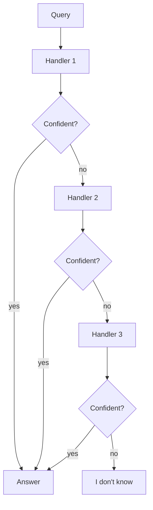

# Fallback Chain

**Also known as:** Cascade Fallback, Try-Then-Try-Else, Tool Failed Fall Back, Provider Failed Retry Other

**Category:** Routing & Composition  
**Status in practice:** mature

## Intent

Try a primary handler; on failure or low confidence, fall through to a sequence of fallback handlers.

## Context

An agent in production depends on at least one model or tool that can fail for routine reasons: rate limiting, vendor errors, regional incidents, or outputs the model itself returns with low confidence. End users are sitting on the other end of the call expecting an answer regardless of which upstream had a bad minute. The team has more than one option available — a backup model, a smaller local model, a deterministic rule-based fallback — but those options are not wired in by default.

## Problem

When the single primary handler fails, the user sees an outage even though other working handlers exist in the system. When the primary returns a low-confidence answer, the product silently ships a degraded response with no signal that something better could have been tried. Without a defined ordering of handlers and a rule for moving between them, every team improvises on each incident and quality regressions in the primary go unnoticed.

## Forces

- Fallback handlers may be slower or worse.
- Detecting 'failure' requires a confidence signal.
- Cascade depth must be bounded.

## Therefore

Therefore: order handlers in a confidence-gated chain that pass downward on failure and end in an honest 'I don't know', so that no single handler's outage becomes the user's outage.

## Solution

Define an ordered chain of handlers. Each handler returns either a confident answer or a failure/low-confidence signal. On failure, the next handler runs. Final fallback is a generic 'I don't know' rather than a wrong answer.

## Example scenario

A translation feature uses a primary high-quality model, but during incidents that model returns 502s and users see error messages. The team configures a Fallback Chain: try the primary model, on failure or low-confidence output try a secondary model, on failure of that try a smaller local model with a 'degraded quality' indicator. The user gets a translation in every case; the team gets visibility into how often each layer is used.

## Diagram

## Consequences

**Benefits**

- Graceful degradation under partial failures.
- Each layer can be tuned independently.

**Liabilities**

- Cumulative latency on full cascade.
- Hides quality regressions in the primary.

## What this pattern constrains

Each handler may produce a result or pass; only the chain may decide to terminate.

## Applicability

**Use when**

- Single-handler failure would cascade to the user as an outage.
- Multiple handlers exist with meaningful differences in capability or cost.
- Each handler can return a confidence or failure signal that triggers the next.

**Do not use when**

- Only one handler exists and there is nothing to fall back to.
- Handler failure modes are correlated and all handlers fail together.
- An honest 'I don't know' is preferred over fallback chains that mask root cause.

## Known uses

- **Most production routing layers** — *Available*
- **AI-Standards Fallback Chain pattern** — *Available*

## Related patterns

- *complements* → [routing](routing.md)
- *composes-with* → [circuit-breaker](circuit-breaker.md)
- *complements* → [multi-model-routing](multi-model-routing.md)
- *generalises* → [provider-fallback](provider-fallback.md)
- *complements* → [confidence-reporting](confidence-reporting.md)
- *complements* → [exception-recovery](exception-recovery.md)
- *complements* → [graceful-degradation](graceful-degradation.md)
- *used-by* → [open-weight-cascade](open-weight-cascade.md)

**Tags:** routing, fallback, reliability
