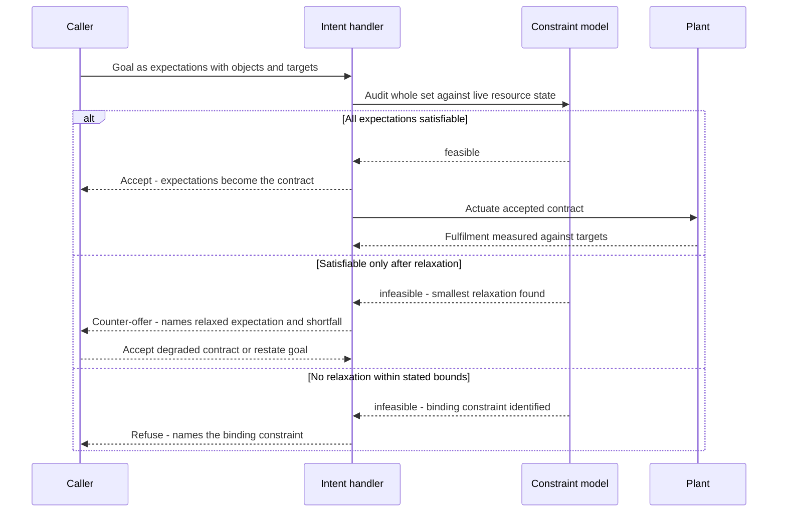

# Feasibility-Negotiated Intent Contract

**Also known as:** Intent Negotiation Handler, Three-Valued Goal Contract, Counter-Offer Intent Gate

**Category:** Safety & Control  
**Status in practice:** emerging

## Intent

Let a caller state a goal with measurable expectations, audit it against hard system constraints before actuation, and reply with acceptance, a counter-offer naming the relaxed expectation, or a refusal naming the binding constraint.

## Context

An agent sits in front of a system whose capacity is finite and physically bounded: a radio access network, an optical transport layer, a power schedule, a fleet. Callers do not want to name the configuration steps; they want to name an outcome, such as a latency ceiling for one traffic class during a given window. Standardised management interfaces have moved in the same direction, expressing a request as a set of declarative expectations with numeric targets rather than as a command sequence, and requiring the handler to report against those targets rather than only acknowledging receipt.

## Problem

An ordinary tool call has two outcomes, success or error, and the caller learns which one applies only by making the call. Applied to a declarative goal against a constrained plant, that shape is unsafe. A goal that the plant cannot honour is discovered during actuation, after configuration has already been written and other traffic has already been disturbed, and the error that comes back says an action failed without saying which expectation was unreachable or by how much. The caller cannot replan from that, because a bare failure carries no information about what would have been achievable. Translating stated goals straight into configuration through heuristics produces exactly this: unpredictable behaviour on a live plant with no stable notion of what counts as a safe request.

## Forces

- A declarative goal is easier for a caller to state than a procedure, but the plant enforces its limits on procedures, so someone has to decide whether the goal is reachable before anything is written.
- Discovering infeasibility by attempting actuation is the cheapest thing to build and the most damaging thing to run; on an O-RAN testbed, a direct-actuation baseline that translated operator intent straight into configuration produced harmful executions that a pre-actuation constraint audit eliminated.
- Goal extraction from natural language is inherently probabilistic, while the decision to actuate must be deterministic, so the two cannot live in the same component.
- A caller who is refused without a named cause will simply resubmit a near-identical goal, whereas a caller told which expectation was the binding one can relax it and converge.
- The best achievable result is not a property of the goal alone; it depends on the resource situation at the moment of asking and changes over time, so feasibility has to be re-audited rather than cached as a static rule.

## Therefore

Therefore: put a deterministic feasibility audit between the stated goal and the actuator, and give the handler a third reply — a counter-offer that names which expectation it relaxed and by how much — alongside acceptance and a refusal that names the binding constraint.

## Solution

Split the exchange into a proposal and a contract. The caller submits a goal as a set of expectations, each with a target, an object it applies to, and the context in which it holds; nothing about how to reach it. The handler does not actuate on receipt. It first runs a deterministic audit of the whole expectation set against a model of the controlled system — live resource state, physical limits, standing commitments already accepted for other callers — and decides whether every expectation can hold at once. That audit has three outcomes, not two. If the set is satisfiable, the handler accepts and the expectations become the contract it is now measured against. If the set is unsatisfiable but a nearby set is not, the handler returns a counter-offer: the same goal with one expectation relaxed, naming which one and quoting the shortfall as a number, so the caller can accept the degraded contract or restate the goal. If no relaxation inside the caller's stated bounds is reachable, the handler refuses and names the binding constraint rather than returning a generic failure. Only an accepted contract reaches the actuator. After actuation the handler keeps measuring delivered values against the accepted targets and reopens the negotiation when the contract degrades, which keeps the audit honest as the resource situation moves. The model may propose any goal at all, because the component that decides achievability is not the component that wrote the goal.

## Structure

```
Caller --goal {expectations: [{object, target, context}]}--> intent handler --> feasibility audit against constraint model {live resource state, physical limits, accepted contracts} --> three-valued reply: accept (contract fixed, actuator invoked) | counter-offer (named expectation relaxed + quantified shortfall, caller decides) | refuse (binding constraint named, nothing actuated). Accepted contract --> actuator --> plant --> fulfilment monitor --degraded--> reopen negotiation.
```

## Diagram



*The audit runs against the constraint model before anything is actuated, and the handler answers with one of three replies rather than success or error; only an accepted contract reaches the plant.*

## Example scenario

An operator tells the network agent to hold video latency under 15 milliseconds for the stadium cell for the next three hours. The agent does not start changing the slice configuration. It checks the request against the cell's current load and its radio limits, finds that 15 milliseconds is not reachable while the emergency-services slice keeps its guaranteed share, and answers that it can hold 22 milliseconds instead, naming the guarantee that blocked the tighter target. The operator accepts the 22 milliseconds, and only then is anything reconfigured.

## Consequences

**Benefits**

- An unreachable goal is rejected before any configuration is written, so infeasibility costs a reply rather than a disturbance to a live plant.
- A counter-offer gives the caller a usable second option instead of a failure, so a slightly-too-ambitious goal converges in one round rather than being abandoned or blindly resubmitted.
- Naming the binding constraint turns a refusal into replanning information, and naming the relaxed expectation makes an accepted degradation explicit rather than silent.
- Probabilistic goal extraction is decoupled from governed execution, so a mis-parsed or over-ambitious goal cannot reach the actuator on the strength of the parser's confidence.
- The accepted expectations double as the monitoring contract, so drift after actuation is measurable against the same numbers the caller agreed to.

**Liabilities**

- The audit is only as good as the constraint model behind it; a model that omits a real limit accepts goals the plant cannot honour, and one that is too conservative refuses goals it could have served.
- Maintaining a live model of resource state, physical limits and already-accepted contracts is ongoing work that grows with the plant, and stale state produces confident wrong verdicts.
- Searching for the smallest useful relaxation is a separate optimisation problem, and a handler that returns an arbitrary relaxation instead of the least damaging one trains callers to ignore counter-offers.
- The audit adds latency in front of every change, which is a poor trade for goals whose worst case is trivially reversible.
- A three-valued reply is a larger interface commitment than success-or-error, and every caller has to be written to handle the middle case.

## Failure modes

- The handler accepts everything and treats the audit as advisory, so the pattern's structure is present while actuation is still effectively direct.
- The refusal is generic — infeasible, request failed — and the caller resubmits a near-identical goal, turning negotiation into a retry loop.
- The counter-offer relaxes an expectation the caller considered non-negotiable, such as a safety floor, because the handler had no ranking of which expectations may move.
- Feasibility is checked once at submission and never re-checked, so a contract accepted under yesterday's resource situation keeps actuating under today's.
- Goals accepted for different callers are audited independently, and the plant is oversubscribed by contracts that are each individually feasible.
- The counter-offer path silently becomes the default because the model states goals it knows will be relaxed, and the stated target stops meaning anything.

## What this pattern constrains

The handler must not actuate any expectation before the feasibility audit has run against current resource state, and it may not answer with a bare success or error: a relaxed acceptance must name the expectation it relaxed and the quantified shortfall, and a rejection must name the binding constraint. Only an accepted contract reaches the actuator.

## Applicability

**Use when**

- The caller states an outcome with measurable targets rather than a sequence of steps, and the handler controls a system with hard capacity or physical limits.
- Actuating an unreachable goal is expensive or damaging, so infeasibility must be found before configuration is written rather than during it.
- A partly satisfied goal is genuinely useful to the caller, so a named relaxation is worth more than a failure.
- Goals from several callers compete for the same finite resources and have to be reconciled against commitments already accepted.
- A natural-language front end proposes goals, and actuation must stay deterministic regardless of how confident that front end is.

**Do not use when**

- The action is cheap and trivially reversible, so attempting it and reading the error is a faster answer than auditing it.
- No usable model of the system's constraints and current resource state exists, which leaves the audit guessing and its verdicts worse than the plant's own errors.
- The goal admits no partial satisfaction, so there is no meaningful relaxation to counter-offer and a two-valued gate is the honest interface.
- The question is permission rather than achievability, where an admit-or-deny policy gate is the simpler fit.
- The caller's request is ambiguous rather than ambitious, in which case clarifying what was meant comes before auditing what can be delivered.

## Components

- Declarative intent object — carries the goal as expectations with targets, the objects they apply to, and the context in which they hold, and no procedure
- Constraint model — live resource state, physical limits and already-accepted contracts that the audit evaluates against
- Feasibility auditor — deterministic check of whether the whole expectation set can hold at once, run before any actuation
- Relaxation search — finds the smallest change to a named expectation that turns an unsatisfiable set into a satisfiable one
- Three-valued reply channel — carries acceptance, a counter-offer with a named relaxation and quantified shortfall, or a refusal with the binding constraint named
- Actuator — applies configuration only for an accepted contract and never for a proposal still under negotiation
- Fulfilment monitor — measures delivered values against the accepted targets and reopens negotiation when the contract degrades

## Tools

- 3GPP TS 28.312 intent expectation and intent report model — a standard vocabulary for stating goals as targets and reporting feasibility against them
- Constraint solver or satisfiability checker such as OR-Tools or Z3 — decides whether the expectation set is jointly satisfiable against the resource model
- Network or plant control API such as an O-RAN RIC interface — the actuation surface an accepted contract is applied through
- Digital twin or plant simulator — supplies the resource state and limits the audit reads when live telemetry is not enough
- JSON Schema reply contract — makes the accept, counter-offer and refuse branches machine-readable so the caller can act on the middle case
- Telemetry and monitoring stack — feeds the fulfilment monitor the delivered values to compare against the accepted targets

## Evaluation metrics

- Harmful actuation rate — how many submitted goals reach the plant and violate a hard constraint, the number a pre-actuation audit is supposed to drive to zero
- Counter-offer acceptance rate — how often a proposed relaxation is taken rather than the goal being abandoned, which shows whether the relaxations are the useful ones
- Refusal specificity — the share of refusals that name a single binding constraint the caller can act on rather than reporting a generic failure
- Rounds to an accepted contract — how many exchanges a caller needs before a goal is accepted, which shows whether negotiation converges
- Audit-to-actuation latency — the delay the feasibility check adds in front of every change
- Fulfilment drift — the gap between accepted targets and delivered values, which tells whether the audit was optimistic and how often contracts have to be reopened

## Known uses

- **[3GPP TS 28.312 intent driven management for mobile networks](https://www.etsi.org/deliver/etsi_ts/128300_128399/128312/18.05.00_60/ts_128312v180500p.pdf)** _available_ — The producer runs a feasibility check automatically on intent creation or modification, and the resulting report may be either a plain feasible or infeasible indication or a detailed report naming which expectations or targets are infeasible and why. The specification also describes settling feasibility through a guided negotiation in which the consumer can ask what the best achievable result would be before committing to a goal.
- **[Contract-based Agentic Intent Framework (CAIF) on an O-RAN network-slicing testbed](https://arxiv.org/abs/2603.01663)** _pure-future_ — A closed-loop pipeline audits stated objectives against formal radio-access-network constraints prior to actuation and separates probabilistic intent extraction from governed policy execution; measured against a direct-actuation baseline, it removed the harmful intent executions that baseline produced.
- **[Intent-driven optical network design with formal feasibility checking](https://arxiv.org/abs/2509.22834)** _pure-future_ — Couples model-based parsing of a stated design goal with formal methods, so a design is checked for feasibility before it is committed rather than validated after the fact.
- **[Knowledge-based intent modelling for next-generation cellular networks](https://arxiv.org/abs/2302.08544)** _pure-future_ — Represents consumer expectations declaratively and domain-independently and identifies the mapping from those expectations onto service and resource models as the open problem, which is the mapping a feasibility audit has to perform.

## Related patterns

- _alternative-to_ **Solver-Ready Formulation Handoff** — Both turn a declaratively stated problem over to a deterministic component, but there an exact solver produces the decision and its certificate, while here a handler decides only whether the caller's goal is reachable and may answer with a counter-offer the caller then chooses to accept or not.
- _complements_ **Policy-as-Code Gate** — That gate answers a binary permission question about an already-formed concrete action against externally authored rules; this audit answers an achievability question about a declarative goal against live resource state, and its middle reply has no analogue in a permission verdict.
- _complements_ **Affordance Grounding Before Action** — That gate screens whether one candidate action is physically supported by the current scene; this negotiates a whole multi-expectation objective and returns a quantified shortfall rather than filtering a candidate.
- _complements_ **Simulate Before Actuate** — Simulation predicts the effects of an action that has already been formed; the feasibility audit runs earlier, on the goal, before any action exists to simulate, and a simulator is one reasonable way to implement the audit.
- _complements_ **Typed Refusal Codes** — Supplies the machine-readable vocabulary a refusal needs; this pattern says what the refusal must carry, namely the binding constraint that made the stated goal unreachable.
- _complements_ **Graceful Degradation** — There degradation happens after a dependency has already failed and is disclosed to the user; here the degradation is proposed before actuation as a counter-offer the caller agrees to in advance.
- _specialises_ **Stochastic-Deterministic Boundary (SDB)** — Applies that seam to declarative goals and widens its verdict from accept-or-reject to a three-valued reply, where the counter-offer carries a named relaxation back to the proposer.

## References

- [Contract-based Agentic Intent Framework for Network Slicing in O-RAN](https://arxiv.org/abs/2603.01663) — Fransiscus Asisi Bimo, Chun-Kai Lai, Zhi-Yuan Yang, Ray-Guang Cheng, 2026
- [3GPP TS 28.312: Intent driven management services for mobile networks (ETSI TS 128 312)](https://www.etsi.org/deliver/etsi_ts/128300_128399/128312/18.05.00_60/ts_128312v180500p.pdf) — 2024
- [Knowledge-based Intent Modeling for Next Generation Cellular Networks](https://arxiv.org/abs/2302.08544) — Kashif Mehmood, Katina Kralevska, David Palma, 2023
- [Bridging Language Models and Formal Methods for Intent-Driven Optical Network Design](https://arxiv.org/abs/2509.22834) — Anis Bekri, Amar Abane, Abdella Battou, Saddek Bensalem, 2025
