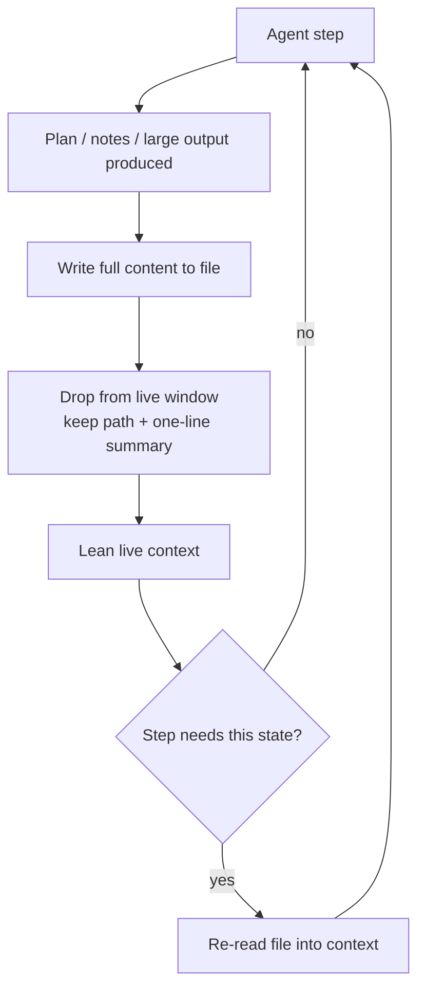

# Filesystem as Context

**Also known as:** Context Offloading, Filesystem as External Memory, File-backed Working Memory

**Category:** Memory  
**Status in practice:** emerging

## Intent

Use the filesystem as the agent's externalized working memory, writing plans, notes, and large tool outputs to files, dropping them out of the live window, and re-reading on demand.

## Context

An agent runs a long-horizon task that generates more state than the context window can hold: a multi-step plan, accumulating notes, and tool calls that each return large payloads such as logs, scraped pages, or query dumps. The runtime can read and write files, and the same files persist across many turns of the loop.

## Problem

Keeping every plan revision, note, and verbatim tool output in the live window pushes the agent toward the window limit, raises per-turn cost, and degrades reasoning as relevant signal is buried under bulk. Truncating or dropping that material blindly loses state the agent still depends on later in the task, and a window that overflows mid-task forces an abrupt summarize-or-die compaction that can discard exactly the detail a later step needs.

## Forces

- The window is finite but the task generates unbounded state.
- Large verbatim payloads cost tokens every turn they remain live.
- State dropped from the window is gone unless it was stored somewhere durable.
- Re-reading a file costs a tool round-trip and latency.

## Applicability

**Use when**

- The task runs over many turns and generates more state than the window holds.
- Tool outputs are large and only needed intermittently rather than every turn.
- The runtime can read and write files that persist across the agent loop.
- The plan and notes should survive restarts or be inspectable by a human.

**Do not use when**

- The task is short and its full state fits comfortably in the window.
- The runtime has no durable filesystem the agent can read back from.
- Re-read latency on the hot path outweighs the token savings.
- The needed state is small enough that in-context notes suffice.

## Therefore

Therefore: make the filesystem the primary store for the agent's plan, notes, and large outputs; keep only lightweight pointers and a short summary live, write the full content to files, and re-read a file only when the current step needs it.

## Solution

The agent maintains its working state as files rather than as live context. A plan lives in a file such as todo.md that the agent rewrites as steps complete; running notes accumulate in a notes file; large tool outputs are written to disk and replaced in the window by a path plus a one-line description. Each turn the agent carries lightweight identifiers (file paths, line ranges, keys) and loads the full content back into context only for the step that needs it, then drops it again. Because the content is restorable from disk, compaction is lossless: the window holds a lean view while the filesystem holds the full state. This makes the filesystem the externalized memory of record, distinct from in-context note-taking, which keeps notes live, and from eviction, which discards consumed payloads behind a marker.

## Example scenario

A coding agent is migrating a large codebase across many turns. It writes the migration plan to todo.md and checks off steps as it goes, and each test run produces a 2,000-line log. Instead of holding those logs live, the harness writes each full log to a file and leaves only the path and a one-line verdict in the window. When a later step needs the exact stack trace, the agent re-reads the relevant log file. The window stays lean across the whole migration while no detail is permanently lost.

## Diagram

## Consequences

**Benefits**

- The live window stays lean across long-horizon tasks regardless of total state size.
- State is durable and restorable, so compaction and window pressure do not destroy detail.
- Per-turn token cost drops because bulk payloads no longer ride in every turn.
- The plan and notes survive process restarts and can be inspected by a human.

**Liabilities**

- Re-reading a file adds a tool round-trip and latency each time state is needed.
- The live window no longer holds full state, so the agent must know which file to re-read or it works from a stale view.
- Stale or contradictory files accumulate unless the agent prunes them.
- File access widens the attack and accident surface and must respect sandbox boundaries.

## What this pattern constrains

Large outputs and notes must not stay in the live window; they are written to files and re-read only when the current step needs them.

## Known uses

- **[Manus](https://manus.im/blog/Context-Engineering-for-AI-Agents-Lessons-from-Building-Manus)** — *Available* — Treats the filesystem as the ultimate context: unlimited in size, persistent, and directly operable by the agent, with compression designed to be restorable from files.
- **Claude Code** — *Available* — Maintains a todo list and reads and writes project files as durable working state across a long session rather than holding it all in the window.
- **[Anthropic memory tool](https://www.anthropic.com/engineering/effective-context-engineering-for-ai-agents)** — *Available* — File-based store on the Claude Developer Platform for persisting structured notes outside the context window and loading them on demand.

## Related patterns

- *complements* → [scratchpad](scratchpad.md)
- *complements* → [tool-result-eviction](tool-result-eviction.md)
- *alternative-to* → [context-compaction](context-compaction.md)
- *complements* → [synthetic-filesystem-overlay](synthetic-filesystem-overlay.md)
- *complements* → [memgpt-paging](memgpt-paging.md)

## References

- (blog) *Context Engineering for AI Agents: Lessons from Building Manus*, <https://manus.im/blog/Context-Engineering-for-AI-Agents-Lessons-from-Building-Manus>
- (blog) *Effective Context Engineering for AI Agents*, <https://www.anthropic.com/engineering/effective-context-engineering-for-ai-agents>
- (blog) *Agent Harness Engineering*, <https://addyosmani.com/blog/agent-harness-engineering/>
- (blog) *AIエージェントのコンテキスト退避とファイルシステム活用*, <https://tech.algomatic.jp/entry/2025/10/15/172110>

**Tags:** memory, context-engineering, filesystem, long-horizon
