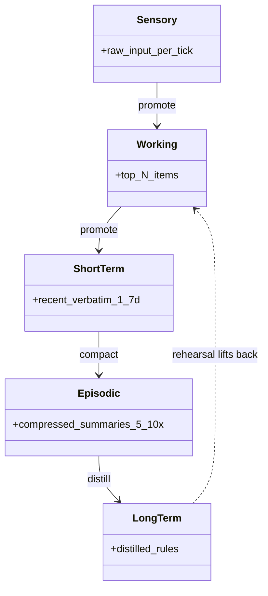

# Five-Tier Memory Cascade

**Also known as:** Multi-Tier Memory, Cognitive Memory Hierarchy

**Category:** Memory  
**Status in practice:** experimental

## Intent

Stage agent memory across sensory, working, short-term, episodic, and long-term tiers with explicit promotion and decay between them.

## Context

A long-running agent accumulates information at very different timescales. Some observations are one-tick-only ('the user just clicked save'); some are one-day patterns ('this user worked on project X this afternoon'); some are one-month rules ('this user prefers concise replies'); some are stable identity facts ('this user's name is Marco'). A flat single-tier memory store cannot represent these differences in age, decay rate, or relevance horizon.

## Problem

A flat append-only log collapses signal across timescales: a momentary observation and a stable identity fact look the same and compete for attention. Pure long-term memory, on the other hand, cannot capture momentary salience — a recent flick of attention that needs to live for the next few minutes and then expire. Without an explicit cascade that separates working memory from short-term, episodic, semantic, and long-term tiers, each with its own decay and promotion rules, the agent either drowns in stale recent noise or forgets the very fast signals it needs in order to respond well.

## Forces

- Promotion criteria from one tier to the next must be defined and audited.
- Storage cost grows with tier count.
- Reads must consult the right tier; cross-tier conflicts must be resolved.

## Therefore

Therefore: stage memory across sensory, working, short-term, episodic, and long-term tiers with explicit promotion, decay, and rehearsal between them, so that every item lives where its access pattern justifies its cost.

## Solution

Five tiers. Sensory: raw input per tick. Working: top-N items in active focus (Global Workspace Theory, ≤7 items). Short-term: recent verbatim (1-7 days). Episodic: compressed summaries (5-10x). Long-term: distilled rules and insights. Compaction promotes upward on a schedule; decay archives downward; rehearsal lifts archived items back when re-attended.

## Example scenario

A personal agent that runs continuously needs to track the user's last sentence (sensory), the current task (working), today's session (short-term), the last few weeks of episodes (episodic), and stable preferences (long-term). A flat append-only log either grows unboundedly or loses the immediate signal. The team builds a Five-Tier Memory Cascade with explicit promotion (today's confirmed preference moves to long-term) and decay (yesterday's sensory buffer is dropped). Each tier serves the timescale it's good at.

## Diagram

## Consequences

**Benefits**

- Each tier optimises for its timescale.
- Inspectable memory hierarchy maps to cognitive science vocabulary.

**Liabilities**

- Architecturally heavy; only earns its seat in long-running agents.
- Tuning the promotion thresholds is empirical work.

## What this pattern constrains

Reads at each tier may only return items at that tier's compaction level; cross-tier joins go through promotion or rehearsal.

## Applicability

**Use when**

- A flat append-only log is collapsing signal across timescales (sensory, working, recent, episodic, distilled).
- Promotion and decay between tiers can be implemented on a schedule.
- Working memory needs an explicit cap (e.g. ≤7 items, Global Workspace Theory).

**Do not use when**

- The agent's memory needs are too short-lived to justify five tiers (use a sliding window or single summary).
- No salience or decay function exists to drive promotion and archival cleanly.
- Storage and compaction cost across tiers exceeds the quality lift.

## Known uses

- **[Sparrot (author's long-running personal agent; single private deployment)](https://marco-nissen.com/sparrot/)** — *Available* — Memory is staged across sensory / working / short-term / episodic / long-term tiers with explicit decay between tiers, rather than one flat store retrieved by similarity. Single-source evidence: one private deployment by the catalog author.

## Related patterns

- *uses* → [episodic-summaries](episodic-summaries.md)
- *uses* → [hippocampal-rehearsal](hippocampal-rehearsal.md)
- *composes-with* → [append-only-thought-stream](append-only-thought-stream.md)
- *alternative-to* → [memgpt-paging](memgpt-paging.md)
- *composes-with* → [salience-attention-mechanism](salience-attention-mechanism.md)
- *complements* → [preoccupation-tracking](preoccupation-tracking.md)

## References

- (paper) Park et al., *Generative Agents (memory stream + reflection)*, 2023, <https://arxiv.org/abs/2304.03442>
- (book) Bernard Baars, *A Cognitive Theory of Consciousness (Global Workspace Theory)*, 1988, <https://www.goodreads.com/book/show/1148175.A_Cognitive_Theory_of_Consciousness>
- (book) Richard C. Atkinson, Richard M. Shiffrin, *Human Memory: A Proposed System and Its Control Processes*, 1968, <https://www.sciencedirect.com/science/article/abs/pii/S0079742108604223>
- (book) Endel Tulving, *Episodic and Semantic Memory*, 1972, <https://www.semanticscholar.org/paper/Episodic-and-semantic-memory-Tulving/d792562462dbb687015954805d31620240db57a1>

**Tags:** memory, cognitive-architecture
