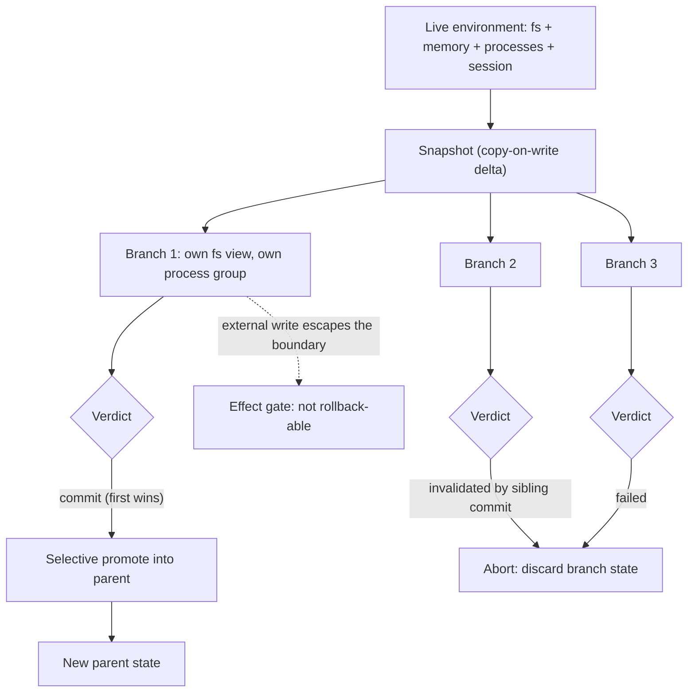

# Forkable Agent Sandbox

**Also known as:** Branch-Context Exploration, Sandbox Checkpoint/Rollback, Copy-on-Write Agent Environment

**Category:** Tool Use & Environment  
**Status in practice:** emerging

## Intent

Turn the agent's whole execution environment, including filesystem, memory and running processes, into a versioned object that can be snapshotted, forked into isolated branches, rolled back and selectively committed.

## Context

An agent works inside a stateful environment: a container with a seeded database, a package tree that took minutes to install, a running development server, a logged-in browser or desktop session. Search strategies the agent depends on — tree search with backtracking, best-of-N sampling, reinforcement-learning rollouts, speculative execution of a risky command — all assume that a step can be tried and then unmade. Model outputs are trivial to discard because sampling is stateless, but the environment those outputs act on is not.

## Problem

Real environments accumulate side effects that plain re-execution cannot undo. A migration has already altered the schema, a process has already written a lock file, a form has already been submitted in the browser session. Backtracking therefore means rebuilding the environment from scratch and replaying every earlier action, which is slow and not always faithful. Full-state duplication is the obvious alternative, but copying an entire sandbox costs hundreds of milliseconds to seconds per operation, which is far too slow to sit in the inner loop of a deep search or a large fan-out. So the agent either explores one path timidly or pays for a fresh environment per branch.

## Forces

- Search, best-of-N and rollout training all need cheap state restoration, while the environments worth searching in are exactly the ones that are expensive to rebuild.
- Undo by re-execution is only faithful when every action is deterministic and reversible; a single external write, timestamp or random seed breaks the replay.
- Full-state duplication is simple and correct but costs hundreds of milliseconds to seconds per checkpoint, which bottlenecks deep search and large-scale fan-outs; copy-on-write deltas cut that to milliseconds at the cost of a shared-page dependency between parent and branch.
- Isolation and branching pull the same lever in opposite directions: containment keeps a bad path from damaging user state, while forking multiplies the number of live copies of that state that must be tracked, resource-limited and eventually reclaimed.
- Anything a branch does outside the snapshot boundary — a payment, an email, an external API write — cannot be rolled back, so the versioning abstraction is exact inside the box and a lie outside it.

## Therefore

Therefore: treat the whole execution environment as a versioned object with fork, explore and commit-or-abort as explicit operations, implement the fork with copy-on-write deltas rather than full duplication, and let the first branch that commits invalidate its siblings.

## Solution

Give the sandbox a lifecycle rather than only a lifetime. A snapshot captures the complete machine state — filesystem, memory pages, process groups, and where it applies the GUI or browser session — as a restorable object. Forking that snapshot creates N branch contexts, each with an independent view of the filesystem and its own process group, sharing unmodified pages copy-on-write so a fork costs a delta rather than a full copy; measured implementations land in the low tens of milliseconds for a checkpoint and single-digit milliseconds for a rollback, which is what makes branching affordable inside a search loop. Each branch runs to a verdict: it commits, promoting its changes back into the parent, or it aborts and its state is discarded whole. When several siblings are exploring the same subproblem, the first successful commit wins and the runtime invalidates the rest, so no merge conflict has to be resolved by the model. Commit can be selective, promoting a chosen subset of changes rather than the whole branch, and contexts nest so a branch can itself fork for a sub-decision. Actions with effects outside the snapshot boundary are routed through a separate gate, because no rollback can retract them.

## Structure

```
Live environment --snapshot--> restorable state object --fork--> N branch contexts (copy-on-write fs view + own process group). Each branch: explore -> commit (selective, promotes to parent) or abort (discard whole). First commit wins; siblings invalidated. Contexts nest. External effects bypass the boundary and need their own gate.
```

## Diagram



*One snapshot forks into isolated branches; the first commit promotes into the parent and invalidates its siblings, while effects that leave the snapshot boundary need a separate gate.*

## Example scenario

An agent is fixing a failing test inside a container where a database has been seeded and a development server is already running. It wants to try three different repairs, but the first one runs a schema migration that the second one would need undone. Rather than rebuild the container three times, it snapshots the running sandbox, forks three branches from that snapshot, and keeps only the branch whose test suite goes green. The other two are discarded, and the migration they ran disappears with them.

## Consequences

**Benefits**

- Backtracking costs a rollback instead of an environment rebuild plus an action replay, so an agent explores substantially more nodes under a fixed time budget.
- Speculative and destructive actions become testable: a branch can run the migration, the destructive refactor or the uncertain command and be discarded if the result is bad.
- Parallel exploration works in environments that cannot be re-derived from a prompt, because every branch starts from the identical live state rather than from a re-provisioned approximation.
- First-commit-wins with sibling invalidation removes the merge problem from the agent's reasoning; the runtime resolves it structurally.

**Liabilities**

- The abstraction is exact only inside the snapshot boundary; a branch that sent an email, charged a card or wrote to an external store has produced an effect that abort cannot retract.
- Copy-on-write branches share pages with the parent, so a long-lived fork tree holds storage and memory proportional to the divergence, and abandoned branches leak resources unless reclamation is enforced.
- Memory snapshots restore process state that assumed the world had not moved on: expired tokens, closed sockets, stale file handles and clock jumps surface as confusing failures after a restore.
- Snapshot and restore are engine-specific and tie the agent to a particular runtime, which makes the exploration strategy hard to move between sandbox providers.
- Forked GUI or browser sessions can reuse the same authenticated identity, so siblings acting in parallel may contend for a single remote session the snapshot never owned.

## Failure modes

- A branch performs an external side effect, aborts, and the effect remains, so the parent state and the world disagree.
- Checkpointing is implemented as full-state duplication, each operation costs seconds, and the search collapses to a single greedy path because branching is unaffordable.
- Two siblings both succeed, both commit, and the parent state ends up with interleaved changes that neither branch was tested against.
- Branches are forked but never aborted or reclaimed, and the host runs out of disk or memory partway through a fan-out.
- A restored memory snapshot resumes a process holding an expired credential or a dead connection, and the failure is attributed to the agent's reasoning rather than to the restore.

## What this pattern constrains

Exploration may only happen inside a forked branch; a branch cannot write to the parent environment before it commits, at most one sibling commit is accepted and the rest must be aborted rather than merged, and actions whose effects escape the snapshot boundary must not be issued speculatively from inside a branch.

## Applicability

**Use when**

- The environment is expensive to rebuild — seeded databases, long installs, long-running processes, an authenticated browser or desktop session — and cannot be re-derived from a prompt.
- The agent runs a search, a best-of-N sampling loop or a reinforcement-learning rollout that needs frequent state restoration.
- Actions under consideration are destructive or hard to reverse, and trying one should not commit the whole run to it.
- Several candidate paths address the same subproblem and only one of them needs to survive.

**Do not use when**

- The environment is stateless or trivially re-provisioned, in which case a fresh sandbox per branch is simpler than a fork tree.
- The main effects of the work leave the sandbox — payments, emails, third-party writes — so abort cannot restore the world and the abstraction misleads.
- Only one path is ever pursued and a linear checkpoint for crash recovery is all that is needed.
- The runtime cannot capture process or memory state and the agent's work genuinely depends on it, since a filesystem-only snapshot restores an incomplete environment.

## Components

- Snapshot engine — captures filesystem, memory pages, process groups and session state as a restorable object
- Copy-on-write branch context — an independent filesystem view and process group that shares unmodified pages with the parent
- Lifecycle controller — exposes fork, explore and commit-or-abort as explicit operations rather than implicit side effects
- Commit arbiter — applies first-commit-wins and invalidates sibling branches so no merge has to be reasoned about
- Selective commit filter — promotes a chosen subset of a branch's changes into the parent instead of the whole branch
- Branch reaper — reclaims storage and memory held by aborted or abandoned branches
- External-effect gate — routes actions whose consequences leave the snapshot boundary out of speculative branches

## Tools

- Container and microVM snapshot APIs — capture and restore whole sandbox state, including memory where supported
- Copy-on-write filesystems such as overlayfs, btrfs or ZFS — make a branch cost a delta rather than a full copy
- Process checkpoint-restore tooling such as CRIU — preserves running processes, open handles and memory across a restore
- Sandbox platform SDKs (E2B, Modal, Daytona) — expose pause, snapshot and fork as first-class calls to the agent runtime
- Version-control worktrees — the file-only degenerate case, useful when no process or session state has to survive

## Evaluation metrics

- Fork latency — time to create a usable branch from a snapshot
- Rollback latency — time to discard a branch and restore the parent state
- Nodes explored per fixed time budget — the search throughput the branching primitive actually buys
- Storage and memory amplification per branch — how much a fork tree costs beyond the parent
- Escaped-effect rate — share of aborted branches that left an effect outside the snapshot boundary
- Branch reclamation lag — time between abort and resource release, which predicts host exhaustion during fan-outs
- Post-restore failure rate — failures caused by stale tokens, dead sockets or clock jumps after a memory restore

## Known uses

- **[E2B Sandbox persistence](https://docs.e2b.dev/sandbox/persistence)** _available_ — Pauses a sandbox and resumes it from the exact prior state, saving both filesystem and memory so running processes and loaded variables survive the restore.
- **[Modal Sandbox snapshots](https://modal.com/docs/guide/sandbox-snapshots)** _available_ — Filesystem snapshots are images, so multiple sandboxes can be created from one snapshot; each starts with an identical copy and is used to run parallel workloads or test different changes independently.
- **[Daytona](https://www.daytona.io/)** _available_ — Markets save, restore and resume of an agent workflow as the core sandbox operation rather than as a backup feature.
- **[NVIDIA NemoClaw](https://github.com/NVIDIA/NemoClaw)** _available_ — Lists snapshots as a first-class CLI operation alongside network policy and lifecycle operations in the agent runtime stack.
- **[Branch contexts (Fork, Explore, Commit)](https://arxiv.org/abs/2602.08199)** _pure-future_ — Research operating-system abstraction giving copy-on-write filesystem and process isolation, a fork/explore/commit lifecycle, first-commit-wins sibling invalidation and nestable contexts.
- **[DeltaBox](https://arxiv.org/abs/2605.22781)** _pure-future_ — Delta-based sandbox checkpoint and rollback reported at 14 ms and 5 ms on SWE-bench and reinforcement-learning micro-benchmarks, against hundreds of milliseconds to seconds for full-state duplication.
- **[TClone](https://arxiv.org/abs/2605.17320)** _pure-future_ — Extends the same primitive to a live GUI workspace that can be snapshotted, forked into isolated branches, rolled back, and selectively committed or merged.

## Related patterns

- _uses_ **Sandbox Isolation** — Isolation supplies the containment boundary; this pattern adds a versioning primitive on top of it, turning the contained environment into something that can be forked and rolled back.
- _alternative-to_ **Durable Workflow Snapshot** — That snapshots serialisable orchestration state to a storage provider so one linear run can resume after a restart; here the artifact is live machine state and the purpose is parallel branching, not resumption.
- _alternative-to_ **Replay / Time-Travel** — That re-runs a recorded trace of model and tool calls with modifications for retrospective debugging; this forks the live environment forward for exploration, and restores process and session state a trace cannot reconstruct.
- _complements_ **Shadow Workspace** — A source-file mirror for edit-then-review covers the filesystem in a single branch; this extends the same discipline to running processes and desktop sessions across many branches.
- _used-by_ **Language Agent Tree Search** — Tree search with backtracking assumes the environment can be reset at each node; snapshot-and-fork is what makes that reset cheap enough to search deeply.
- _used-by_ **Adaptive Branching Tree Search** — Adaptive branching decides how wide to go at each node, which is only affordable when a branch costs a delta rather than a rebuilt environment.
- _complements_ **Speculative Agentic Actions** — Speculation is safe to discard only if the environment it touched can be discarded with it.
- _complements_ **Clone Fan-Out Research** — Fan-out over identical workers assumes the starting environment is cheap to reproduce; forking one snapshot supplies that starting state when provisioning from scratch is expensive.
- _complements_ **Subagent Isolation** — Isolation stops parallel workers from colliding; forking gives each worker an identical live starting state instead of an empty one.
- _complements_ **Compensating Action** — The remedy for effects that escape the snapshot boundary: what cannot be rolled back has to be compensated.
- _complements_ **Agent Resumption** — Resumption restores one timeline after an interruption; the same snapshot machinery, forked rather than resumed, supports exploration.

## References

- [Fork, Explore, Commit: OS Primitives for Agentic Exploration](https://arxiv.org/abs/2602.08199) — 2026
- [DeltaBox: Scaling Stateful AI Agents with Millisecond-Level Sandbox Checkpoint/Rollback](https://arxiv.org/abs/2605.22781) — 2026
- [TClone: Low-Latency Forking of Live GUI Environments for Computer-Use Agents](https://arxiv.org/abs/2605.17320) — 2026
- [Tree Search for Language Model Agents](https://arxiv.org/abs/2407.01476) — Jing Yu Koh, Stephen McAleer, Daniel Fried, Ruslan Salakhutdinov, 2024
- [E2B Docs — Sandbox persistence](https://docs.e2b.dev/sandbox/persistence)
- [Modal Docs — Sandbox snapshots](https://modal.com/docs/guide/sandbox-snapshots)
